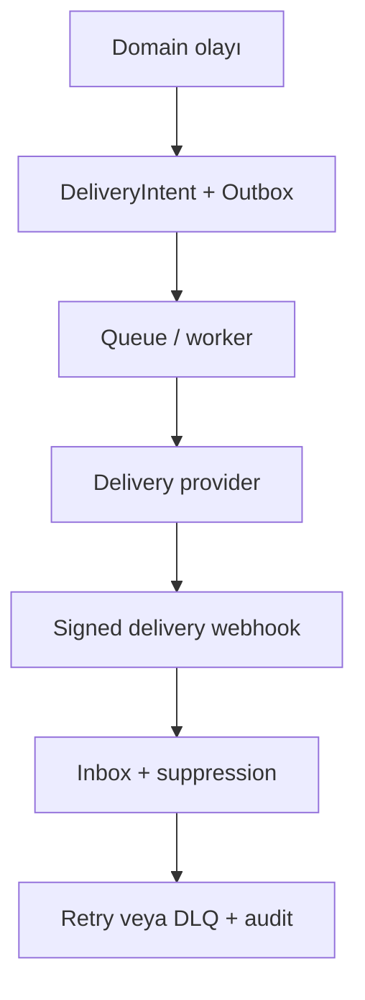

# OzelAPP — Anonim Teknik Mimari, API ve Uygulama Sözleşmesi

**Araştırma tarihi:** 3 Eylül 2026  
**Belge türü:** Araştırma ve uygulanabilir teknik sözleşme; kod veya canlı sistem inceleme raporu değildir.  
**Anonimlik:** Bu belgede ürün yalnızca **OzelAPP** olarak anılır. Gerçek proje, kurum, repository, domain, müşteri ve hesap bilgisi kullanılmamıştır.

## 1. Yönetici özeti

OzelAPP için önerilen başlangıç mimarisi, sınırları sıkı bir **modüler monolit**, PostgreSQL, aynı transaction’a yazılan outbox, ayrı worker süreçleri ve sağlayıcıya özel adapter’lardır. Bu, ödeme–fatura–belge zincirindeki atomik yerel değişiklikleri açık tutar; dağıtık transaction yanılsamasını önler ve daha sonra ölçülmüş ihtiyaç halinde modül çıkarılmasına izin verir. Bu bir ürün mimarisi kararıdır; herhangi bir standardın zorunlu tuttuğu topoloji değildir.

Değiştirilemez sıra şudur:

1. OzelAPP’ın kendi ödeme sistemi
2. Ödeme güvenliği, webhook, refund ve reconciliation
3. Manuel fatura sistemi
4. Paraşüt API v4 faturalama sistemi
5. Belge güvenliği ve `document-ready` akışı
6. Gerekli transactional ödeme/fatura bildirimleri
7. Tüm zincirin pilot testi
8. Genel form, builder, UI/UX ve dışa aktarma geliştirmeleri
9. En son SaaS abonelik ve tenant sistemi

SaaS’ın kullanıcıya açık özellikleri Faz 9’dadır; fakat ilk migration’dan itibaren `workspace_id`, repository scope, object-key namespace ve audit context temelleri bulunmalıdır. Bu sıralama değişikliği değil, sonradan veri taşıma ve çapraz-tenant sızıntısını önleyen güvenlik temelidir.

En kritik sonuçlar:

- Tarayıcıdaki “başarılı” dönüş sayfası ödeme kanıtı değildir. Kesin durum, imzalı webhook ve gerektiğinde server-to-server retrieve ile yakınsatılır.
- OzelAPP PAN/CVV saklamaz, işlemez, loglamaz, dışa aktarmaz veya yedeklemez. Hosted ödeme varsayılandır. PCI kapsamı yine acquiring bank/QSA ile doğrulanmalıdır.
- Stripe’ın resmi küresel uygunluk sayfasında Türkiye desteklenen merchant ülkeleri arasında görünmemektedir. Uygun bir tüzel hesap kanıtlanmadan canlı Stripe kolu `EXTERNAL DEPENDENCY` ve `BLOCKED` durumundadır. Bölge aşma çözümü önerilmez.
- Google Pay `DIRECT` token yolu token doğrulama/deşifre ve kart verisi sorumluluğu getirir; OzelAPP yalnız desteklenen PSP’nin `PAYMENT_GATEWAY` yolu üzerinden etkinleştirmelidir.
- iyzico hosted Checkout Form birincil adaydır; callback yalnız retrieve tetikler. Merchant yetenekleri ve webhook V3 canonical imza ayrıntıları `PROVIDER CONFIRMATION REQUIRED` olarak kalır.
- Manuel fatura ve Paraşüt yolları ayrı application service’lerdir. Paraşüt, genel idempotency/PKCE/revoke/ready-webhook/imzalı XML sözleşmesini resmi belgede açıkça garanti etmediği için bu maddeler sağlayıcı kanıt kapısıdır.
- E-belgede kanonik kayıt XML/UBL-TR ve doğrulama kanıtıdır; PDF yalnız sunum kopyasıdır. `document-ready`, byte’ların varlığı değil, hash + tür + tenant + virüs taraması + kanonik doğrulama + immutable referansın tamamlanmasıdır.
- E-posta bir ürün modülü değildir; ödeme/fatura/belge zorunlu olaylarının transactional teslimat kanalıdır. Domain olayı → outbox → queue → provider → delivery webhook → suppression/DLQ zinciri kullanılır.
- Public form yalnız yayınlanmış immutable snapshot’tan okunur. Embed için varsayılan sınır iframe’dir; inline loader daha geniş host-DOM/CSP riski nedeniyle açık opt-in ve sıkı sürümleme ister.
- Bir fazın kanıt kapısı geçmeden sonraki faz başlamaz. Mock/sandbox, canlı üretim kanıtı sayılmaz.

**Araştırma sonucu:** Tasarım uygulamaya aktarılabilir; ancak canlı ödeme, hukuki fatura senaryoları, Paraşüt boşlukları ve sağlayıcı sözleşmeleri çözülmeden üretim açılışı yapılamaz.

## 2. Araştırma tarihi ve kaynak yöntemi

Araştırma 3 Eylül 2026’da yapıldı. Öncelik sırası: sağlayıcıların resmi API/güvenlik dokümanları; GİB/KVKK ve resmi mevzuat; IETF, PCI SSC, OWASP, W3C, PostgreSQL ve Kubernetes; resmi ürün dokümanları. Mimari öneriler kaynak gerçeğinden ayrıldı ve “OzelAPP sözleşmesi/önerisi” olarak işaretlendi.

Çalışma yöntemi:

1. İstenen 21 bölüm, 20 API grubu, 18 adlandırılmış model ve dokuz ana faz için bir boşluk matrisi oluşturuldu.
2. Ödeme, belge, teslimat, embed, erişilebilirlik, tenant ve operasyon iddiaları resmi kaynaklarla tarandı.
3. Sağlayıcının söylemediği alanlar ikinci bir kaynakla uydurulmadı; uygun boşluk etiketi bırakıldı.
4. Zaman duyarlı sayfalar 3 Eylül 2026 itibarıyla tekrar kontrol edildi.
5. Kaynak ile ürün çıkarımı ayrıldı; taslak API yolları mevcut bir sistemin endpoint’i gibi sunulmadı.
6. Durma kuralı: her zorunlu başlıkta ya birincil kanıt ya açık boşluk etiketi ve test/karar kapısı bulunduğunda araştırma tamamlandı.

Kanıt dereceleri:

| Derece | Anlamı | Kullanım |
|---|---|---|
| Doğrulanmış | Güncel birincil/resmi kaynak doğrudan destekler | Zorunlu kontrol veya sağlayıcı davranışı |
| Tasarım kararı | Resmi kontrollerden türetilmiş OzelAPP sözleşmesi | Endpoint, modül, state ve varsayılanlar |
| `PROVIDER CONFIRMATION REQUIRED` | Sağlayıcı dokümanı eksik ya da merchant’a özgü | Canlı entegrasyon kapısı |
| `LEGAL REVIEW REQUIRED` | İşlem/şirket/veri kategorisine göre hukuki yorum gerekir | Fatura, saklama, aktarım ve ileti |
| `UNKNOWN` / `NOT VERIFIED` | Kanıt sağlanmadı veya test edilmedi | Fail-closed özellik |
| `EXTERNAL DEPENDENCY` | Hesap, sözleşme, DNS, test/live ortamı veya üçüncü taraf gerekir | Bloke geçiş kapısı |

Mock, demo, sandbox ve yalnız doküman keşfi canlı üretim kanıtı değildir. Araştırmada kod, repository, gerçek veritabanı, canlı hesap veya sağlayıcı paneli görülmemiştir.

## 3. Doğrulanmış bilgiler

| Doğrulanmış bilgi | Mimari karşılığı | Kaynak |
|---|---|---|
| Transactional outbox, iş kaydı ile mesaj niyetini aynı transaction’a yazar; teslimatta duplicate olabilir, consumer idempotent olmalıdır. | Yerel state + outbox atomik; provider/queue çağrısı transaction dışında. | [AWS Transactional Outbox](https://docs.aws.amazon.com/prescriptive-guidance/latest/cloud-design-patterns/transactional-outbox.html) |
| PostgreSQL Read Committed varsayılandır; Serializable serialization hatası üretebilir ve tüm transaction yeniden denenmelidir. | Finansal toplam invariant’ında kilit veya Serializable + SQLSTATE `40001` retry. | [PostgreSQL Transaction Isolation](https://www.postgresql.org/docs/current/transaction-iso.html) |
| PostgreSQL `CHECK` başka satırları güvenilir biçimde doğrulamaz; unique constraint B-tree index yaratır, FK’nin referanslayan tarafı otomatik indexlenmez. | Over-refund toplamı yalnız `CHECK` değildir; composite unique ve explicit FK-side index. | [PostgreSQL Constraints](https://www.postgresql.org/docs/current/ddl-constraints.html) |
| RFC 9457, `application/problem+json` için `type`, `title`, `status`, `detail`, `instance` alanlarını tanımlar ve problem ayrıntısında iç detay sızdırılmamasını öğütler. | Tek hata zarfı; stack trace, token ve iç ID yok. | [RFC 9457](https://www.rfc-editor.org/rfc/rfc9457.html) |
| `409` kaynak durumuyla çatışmayı, `422` sözdizimi doğru fakat talimatı işlenemeyen içeriği ifade eder; `429` isteğin sınırlandırıldığını belirtir. | Idempotency body çatışması `409`; semantik validation `422`; rate limit `429`. | [RFC 9110](https://www.rfc-editor.org/rfc/rfc9110.html), [RFC 6585](https://www.rfc-editor.org/rfc/rfc6585.html) |
| Stripe duplicate event, sırasız teslim, ham body imzası, replay timestamp ve hızlı `2xx` davranışlarını açıklar. | Webhook inbox + dedupe + async reducer + retrieve. | [Stripe Webhooks](https://docs.stripe.com/webhooks) |
| CVV, yetkilendirmeden sonra şifreli olsa dahi saklanamaz. | Şema/log/cache/export/backup denylist’i. | [PCI SSC FAQ 1280](https://www.pcisecuritystandards.org/faqs/1280/), [FAQ 1574](https://www.pcisecuritystandards.org/faqs/1574) |
| Google Pay `DIRECT` ve `PAYMENT_GATEWAY` yollarını ayırır; direct yol ECv2 doğrulama/deşifre sorumluluğu taşır. | `DIRECT` reddedilir; yalnız doğrulanmış gateway capability. | [Google Pay request objects](https://developers.google.com/pay/api/web/reference/request-objects), [payment data cryptography](https://developers.google.com/pay/api/web/guides/resources/payment-data-cryptography) |
| Paraşüt v4 dokümanı OAuth, satış faturası/e-belge işleri ve 10 istek/10 saniye limiti yayınlar; job/PDF asenkrondur. | Rate-aware adapter, poller, job inbox, geçici URL’yi kullanıcıya doğrudan vermeme. | [Paraşüt API](https://apidocs.parasut.com/), [Swagger](https://apidocs.parasut.com/swagger.json) |
| OAuth Security BCP authorization code, tam redirect eşleşmesi, PKCE ve refresh korumalarını destekler; password grant kullanılmamalıdır. | Paraşüt bağlantısında auth-code; password grant `REJECTED`. | [RFC 9700](https://www.rfc-editor.org/rfc/rfc9700.html) |
| GİB 2026 paket/UBL kod listesi değişikliklerini ve 14 Eylül 2026 yürürlük tarihini yayımladı. | Pilot öncesi şema paket/hash yeniden doğrulaması zorunlu. | [GİB e-Belge duyuruları](https://ebelge.gib.gov.tr/anasayfa.html) |
| WCAG 2.2 sürükleme için tek-pointer alternatifi, 320 CSS px reflow, etiket/talimat ve metinsel hata tanımı ister. | Builder’da klavye/dokunma alternatifleri ve public form erişilebilirlik testleri. | [Dragging Movements](https://www.w3.org/WAI/WCAG22/Understanding/dragging-movements.html), [Reflow](https://www.w3.org/WAI/WCAG22/Understanding/reflow.html), [Error Identification](https://www.w3.org/WAI/WCAG22/Understanding/error-identification.html) |
| WordPress nonce authorization değildir; REST route permission callback gerektirir. | Plugin gizli anahtar taşımaz; private ayarlar server-side capability + nonce ile korunur. | [WordPress Nonces](https://developer.wordpress.org/apis/security/nonces/), [REST endpoints](https://developer.wordpress.org/rest-api/extending-the-rest-api/adding-custom-endpoints/) |
| RLS etkin ve uygun policy yoksa normal roller default-deny olur; owner ve `BYPASSRLS` istisnaları vardır. | App runtime owner/superuser değildir; repository scope + RLS savunma katmanı. | [PostgreSQL Row Security](https://www.postgresql.org/docs/current/ddl-rowsecurity.html) |
| Readiness trafiğe kabulü, liveness yeniden başlatmayı, startup ise yavaş başlangıcı yönetir. | Liveness yalnız süreç; readiness kritik yerel bağımlılıklar; opsiyonel PSP kesintisi tüm uygulamayı düşürmez. | [Kubernetes Probes](https://kubernetes.io/docs/concepts/workloads/pods/probes/) |

## 4. Doğrulanamayan bilgiler

| Durum | Doğrulanamayan nokta | Fail-closed davranış / kanıt kapısı |
|---|---|---|
| `EXTERNAL DEPENDENCY` | OzelAPP tüzel kişisinin Stripe desteklenen ülke hesabı ve canlı sözleşmesi | Stripe/Google Pay gösterilmez; hukuk/uyum onaylı hesap kanıtı gerekir. |
| `PROVIDER CONFIRMATION REQUIRED` | iyzico merchant’ın döviz, yabancı kart, taksit, kısmi iade, cancel cutoff ve tam webhook V3 canonical string/replay kuralları | Capability `false`; resmi yazılı cevap + güncel signed fixture gelmeden canlı kapı kapalı. |
| `PROVIDER CONFIRMATION REQUIRED` | Paraşüt sandbox, PKCE desteği, token revoke, genel idempotency, e-belge ready webhook’u, imzalı XML indirme sözleşmesi | Poll/retrieve ve OzelAPP duplicate koruması; üretim pilotu sağlayıcı kanıtına bağlı. |
| `LEGAL REVIEW REQUIRED` | Mükellef türü, e-Fatura/e-Arşiv senaryosu, tevkifat/istisna, belge tarihi-numarası, saklama ve iptal/itiraz süreleri | Şirket/işlem bazlı mali müşavir-hukuk kontrolü olmadan otomatik belge üretimi açılmaz. |
| `LEGAL REVIEW REQUIRED` | KVKK hukuki sebep, yurt dışı aktarım, saklama/anonimleştirme süreleri ve destek erişimi | Veri envanteri + DPA/SCC/aktarim mekanizması + retention policy onayı. |
| `PROVIDER CONFIRMATION REQUIRED` | Transactional e-posta sağlayıcısının bölgesi, DPA’sı, fiyatı, SLA’sı, webhook imzası ve dedicated IP gereği | Provider procurement/contract test tamamlanmadan canlı gönderim yok. |
| `UNKNOWN` | Hedef SLO, RPO/RTO, yedek saklama, maksimum form boyutu, günlük hacim ve bütçe | Ölçüm toplanır; limitler config/policy; rastgele sayı üretimi yok. |
| `NOT VERIFIED` | Gerçek repository, framework, migration aracı, queue, object storage, CI ve deploy topolojisi | Belgede gerçek dosya adı/uyumluluk iddiası yok; uygulama ajanı önce envanter çıkarır. |
| `NOT VERIFIED` | OpenAPI 3.2.0’ın seçilecek generator/gateway ile uyumu | En yeni spec 3.2.0’dır; araç contract testi geçmezse desteklenen sürüm sabitlenir. |

## 5. Ana mimari kararlar

| Karar | Kategori | Gerekçe | Faz | Teknik/ürün/güvenlik/maliyet etkisi | Rollback |
|---|---|---|---:|---|---|
| Modüler monolit + ayrı worker | `ACCEPTED` | Yerel finans invariant’ları atomik; erken mikroservis operasyon yükü gereksiz. | 1 | Net sınırlar, tek şema; yatay worker ölçeği. | Modül sözleşmeleri korunarak ölçülmüş modül çıkarılır. |
| DB state + outbox aynı transaction | `ACCEPTED` | Dual-write kaybını önler; duplicate consumer idempotency ile yönetilir. | 1 | Teslimat gecikebilir ama kaybolmaz; outbox bakım maliyeti. | Worker durur, outbox replay edilir; kayıt silinmez. |
| Hosted ödeme / kart verisi yok | `SAFE-NOW` | PCI kapsamını ve ihlal etkisini azaltır. | 1 | UI sağlayıcı sınırına bağlı; direct PAN/CVV reddedilir. | Provider feature flag kapatılır. |
| Stripe canlı yolunu uygunluk kanıtına bağla | `EXTERNAL DEPENDENCY` | Türkiye merchant uygunluğu doğrulanmadı. | 1 | Bir provider dalı görünmez; hukuksuz bölge aşımı yok. | Varsayılan kapalıdır. |
| Google Pay `DIRECT` | `REJECTED` | ECv2/kart verisi/PCI yükü OzelAPP’ın sınırına aykırı. | 1 | Gateway varsa wallet UX korunur. | Yok; ancak yeni risk değerlendirmesiyle plan değişikliği. |
| Webhook inbox + reducer | `ACCEPTED` | Duplicate/sırasız teslim ve callback yarışını yönetir. | 2 | Ek tablo/worker; deterministik state. | İşleme durur, immutable inbox replay edilir. |
| Manuel ve Paraşüt fatura yollarını ayır | `ACCEPTED` | Dış sağlayıcı hatası manuel kayıt akışını bozmamalı. | 3–4 | Ortak Invoice çekirdeği; ayrı orchestrator. | Paraşüt flag kapalı; manuel yol sürer. |
| XML/UBL-TR kanonik, PDF sunum | `ACCEPTED` | GİB teknik akışı yapılandırılmış e-belgeye dayanır. | 5 | İki artifact; hash ve immutable saklama. | Ready yayınlama durur; kanonik kayıt korunur. |
| Mailing/campaign özellikleri | `REJECTED` | Ürün kapsamı yalnız zorunlu transactional olaylardır. | 6 | Daha düşük mevzuat/suppression karmaşıklığı. | Uygulanmaz. |
| Iframe varsayılan, inline opt-in | `SIMPLIFIED` | Origin/CSS/JS sınırı daha güçlü ve destek matrisi daha küçük. | 8 | Inline esneklik azalır; güvenli varsayılan. | Tenant başına flag ile iframe’e dönülür. |
| Builder’da en çok altı layout ancestor | `SIMPLIFIED` | Standart sayısı değildir; cycle/perf/a11y için ölçülebilir başlangıç bütçesi. | 8 | Aşırı iç içe tasarım sınırlanır. | Schema version + benchmark ile artırılır. |
| Gelişmiş tema/marketplace/marketing automation | `DEFERRED` | Ödeme–fatura zincirine katkısı yok; önce pilot. | 8 sonrası | Kapsam ve maliyet korunur. | Ayrı ürün kararı. |
| Tenant temelleri erken, SaaS özellikleri son | `SAFE-NOW` | Sonradan scope eklemek veri sızıntısı riski taşır; ürün sırası değişmez. | 1/9 | Her satır/iş/object tenant bağlamlı; abonelik UI son. | Tenant tekil kurulumda sabit workspace’e indirgenebilir. |
| Retention sürelerini tahmin etme | `LEGAL REVIEW REQUIRED` | Belge/veri/işlem türüne göre değişir. | 3–9 | Silme motoru policy-driven; hukuk onayı gerekir. | Policy sürümü geri alınır, legal hold silmeyi durdurur. |

### Plan amendment değerlendirmesi

Ana sıra korunur. Faz 1’de `workspace_id`, tenant-aware unique/index, audit actor, correlation ve object-key namespace eklenmesi; Faz 9 SaaS ürününü öne çekmez, `SAFE-NOW` güvenlik altyapısıdır.

GİB’in 14 Eylül 2026 paket değişikliği pilot tarihinden önceyse: **`PLAN AMENDMENT REQUIRED`**. Etkilenen faz 4–5; neden şema/kod listesi uyumu; bağımlılık güncel GİB paketi + Paraşüt davranışı; önerilen revizyon Faz 4 contract fixture’ını ve Faz 5 validator hash’ini güncelleyip Faz 7 pilotunu yeniden kapılamaktır. Ana sıra değişmez.

## 6. Kod mimarisi

### 6.1 Modül sözleşmeleri

| Modül | Sorumluluk / sorumlu değil | Girdi → çıktı | İzin verilen / yasak çağrı | Güvenlik sınırı | Test sınırı |
|---|---|---|---|---|---|
| Public Form | Yayın snapshot’ını gösterir; draft/admin verisi bilmez. | public key, locale → public DTO | Publish read model, Submission service / Admin repo, secret | Anonymous abuse, CSP, payload allowlist | snapshot, 404/410, 320px, no-leak |
| Admin | Yetkili komut/query orkestrasyonu; domain kuralı taşımaz. | principal, command → admin DTO | application services / provider adapter’a doğrudan çağrı | session, CSRF, RBAC, tenant | her capability için pozitif/negatif |
| Form Builder | Draft düzenleme, ağaç invariant’ları, undo; publish etmez. | edit command → FormVersion draft | Form Publish / Payment, Invoice | schema validation, cycle/nesting | pointer/touch/keyboard, property test |
| Form Publish | Draft doğrular ve immutable public snapshot üretir; canlı snapshot’ı yerinde değiştirmez. | draft version → snapshot/public key | Media metadata, Audit / provider | private alan allowlist’i | deterministic snapshot, rollback pointer |
| Payment | Order/attempt/state/refund invariant’ı; PSP protokolü bilmez. | order/refund command, normalized event → state/outbox | Adapter interface, Audit, Invoice candidate / React | money integer, idempotency, locks | state permutations, over-refund |
| Payment Provider Adapter | Sağlayıcı request/response/signature/status dönüşümü; domain state yazmaz. | typed request/raw webhook → normalized result | Provider HTTP / repository doğrudan | secrets, TLS, signature, timeout | official fixtures + contract tests |
| Invoice | Payment allocation ve invoice lifecycle; vergi yorumunu UI’a bırakmaz. | settled allocation → InvoiceRecord | Manual veya Paraşüt orchestrator, Vault | tenant/amount/currency invariant | allocation concurrency, lifecycle |
| Manual Accounting | Seçim snapshot, güvenli CSV/XLSX, dönüş belge importu; e-belge üretmez. | invoice candidates → export/import result | Invoice, Vault, Audit / Paraşüt | formula injection, upload quarantine | snapshot repeat, duplicate import |
| Paraşüt Integration | OAuth, mapping, API/job polling; manuel yolun state’ini sahiplenmez. | InvoiceRecord → external refs/status | Integration secrets, Invoice, Vault / UI doğrudan token | OAuth state/PKCE, token encryption | Swagger fixtures, 429/timeout/duplicate |
| Document Vault | Quarantine, validate, hash, immutable store, signed download; fatura kararını vermez. | bytes+metadata → document ref/ready | AV/parser/object store, Audit / email provider | MIME/signature, tenant key, malware | polyglot, overwrite, cross-tenant |
| Transactional Delivery | DeliveryIntent/outbox/provider/webhook/suppression; campaign veya audience yok. | allowed domain event → delivery state | provider adapter, Audit / Payment state write | template allowlist, recipient minimization | duplicate, bounce, DLQ, webhook signature |
| Integration | ProviderConnection/WebhookSubscription/secret ref yaşam döngüsü; domain orchestration yapmaz. | admin capability command → connection health | secret manager, adapters, Audit / secret plaintext serialize | envelope encryption, rotation | revoke/rotate/tenant mismatch |
| Audit | Append-only actor/action/target/correlation kaydı; iş state’i değildir. | security/domain event → redacted record | sink/storage / hiçbir domain mutation | tamper/access/PII minimization | completeness, redaction, failure |
| Tenant/SaaS | Workspace üyelik/entitlement/suspend/subscription; tenant müşteri ödemesini sahiplenmez. | membership/subscription event → policy | all module policy façades, Audit / tenant data bypass | RLS, default deny, support access | cross-tenant matrix, suspend/reactivate |

### 6.2 Katman kuralları

| Katman | Yapabilir | Yapamaz | Zorunlu test |
|---|---|---|---|
| Route/controller | HTTP parse, correlation, service çağrısı, status/header | İş kuralı, SQL, provider state kararı | method/content/auth/error mapping |
| DTO/schema validation | Tip, biçim, boyut, allowlist, unknown-field policy | DB’ye bağlı iş invariant’ı | boundary/fuzz/schema |
| Authorization/policy | principal + workspace + resource + capability kararı | Sadece UI gizlemeye güvenmek | her endpoint cross-tenant negatif |
| Application service | Use-case sırası, transaction, outbox, adapter sonucu orkestrasyonu | HTTP framework DTO’sunu domaine taşımak | unit + transaction integration |
| Domain rules | Saf state transition, para/allocation/nesting invariant’ı | I/O, clock/random global, provider alanı | table/property tests |
| Repository | Tenant-scoped query, lock, constraint mapping | Yetki kararı, HTTP/provider çağrısı | gerçek DB constraint/concurrency |
| Provider adapter | Timeout/retry/signature/normalize/capability | Domain tablo yazma, secret döndürme | official fixture + contract |
| Queue/worker | Claim, idempotent handle, backoff, DLQ | Sonsuz retry, tenant bağlamı olmadan iş | crash/replay/poison message |
| Serializer | Role’a özel explicit allowlist DTO | ORM entity veya secret serialize | snapshot/no-leak contract |
| Audit/observability | Redacted structured olay/metric/trace | PAN/CVV/token/body dump, iş sonucu değiştirme | redaction ve sink-failure |

Bağımlılık yönü `route → application → domain/repository port`; adapter ve repository portları içeri doğru implemente eder. React yalnız DTO ve etkileşim state’i bilir. Route’ta ödeme/fatura state switch’i, adapter’da domain repository çağrısı, serializer’da ORM otomatik serileştirme ve worker’da authz bypass yasaktır.

### 6.3 Transaction sınırları

| Olay | Aynı DB transaction | Transaction dışında / outbox-worker | Concurrency/idempotency |
|---|---|---|---|
| Form submission | submission + idempotency kaydı + outbox | bot doğrulaması önceden; delivery/payment sonra | snapshot ID + client key; duplicate no-op |
| PaymentOrder oluşturma | order + ilk attempt niyeti + audit/outbox | PSP checkout çağrısı; sonucu ayrı kısa tx | tenant+operation key ve request hash |
| Webhook kabulü | doğrulanmış event inbox insert | hızlı `2xx`; reducer worker | provider account+event ID unique |
| Payment state güncelleme | row lock/reducer + state + audit + outbox | eksik/sırasızsa retrieve önce, sonuç sonra tx | forward-only transition; tek fulfillment |
| Refund | authz/step-up önceden; refund command + idempotency + audit | provider çağrısı ve sonuç inbox/retrieve | kilitli refundable total; same key/same body |
| Invoice candidate | allocation lock + candidate + audit/outbox | dış muhasebe çağrısı | settled amount, currency, unique allocation |
| Belge importu | upload intent/metadata/quarantine state | byte upload/AV/parser/object store; sonra finalize tx | checksum+tenant+source unique |
| Document-ready | immutable object ref + hash + validation results + state + audit/outbox | bildirim gönderimi | compare-and-set; eksik kontrol varsa ready yok |
| Transactional mail | business state + DeliveryIntent/outbox | render/send; delivery webhook ayrı inbox | event+template+recipient unique |
| Tenant suspension/reactivation | workspace state/version + audit + quiesce/reactivate outbox | provider revoke, cache purge, public route disable, health probes | version/CAS; reactivation aynı snapshot pointer |

Transaction içinde dış HTTP, e-posta, object upload veya uzun parser çalışmaz. Serializable kullanılan bloklar `40001` için tüm use-case’i bounded jitter ile yeniden dener; yan etkiler outbox’a kadar ertelenir.

## 7. API sözleşmeleri

Bu bölümdeki yollar mevcut bir sisteme ait olduğu iddiası taşımayan **PROPOSED OzelAPP contract**’tır. OpenAPI belgesi tek kaynak olmalı ve toolchain contract testiyle sürümü sabitlenmelidir. En güncel yayın [OpenAPI 3.2.0](https://spec.openapis.org/oas/latest.html) olmakla birlikte generator/gateway uyumu `NOT VERIFIED`’dır.

Ortak kurallar:

- JSON başarı zarfı kaynak DTO’sudur; hatalar `application/problem+json` ve RFC 9457 alanlarını kullanır. `instance` tahmin edilemez olay URI’sidir; stack/SQL/provider body içermez.
- Public kimlikler rastgele/opaque’tır fakat authorization yerine geçmez. Private kaynakta principal + workspace membership + capability + resource scope birlikte kontrol edilir.
- OzelAPP `Idempotency-Key` sözleşmesi: tenant/principal/operation ile scope edilir, canonical request hash saklanır; aynı key + aynı body önceki sonucu döndürür, farklı body `409`; TTL ürün policy’sidir (`UNKNOWN`) ve API dokümanında sürümlenir.
- Rate politikaları: `RL-PUBLIC-READ`, `RL-PUBLIC-WRITE`, `RL-PAYMENT-MUTATION`, `RL-WEBHOOK-PROVIDER`, `RL-ADMIN`, `RL-EXPORT`, `RL-INTEGRATION`. Sayısal değerler hacim testi sonrası config; aşım `429`, mümkünse `Retry-After`.
- Güvenli retry: yalnız GET veya idempotency/inbox ile korunan mutation; `400/401/403/404/409/422` otomatik denenmez; `429/5xx/timeout` jitter + üst sınır; belirsiz provider mutation retrieve edilmeden yeniden yaratılmaz.
- Public DTO denylist’i: `secret`, token/refresh/access/client-secret, admin session, provider connection ID, internal DB ID, workspace/tenant özel verisi, webhook bilgisi, özel fatura/muhasebe bağlantısı, SMTP, stack trace, draft schema, internal notes, raw provider payload, storage key.

Tablolarda “PII” hassas veri; “Yok” ise public cevabın PII/secret taşımadığı anlamındadır. Her satırda istenen 16 alan bulunur.

### 7.1 Public form görüntüleme

| Endpoint adı | Metot | URL | Public/private | Authentication | Authorization/capability | Tenant kapsamı | Request schema | Response schema | Hata kodları | Idempotency | Rate limit | Audit olayı | Hassas veri | Retry davranışı | Test gerekliliği |
|---|---|---|---|---|---|---|---|---|---|---|---|---|---|---|---|
| Published form view | GET | `/v1/public/forms/{publicFormKey}` | Public | Yok | Snapshot `published` ve workspace aktif | Anahtardan server-side çözülür; tenant parametresi yok | Path opaque key; `locale?`; `If-None-Match?` | `publicKey,snapshotVersion,title,fields,layout,theme,mediaRefs,submitCapability,etag` allowlist | 404,410,429,500 | GET doğal; ETag | RL-PUBLIC-READ | `public_form.viewed` örneklenmiş | Yok; private/draft alan yok | 429/5xx bounded; contract+snapshot+no-leak+inactive test | Zorunlu: satırdaki contract, güvenlik ve negatif senaryolar |
| Published media read | GET | `/v1/public/media/{mediaKey}` | Public | Yok | Yalnız aktif snapshot referansı | Media key → aynı workspace | Path key; size variant allowlist | Redirect veya bytes; güvenli MIME/cache header | 404,410,416,429 | GET doğal | RL-PUBLIC-READ | Aggregate access metric | Public asset; EXIF yok | CDN retry; orphan/cross-tenant/MIME/cache test | Zorunlu: satırdaki contract, güvenlik ve negatif senaryolar |

### 7.2 Public submission

| Endpoint adı | Metot | URL | Public/private | Authentication | Authorization/capability | Tenant kapsamı | Request schema | Response schema | Hata kodları | Idempotency | Rate limit | Audit olayı | Hassas veri | Retry davranışı | Test gerekliliği |
|---|---|---|---|---|---|---|---|---|---|---|---|---|---|---|---|
| Create submission | POST | `/v1/public/forms/{publicFormKey}/submissions` | Public | Bot token + optional submission session | Published snapshot accepts responses | Key’den scope; body tenant alamaz | `snapshotVersion,answers,consents,clientSubmissionId,botToken`; strict limits | `submissionKey,status,nextAction`; payment secret yok | 400,404,409,410,413,415,422,429,503 | Header + clientSubmissionId + snapshot; body conflict 409 | RL-PUBLIC-WRITE | `submission.accepted/rejected` redacted | PII olabilir; loglanmaz | Yalnız idempotent retry; duplicate/concurrency/bot/size/schema/no-leak test | Zorunlu: satırdaki contract, güvenlik ve negatif senaryolar |

### 7.3 Payment intent/order oluşturma

| Endpoint adı | Metot | URL | Public/private | Authentication | Authorization/capability | Tenant kapsamı | Request schema | Response schema | Hata kodları | Idempotency | Rate limit | Audit olayı | Hassas veri | Retry davranışı | Test gerekliliği |
|---|---|---|---|---|---|---|---|---|---|---|---|---|---|---|---|
| Create payment order | POST | `/v1/public/submissions/{submissionKey}/payment-orders` | Public-session | Signed short-lived submission capability | Snapshot payment config; amount server hesaplı | Submission’dan; body tenant yok | `offerKey,currency,providerPreference?`; amount kabul edilmez | `paymentOrderKey,status,amountMinor,currency,availableMethods,expiresAt` | 400,404,409,410,422,429,503 | Zorunlu key; submission+offer unique active order | RL-PAYMENT-MUTATION | `payment_order.created/reused` | PII yok; iç/provider ID yok | Same-key retry; altered amount/provider/cross-form/concurrency test | Zorunlu: satırdaki contract, güvenlik ve negatif senaryolar |

### 7.4 Provider checkout başlatma

| Endpoint adı | Metot | URL | Public/private | Authentication | Authorization/capability | Tenant kapsamı | Request schema | Response schema | Hata kodları | Idempotency | Rate limit | Audit olayı | Hassas veri | Retry davranışı | Test gerekliliği |
|---|---|---|---|---|---|---|---|---|---|---|---|---|---|---|---|
| Start hosted checkout | POST | `/v1/public/payment-orders/{paymentOrderKey}/checkout-sessions` | Public-session | Order-bound short capability | Provider canlı/eligible + order payable | Order’dan | `method,returnContext`; arbitrary return URL yok | `checkoutAction:{type,redirectUrl-or-hostedToken},attemptKey,expiresAt`; yalnız client-safe | 400,404,409,410,422,429,502,503 | Key → aynı attempt; belirsiz timeout retrieve | RL-PAYMENT-MUTATION | `payment_attempt.started/failed` | Hosted token hassas; kısa ömür, log yok | Kör provider create retry yok; URL allowlist/capability/timeout/duplicate test | Zorunlu: satırdaki contract, güvenlik ve negatif senaryolar |

### 7.5 Provider callback

| Endpoint adı | Metot | URL | Public/private | Authentication | Authorization/capability | Tenant kapsamı | Request schema | Response schema | Hata kodları | Idempotency | Rate limit | Audit olayı | Hassas veri | Retry davranışı | Test gerekliliği |
|---|---|---|---|---|---|---|---|---|---|---|---|---|---|---|---|
| Checkout return | GET/POST | `/v1/payments/providers/{provider}/return` | Public callback | Provider token/state; ödeme kanıtı değil | Kayıtlı attempt+provider+state eşleşmesi | Server mapping; tenant input yok | Provider allowlist query/form; body size limit | 303 ile `/pay/{paymentOrderKey}/status`; başarı iddiası yok | 400,404,409,413,429 | Tekrar güvenli; retrieve job dedupe | RL-PUBLIC-WRITE | `provider_return.received/rejected` | Token olabilir; URL/log/analytics redaction | Kullanıcı tekrar dönebilir; fake success/state mismatch/no-fulfillment test | Zorunlu: satırdaki contract, güvenlik ve negatif senaryolar |

### 7.6 Webhook

| Endpoint adı | Metot | URL | Public/private | Authentication | Authorization/capability | Tenant kapsamı | Request schema | Response schema | Hata kodları | Idempotency | Rate limit | Audit olayı | Hassas veri | Retry davranışı | Test gerekliliği |
|---|---|---|---|---|---|---|---|---|---|---|---|---|---|---|---|
| Payment webhook | POST | `/v1/webhooks/payments/{provider}/{subscriptionKey}` | Provider-public | TLS + raw-body signature + timestamp/replay | Aktif WebhookSubscription ve event allowlist | Subscription’dan; payload tenant’a güvenilmez | Raw bytes + signature headers; strict size/type | Boş `2xx` kabul/duplicate; ayrıntı sızmaz | 400,401,404,413,415,429,503 | account+event ID unique inbox; duplicate 2xx | RL-WEBHOOK-PROVIDER + provider IP sinyal, tek başına auth değil | `webhook.accepted/duplicate/rejected` | Raw payload restricted; signature/secret log yok | Provider retry eder; signed fixture/tamper/replay/duplicate/order test | Zorunlu: satırdaki contract, güvenlik ve negatif senaryolar |
| Delivery webhook | POST | `/v1/webhooks/delivery/{provider}/{subscriptionKey}` | Provider-public | Provider signature | Aktif subscription + event allowlist | Subscription + provider message map | Raw signed event | Boş `2xx` | 400,401,404,413,415,429,503 | provider event/message ID inbox | RL-WEBHOOK-PROVIDER | `delivery_webhook.*` | Recipient PII olabilir; redacted | Duplicate/suppression/signature/DLQ test | Zorunlu: satırdaki contract, güvenlik ve negatif senaryolar |

### 7.7 Payment retrieve

| Endpoint adı | Metot | URL | Public/private | Authentication | Authorization/capability | Tenant kapsamı | Request schema | Response schema | Hata kodları | Idempotency | Rate limit | Audit olayı | Hassas veri | Retry davranışı | Test gerekliliği |
|---|---|---|---|---|---|---|---|---|---|---|---|---|---|---|---|
| Public payment status | GET | `/v1/public/payment-orders/{paymentOrderKey}` | Public-session | Order capability | Yalnız sahibinin order’ı | Order’dan | Path key; conditional request | `status,nextPollAfter,receiptAvailable`; provider/iç ID yok | 404,410,429,503 | GET doğal | RL-PUBLIC-READ | Aggregate poll metric | Yok | 429/5xx; terminal-state/no-leak/enumeration test | Zorunlu: satırdaki contract, güvenlik ve negatif senaryolar |
| Force provider retrieve | POST | `/v1/admin/payment-orders/{paymentOrderKey}/retrieve` | Private | Admin session + MFA/CSRF | `payments.reconcile` | URL key → membership doğrula | `reason` | `operationKey,status=queued` | 401,403,404,409,422,429 | Key; tek aktif retrieve | RL-ADMIN | `payment.retrieve_requested` actor/reason | Provider ref iç kullanım | Queue retry; RBAC/cross-tenant/timeout/stale-event test | Zorunlu: satırdaki contract, güvenlik ve negatif senaryolar |

### 7.8 Refund

| Endpoint adı | Metot | URL | Public/private | Authentication | Authorization/capability | Tenant kapsamı | Request schema | Response schema | Hata kodları | Idempotency | Rate limit | Audit olayı | Hassas veri | Retry davranışı | Test gerekliliği |
|---|---|---|---|---|---|---|---|---|---|---|---|---|---|---|---|
| Create refund | POST | `/v1/admin/payment-orders/{paymentOrderKey}/refunds` | Private | Session + CSRF + step-up/MFA | `payments.refund` | Membership + resource scope | `amountMinor,reasonCode,note?`; currency order’dan | `refundKey,status,amountMinor,currency,createdAt` | 400,401,403,404,409,422,429,502 | Zorunlu key; request hash; provider key türetilir | RL-PAYMENT-MUTATION | `refund.requested/denied/completed` | Note PII içerebilir; minimize | Timeout retrieve; over-refund/race/RBAC/duplicate/CSRF test | Zorunlu: satırdaki contract, güvenlik ve negatif senaryolar |

### 7.9 Reconciliation

| Endpoint adı | Metot | URL | Public/private | Authentication | Authorization/capability | Tenant kapsamı | Request schema | Response schema | Hata kodları | Idempotency | Rate limit | Audit olayı | Hassas veri | Retry davranışı | Test gerekliliği |
|---|---|---|---|---|---|---|---|---|---|---|---|---|---|---|---|
| Start reconciliation | POST | `/v1/admin/reconciliation-runs` | Private | Session + MFA/CSRF | `finance.reconcile` | Explicit authorized workspace | `provider,dateWindow,mode` allowlist | `runKey,status=queued` | 400,401,403,409,422,429,503 | workspace+provider+window unique active run | RL-ADMIN | `reconciliation.started` | Finansal veri private | Job bounded retry; overlap/window/provider/cross-tenant test | Zorunlu: satırdaki contract, güvenlik ve negatif senaryolar |
| List exceptions | GET | `/v1/admin/reconciliation-exceptions` | Private | Session | `finance.read` | Mandatory workspace context | cursor, status/type/date filters | redacted paged exception DTO | 401,403,422,429 | GET doğal | RL-ADMIN | `reconciliation.viewed` sampled | Private finance | Safe GET; pagination/filter/export-auth test | Zorunlu: satırdaki contract, güvenlik ve negatif senaryolar |

### 7.10 Manuel fatura

| Endpoint adı | Metot | URL | Public/private | Authentication | Authorization/capability | Tenant kapsamı | Request schema | Response schema | Hata kodları | Idempotency | Rate limit | Audit olayı | Hassas veri | Retry davranışı | Test gerekliliği |
|---|---|---|---|---|---|---|---|---|---|---|---|---|---|---|---|
| Freeze manual invoice selection | POST | `/v1/admin/manual-invoice-batches` | Private | Session + CSRF | `invoices.prepare` | Workspace mandatory | candidate keys + filter snapshot + locale | `batchKey,rowCount,snapshotHash,status` | 401,403,404,409,422,429 | Key; candidate allocation unique | RL-ADMIN | `manual_batch.frozen` | Fatura/PII private | Same-key; concurrent allocation/filter drift test | Zorunlu: satırdaki contract, güvenlik ve negatif senaryolar |
| Import accounting result | POST | `/v1/admin/manual-invoice-batches/{batchKey}/imports` | Private | Session + CSRF | `invoices.import` | Batch tenant | uploadIntentKey, manifest, expected batch hash | `importKey,status=quarantined` | 400,401,403,404,409,413,415,422,429 | file hash+batch unique | RL-EXPORT | `manual_import.received` | Belge/PII | Async scan; formula/polyglot/duplicate/wrong-batch test | Zorunlu: satırdaki contract, güvenlik ve negatif senaryolar |

### 7.11 Excel/CSV export

| Endpoint adı | Metot | URL | Public/private | Authentication | Authorization/capability | Tenant kapsamı | Request schema | Response schema | Hata kodları | Idempotency | Rate limit | Audit olayı | Hassas veri | Retry davranışı | Test gerekliliği |
|---|---|---|---|---|---|---|---|---|---|---|---|---|---|---|---|
| Build batch export | POST | `/v1/admin/manual-invoice-batches/{batchKey}/exports` | Private | Session + CSRF | `invoices.export` | Batch tenant | `format=csv-or-xlsx,columnContractVersion` | `exportKey,status=queued` | 401,403,404,409,422,429 | batch+format+contract+hash reuse | RL-EXPORT | `invoice_export.requested/downloaded` | PII/finance | Job retry; CSV formula escaping/encoding/roundtrip/access test | Zorunlu: satırdaki contract, güvenlik ve negatif senaryolar |
| Download export | GET | `/v1/admin/exports/{exportKey}/content` | Private | Session | `invoices.export` | Resource scope | No arbitrary object key | Stream/short same-origin redirect, attachment headers | 401,403,404,410,429 | GET; one-time policy optional | RL-EXPORT | `export.downloaded` | PII/finance | Expiry retry regenerate; cross-tenant/cache/content-disposition test | Zorunlu: satırdaki contract, güvenlik ve negatif senaryolar |

### 7.12 Paraşüt OAuth

| Endpoint adı | Metot | URL | Public/private | Authentication | Authorization/capability | Tenant kapsamı | Request schema | Response schema | Hata kodları | Idempotency | Rate limit | Audit olayı | Hassas veri | Retry davranışı | Test gerekliliği |
|---|---|---|---|---|---|---|---|---|---|---|---|---|---|---|---|
| Start connection | POST | `/v1/admin/integrations/parasut/oauth/authorizations` | Private | Session + CSRF + MFA | `integrations.manage` | Workspace membership | redirect target enum; no caller URL | `authorizationUrl,expiresAt`; state server-bound | 401,403,409,422,429,503 | Tek aktif authorization per workspace/user | RL-INTEGRATION | `parasut.oauth_started` | URL geçici; token yok | No blind retry; state/redirect/PKCE availability test | Zorunlu: satırdaki contract, güvenlik ve negatif senaryolar |
| OAuth callback | GET | `/v1/integrations/parasut/oauth/callback` | Provider-public | Code + state + initiating session binding | Exact state, redirect, workspace, single use | State’den | `code,state,error?` strict | 303 admin connection result; token dönmez | 400,401,409,410,429,502 | State single-use; code exchange duplicate denied | RL-INTEGRATION | `parasut.oauth_connected/failed` | Code/token redacted/encrypted | Exchange belirsizse status/restart; CSRF/replay/mix-up test | Zorunlu: satırdaki contract, güvenlik ve negatif senaryolar |
| Revoke connection | DELETE | `/v1/admin/integrations/parasut/connection` | Private | Session+CSRF+MFA | `integrations.manage` | Workspace | reason | `status=revocation_pending-or-revoked` | 401,403,404,409,429,502 | Operation key/header | RL-INTEGRATION | `parasut.connection_revoked` | Secret refs private | Provider revoke `PROVIDER CONFIRMATION REQUIRED`; local deny first test | Zorunlu: satırdaki contract, güvenlik ve negatif senaryolar |

### 7.13 Paraşüt invoice

| Endpoint adı | Metot | URL | Public/private | Authentication | Authorization/capability | Tenant kapsamı | Request schema | Response schema | Hata kodları | Idempotency | Rate limit | Audit olayı | Hassas veri | Retry davranışı | Test gerekliliği |
|---|---|---|---|---|---|---|---|---|---|---|---|---|---|---|---|
| Submit invoice | POST | `/v1/admin/invoices/{invoiceKey}/parasut-submissions` | Private | Session + CSRF | `invoices.issue` + healthy connection | Invoice tenant | mappingVersion, documentScenario, confirmation | `submissionKey,status=queued` | 401,403,404,409,422,429,503 | Invoice+provider connection unique; request hash | RL-INTEGRATION | `parasut.invoice_queued/submitted` | Fatura/PII | Queue respects 10/10s; timeout retrieve/search before recreate; fixture/duplicate/mapping test | Zorunlu: satırdaki contract, güvenlik ve negatif senaryolar |

### 7.14 E-fatura/e-arşiv sonucu

| Endpoint adı | Metot | URL | Public/private | Authentication | Authorization/capability | Tenant kapsamı | Request schema | Response schema | Hata kodları | Idempotency | Rate limit | Audit olayı | Hassas veri | Retry davranışı | Test gerekliliği |
|---|---|---|---|---|---|---|---|---|---|---|---|---|---|---|---|
| Refresh e-document result | POST | `/v1/admin/invoices/{invoiceKey}/e-document-refreshes` | Private | Session + CSRF | `invoices.reconcile` | Invoice tenant | `reason` | `operationKey,status=queued` | 401,403,404,409,422,429 | Tek aktif refresh; job ID dedupe | RL-INTEGRATION | `edocument.refresh_requested/status_changed` | Fatura özel | Poll 204/pending, 429/backoff; expired job/new-query tests | Zorunlu: satırdaki contract, güvenlik ve negatif senaryolar |
| Read invoice status | GET | `/v1/admin/invoices/{invoiceKey}` | Private | Session | `invoices.read` | Invoice tenant | include allowlist | Invoice status, external display refs, document readiness; token/URL yok | 401,403,404,429 | GET doğal | RL-ADMIN | `invoice.viewed` sampled | Fatura/PII | Safe GET; status mapping/no-temp-URL/cross-tenant test | Zorunlu: satırdaki contract, güvenlik ve negatif senaryolar |

### 7.15 Belge upload/download

| Endpoint adı | Metot | URL | Public/private | Authentication | Authorization/capability | Tenant kapsamı | Request schema | Response schema | Hata kodları | Idempotency | Rate limit | Audit olayı | Hassas veri | Retry davranışı | Test gerekliliği |
|---|---|---|---|---|---|---|---|---|---|---|---|---|---|---|---|
| Create upload intent | POST | `/v1/admin/documents/upload-intents` | Private | Session + CSRF | `documents.upload` | Workspace | type, size, declaredMime, checksum, invoiceKey? | upload key/instructions/expiry; storage key gizli | 401,403,404,409,413,415,422,429 | checksum+purpose+tenant | RL-EXPORT | `document.upload_intent_created` | Metadata/PII | Expired intent recreate; size/MIME/purpose/cross-tenant test | Zorunlu: satırdaki contract, güvenlik ve negatif senaryolar |
| Finalize upload | POST | `/v1/admin/documents/{documentKey}/finalizations` | Private | Session + CSRF | `documents.upload` | Document tenant | checksum, upload nonce | `status=quarantined-or-validating` | 401,403,404,409,422,429 | document+checksum one finalize | RL-EXPORT | `document.uploaded/validation_queued` | Document private | Async validation; mismatch/malware/polyglot/overwrite test | Zorunlu: satırdaki contract, güvenlik ve negatif senaryolar |
| Download document | GET | `/v1/admin/documents/{documentKey}/content` | Private | Session, optional step-up | `documents.read` | Resource tenant | disposition enum | Stream veya çok kısa same-origin signed handoff | 401,403,404,410,429 | GET | RL-EXPORT | `document.downloaded` actor/purpose | Yüksek hassasiyet | Expiry retry; no-store/cross-tenant/bearer-leak/range test | Zorunlu: satırdaki contract, güvenlik ve negatif senaryolar |

### 7.16 Transactional delivery

| Endpoint adı | Metot | URL | Public/private | Authentication | Authorization/capability | Tenant kapsamı | Request schema | Response schema | Hata kodları | Idempotency | Rate limit | Audit olayı | Hassas veri | Retry davranışı | Test gerekliliği |
|---|---|---|---|---|---|---|---|---|---|---|---|---|---|---|---|
| Read delivery status | GET | `/v1/admin/deliveries/{deliveryKey}` | Private | Session | `deliveries.read` | Resource tenant | path key | template/event/status/attempts/last error class; body/recipient masked | 401,403,404,429 | GET | RL-ADMIN | `delivery.viewed` | Masked recipient | Safe GET; masking/cross-tenant/state test | Zorunlu: satırdaki contract, güvenlik ve negatif senaryolar |
| Retry delivery | POST | `/v1/admin/deliveries/{deliveryKey}/retries` | Private | Session + CSRF | `deliveries.retry` | Resource tenant | reason; destination değişmez | `status=queued` | 401,403,404,409,422,429 | Key; suppression/terminal conflict | RL-ADMIN | `delivery.retry_requested/denied` | PII masked | Only transient class; suppression/permanent failure/duplicate test | Zorunlu: satırdaki contract, güvenlik ve negatif senaryolar |

### 7.17 Embed/iframe

| Endpoint adı | Metot | URL | Public/private | Authentication | Authorization/capability | Tenant kapsamı | Request schema | Response schema | Hata kodları | Idempotency | Rate limit | Audit olayı | Hassas veri | Retry davranışı | Test gerekliliği |
|---|---|---|---|---|---|---|---|---|---|---|---|---|---|---|---|
| Iframe document | GET | `/embed/v1/forms/{publicFormKey}` | Public | Yok | Published + embed enabled + ancestor allowlist policy | Key’den | locale/theme variant allowlist; host param auth değil | HTML shell + CSP `frame-ancestors`; snapshot API client | 404,410,429 | GET/ETag | RL-PUBLIC-READ | `embed.loaded` aggregate | Yok | Browser retry; CSP/ancestor/sandbox/320px/200% zoom test | Zorunlu: satırdaki contract, güvenlik ve negatif senaryolar |
| Resize message | postMessage contract | `window.postMessage` | Public browser protocol | Origin+source+channel nonce | Parent exact allowed origin | Snapshot/handshake’den | `{v,type='resize',height,channel}` bounded | ACK optional; no data payload | Invalid ignored | Sequence+channel dedupe | Client throttle | Security metric only | Yok | Burst coalesce; wildcard-origin/spoof/source/height-bound test | Zorunlu: satırdaki contract, güvenlik ve negatif senaryolar |

### 7.18 Inline loader

| Endpoint adı | Metot | URL | Public/private | Authentication | Authorization/capability | Tenant kapsamı | Request schema | Response schema | Hata kodları | Idempotency | Rate limit | Audit olayı | Hassas veri | Retry davranışı | Test gerekliliği |
|---|---|---|---|---|---|---|---|---|---|---|---|---|---|---|---|
| Versioned loader | GET | `/embed/v1/loader.js` | Public | Yok | Published form fetch only; no admin capability | Runtime key lookup | Script attributes `data-form-key`, version, locale | Cacheable JS with fixed integrity/version policy; secret yok | 404,410,429 | GET immutable version | RL-PUBLIC-READ/CDN | Aggregate version metric | Yok | Backoff once; CSP/SRI-policy/global-collision/host-CSS/unmount test | Zorunlu: satırdaki contract, güvenlik ve negatif senaryolar |

### 7.19 WordPress

| Endpoint adı | Metot | URL | Public/private | Authentication | Authorization/capability | Tenant kapsamı | Request schema | Response schema | Hata kodları | Idempotency | Rate limit | Audit olayı | Hassas veri | Retry davranışı | Test gerekliliği |
|---|---|---|---|---|---|---|---|---|---|---|---|---|---|---|---|
| Public plugin config | GET | `/v1/public/forms/{publicFormKey}/embed-config` | Public | Yok | Published + embed enabled | Key’den | plugin version, mode | public title/aspect/loader version/allowed mode; secret yok | 404,410,426,429 | GET/ETag | RL-PUBLIC-READ | `wp.embed_config` aggregate | Yok | Cache retry; version matrix/no-secret/deactivated form test | Zorunlu: satırdaki contract, güvenlik ve negatif senaryolar |
| WP admin validation | POST | `/v1/admin/embed-validations` | Private OzelAPP | OzelAPP admin session; WP nonce yalnız WP-local CSRF | `forms.publish` | Authorized workspace | public key + claimed origin; no WP secret | allowed/denied reasons | 401,403,404,409,422,429 | Key | RL-ADMIN | `embed.origin_validated` | Origin private olabilir | No unsafe retry; SSRF/origin/capability test | Zorunlu: satırdaki contract, güvenlik ve negatif senaryolar |

### 7.20 SaaS tenant

| Endpoint adı | Metot | URL | Public/private | Authentication | Authorization/capability | Tenant kapsamı | Request schema | Response schema | Hata kodları | Idempotency | Rate limit | Audit olayı | Hassas veri | Retry davranışı | Test gerekliliği |
|---|---|---|---|---|---|---|---|---|---|---|---|---|---|---|---|
| Create workspace | POST | `/v1/workspaces` | Private | Account session + CSRF | `workspaces.create`; subscription entitlement | Yeni tenant; actor ownership | displayName, region option if supported | `workspaceKey,state,role` | 401,403,409,422,429 | Account+key/request hash | RL-ADMIN | `workspace.created` | Workspace private | Same-key; quota/name/collision/default-RLS test | Zorunlu: satırdaki contract, güvenlik ve negatif senaryolar |
| Suspend workspace | POST | `/v1/workspaces/{workspaceKey}/suspensions` | Private | Session + MFA/CSRF | owner/billing/support constrained policy | Target membership; support needs ticket | reason, mode; version | `state=suspending,operationKey` | 401,403,404,409,422,429 | Workspace+version operation | RL-ADMIN | `workspace.suspension_requested` | High impact | Queue retry; public-off/read-only/export/support/cross-tenant test | Zorunlu: satırdaki contract, güvenlik ve negatif senaryolar |
| Reactivate workspace | POST | `/v1/workspaces/{workspaceKey}/reactivations` | Private | Session + MFA/CSRF | owner/billing policy + entitlement | Target tenant | expected suspended version | `state=reactivating,operationKey` | 401,403,404,409,422,429,503 | Workspace+version | RL-ADMIN | `workspace.reactivation_requested` | Private | Health-check then same snapshot pointer; expired-secret/no-duplicate-publication test | Zorunlu: satırdaki contract, güvenlik ve negatif senaryolar |
| Export tenant data | POST | `/v1/workspaces/{workspaceKey}/exports` | Private | Session + MFA/CSRF | `workspace.export` | Exact workspace | scope/date/purpose | `exportKey,status=queued` | 401,403,404,409,422,429 | Scope+request hash | RL-EXPORT | `workspace.export_requested/downloaded` | Çok yüksek PII | Async bounded retry; authorization/redaction/expiry/large-data test | Zorunlu: satırdaki contract, güvenlik ve negatif senaryolar |

## 8. Veri modeli

İstek “17 model” dese de adlandırılmış listede `Workspace/Tenant` tek model sayıldığında **18 model** vardır. Sessizce birini atlamak yerine 18’inin tamamı kapsanır. Aşağıdaki alanlar asgari sözleşmedir; gerçek ORM/DB envanteri `NOT VERIFIED`’dır. Para `amount_minor` tamsayı + ISO currency ile tutulur; float yasaktır. Public anahtar ile iç primary key ayrıdır.

### 8.1 Alan, ilişki, index, unique ve state

| Model | Temel alanlar | İlişkiler | Index ve unique constraint | State / invariant |
|---|---|---|---|---|
| PaymentOrder | `id,public_key,workspace_id,submission_id,amount_minor,currency,status,version,expires_at,created_at` | 1-N Attempt/Refund/Allocation/Event | UQ `public_key`; IX workspace+created/status; UQ workspace+submission+offer+active discriminator | `created→checkout_pending→processing→succeeded/failed/expired`; terminal geriye dönmez; amount >0 |
| PaymentAttempt | `id,order_id,provider,environment,provider_account_ref,provider_payment_ref,status,normalized_code,started_at,updated_at` | N-1 order; N-1 connection | UQ workspace+provider+environment+account_ref+provider_payment_ref (nullable-safe); IX order+started | Tek attempt sonucu order’ı kör overwrite etmez; provider state normalize edilir |
| PaymentEventInbox | `id,workspace_id,provider,account_ref,event_id,event_type,body_ciphertext_or_object_ref,body_hash,received_at,processed_at,error_class` | Event → Attempt/Order dolaylı | UQ provider+environment+account_ref+event_id; IX unprocessed+received | Append-only; accepted→processing→processed/quarantined; payload update yok |
| Refund | `id,public_key,workspace_id,order_id,amount_minor,currency,status,reason_code,actor_id,idempotency_key,provider_ref,created_at` | N-1 Order | UQ public_key; UQ workspace+operation+idempotency_key; IX order+status | requested→submitted→pending→succeeded/failed; succeeded toplam ≤ captured |
| ReconciliationException | `id,workspace_id,run_id,type,severity,order_id,provider_ref,expected_json,actual_json,status,owner_id,resolution,detected_at` | Run/Order/Refund | UQ workspace+run+fingerprint; IX workspace+status+severity | open→investigating→resolved/accepted_risk; finans state’ini otomatik değiştirmez |
| InvoiceRecord | `id,public_key,workspace_id,type,scenario,status,currency,total_minor,tax_summary,customer_snapshot,issue_date,provider,external_ref,version` | N-N Order via Allocation; 1-N Document | UQ public_key; UQ workspace+provider+external_ref; IX workspace+status+issue_date | candidate→prepared→submitted→issued/failed/cancelled; issued alanlar immutable correction flow |
| InvoiceAllocation | `id,workspace_id,invoice_id,payment_order_id,amount_minor,currency,created_at` | Join Invoice–PaymentOrder | UQ invoice+order; IX order; constraint amount>0 | Aynı settled tutar iki invoice’a fazla tahsis edilemez; kilit/Serializable gerekir |
| ExternalDocument | `id,public_key,workspace_id,invoice_id,type,status,canonical,object_version_ref,sha256,size,mime,validator_version,scan_result,source_ref,ready_at` | N-1 Invoice; delivery references | UQ public_key; UQ workspace+type+sha256+source_ref; IX invoice+type/status | upload_pending→quarantined→validating→ready/rejected; ready ref/hash immutable |
| DeliveryIntent | `id,public_key,workspace_id,event_key,template_key,template_version,channel,recipient_ciphertext,recipient_hash,status,attempt_count,next_attempt_at,provider_message_ref` | Domain event/Document | UQ workspace+event_key+template+recipient_hash; IX claim(status,next_attempt) | pending→sending→accepted→delivered/failed/suppressed/dead; terminal duplicate no-op |
| ProviderConnection | `id,workspace_id,provider,environment,status,secret_ref,key_version,capabilities_json,account_fingerprint,last_verified_at` | 1-N Attempt/Subscription | UQ workspace+provider+environment+account_fingerprint; IX status | pending→active→degraded→revoked; plaintext secret kolonu yok |
| WebhookSubscription | `id,workspace_id,provider,environment,connection_id,public_subscription_key,secret_ref,status,event_allowlist,rotated_at` | N-1 connection; 1-N inbox | UQ public_subscription_key; UQ connection+purpose; IX active | pending→active→rotating→revoked; eski/yeni secret kısa kontrollü pencere |
| AuditEvent | `id,workspace_id,occurred_at,actor_type,actor_key,action,target_type,target_key,result,reason_code,correlation_id,metadata_redacted,prev_hash?` | Mantıksal, FK’ye aşırı bağlanmaz | IX workspace+occurred; IX correlation; immutable partition | Append-only; audit iş state’i değildir; erişim ayrıca auditlenir |
| Form | `id,public_key,workspace_id,name,status,current_draft_version_id,published_snapshot_id,created_at` | 1-N FormVersion/Snapshot | UQ public_key; UQ workspace+normalized name (policy); IX workspace+status | active→archived; draft/published pointer atomik; hard delete policy’ye bağlı |
| FormVersion | `id,form_id,workspace_id,version_no,schema_json,schema_version,status,created_by,created_at` | N-1 Form; 0-1 Snapshot origin | UQ form+version_no; IX workspace+status | draft mutable optimistic-lock; superseded/published-origin immutable |
| PublicFormSnapshot | `id,public_key,workspace_id,form_id,form_version_id,payload_json,payload_hash,status,published_at,retired_at` | N-1 Form/Version; refs Media | UQ public_key; UQ form+payload_hash; IX status+public_key | published immutable; active pointer değişir; retired snapshot submission referansı için korunur |
| MediaAsset | `id,public_key,workspace_id,object_version_ref,sha256,mime,size,width,height,duration?,alt_text,status,scan_result` | FormVersion/Snapshot refs | UQ public_key; UQ workspace+sha256+purpose; IX workspace+status | quarantined→processing→ready/rejected; kullanılan version immutable |
| Workspace/Tenant | `id,public_key,name,state,region_policy,retention_policy_version,entitlement_version,created_at,suspended_at` | Tüm scoped tablolar; SubscriptionState | UQ public_key; IX state; isim global kimlik değildir | provisioning→active→suspending→suspended→reactivating→active/closed |
| SubscriptionState | `id,workspace_id,plan_key,status,current_period_end,grace_until,provider,external_subscription_ref,version,updated_at` | 1-1 Workspace; OzelAPP billing ledger | UQ workspace; UQ provider+external_ref; IX status+period | trialing/active/past_due/grace/suspended/cancelled; tenant müşteri ödemesinden ayrı |

### 8.2 Scope, yaşam döngüsü, migration, backup ve veri sınıfı

| Model | Tenant scope ve çapraz-tenant risk | Soft delete / immutable | Retention | Migration / rollback | Backup/restore | PII ve şifreli alan |
|---|---|---|---|---|---|---|
| PaymentOrder | Zorunlu workspace; public key bilmek yetmez; yanlış order fulfillment kritik | Finansal çekirdek hard-delete yok; redaction ayrı | `LEGAL REVIEW REQUIRED`; finans/audit policy | Expand-add, dual-read doğrula, constraint validate; status geri dönüş mapping’i | Point-in-time + ledger checksum; restore reconcile | Submission ref dolaylı PII; hassas metadata field-level encrypt |
| PaymentAttempt | Order tenant’ı ile eşleşmeli; provider account karışması kritik | Append-history; provider display metadata redact edilebilir | Provider/finans policy | Provider enum önce toleranslı; rollback unknown status’u korur | Order ile tutarlı restore; provider retrieve | Provider refs hassas, token/secret yok |
| PaymentEventInbox | Subscription’dan tenant; payload’a güvenilmez | Append-only; raw body ayrı sıkı nesne | Minimum incident/replay + legal policy; sınırsız değil | Yeni event schema raw’ı koruyarak normalize; worker rollback/replay | Şifreli, erişim ayrı; restore sonrası dedupe korunur | Raw payload PII olabilir; ciphertext/object encryption |
| Refund | Order tenant; actor başka tenant olamaz | Finansal immutable kayıt; status eventlerle ilerler | Finans/legal policy | Yeni durum forward-compatible; down migration terminal veri silmez | Order+refund birlikte, restore retrieve | Reason/note PII olabilir; note encrypted/minimized |
| ReconciliationException | Workspace filter zorunlu; destek görünürlüğü riskli | Resolution append/audit; archive edilebilir | Operasyon + finans policy | Type enum tolerant; rollback JSON kanıtı korur | Rapor yeniden üretilebilir ama insan kararı yedeklenir | expected/actual private; gerekli alan encrypt |
| InvoiceRecord | Workspace ve customer snapshot; en yüksek sızıntı etkisi | Issued immutable; düzeltme/iptal ayrı kayıt | `LEGAL REVIEW REQUIRED` GİB/vergi/KVKK | Şema version; backfill shadow; rollback eski reader | Kanonik belge ile tutarlılık/hash manifest | Customer/tax PII; snapshot encrypted, arama alanı tokenized |
| InvoiceAllocation | Her iki uç aynı workspace/currency | Immutable; ters kayıtla düzelt | Invoice/order retention ile | Constraint önce NOT VALID/backfill/validate; rollback veri bırakır | Ledger restore ve toplam doğrulama | Doğrudan PII yok |
| ExternalDocument | Object key tenant prefix değil tek auth; DB scope zorunlu | Ready object version/hash immutable; legal hold | `LEGAL REVIEW REQUIRED`; tür/policy bazlı | Metadata expand; object rewrite yok; validator version sakla | Cross-region kararı legal; hash+version restore testi | Çok yüksek PII; at-rest encryption + tenant-bound context |
| DeliveryIntent | Workspace + event ownership; recipient leak riski | Durum geçmişi; body/template snapshot kısıtlı immutable | Teslim kanıtı kadar; içerik erken silinebilir (`LEGAL REVIEW REQUIRED`) | Provider enum tolerant; rollback pending’leri kaybetmez | Outbox/intents restore, provider reconcile | Recipient field encryption; hash lookup; message body minimize |
| ProviderConnection | Workspace-owned BYO; shared connection varsayılan yok | Revoke soft state; secret eski sürüm imha policy | Bağlantı+audit ihtiyacı; plaintext yok | Secret version rotasyonu; eski reader fallback kısa | Secret manager backup/DR ayrı test | Secret_ref/fingerprint hassas; secret KMS envelope |
| WebhookSubscription | Connection tenant; public key enumeration-safe | Revoked saklanır; secrets rotate/delete policy | Güvenlik/audit policy | Dual-secret rotate; rollback eski secret yalnız güvenli pencere | Secret manager + subscription mapping | Secret yalnız manager; event allowlist private |
| AuditEvent | Workspace; platform-security eventleri ayrı restricted scope | Append-only/WORM seçeneği | `LEGAL REVIEW REQUIRED`; güvenlik gereği ölçülü | Yeni metadata schema tolerant; event silinmez | Immutable/tamper-evident restore doğrulaması | PII minimize/redact; gerekirse encrypted metadata |
| Form | Workspace; public serializer ayrı | Archive soft; legal delete workflow | Ürün/KVKK policy | Public key backfill + dual read; pointer CAS | Versions/snapshots ile consistent | İsim PII olabilir; genelde encryption gereği risk analizi |
| FormVersion | Form tenant eşitliği; draft public’e çıkamaz | Draft optimistic mutable; historical immutable | Form lifecycle + submission referansları | JSON schema version/migrator; orijinal payload korunur | Schema hash ve fixture restore | Form soruları PII sınıfı içerebilir; schema private |
| PublicFormSnapshot | Key’den tenant çözülür; allowlist şart | Immutable; retire/rollback pointer | Bağlı submission süresi; public cache purge | Yeni renderer önce eski sürümü okuyabilmeli | Payload hash + active pointer restore | Tasarım gereği PII/secret içermez; testle kanıt |
| MediaAsset | Tenant + public snapshot ref; object URL auth değildir | Ready version immutable; unreferenced cleanup | Reference + policy; EXIF erken sil | Derivative versioned; rollback origin’i korur | Origin+hash, derivative yeniden üretilebilir | EXIF/filename PII olabilir; strip/encrypt metadata |
| Workspace/Tenant | Root scope; yanlış context tüm sistemi etkiler | Close tombstone/audit; purge ayrı legal workflow | Contract/KVKK/legal hold | İlk günden ekle; RLS policy shadow/canary; rollback RLS’i sessiz kapatmaz | Tenant-level restore/export drill; key mapping | Name/admin refs PII; seçili metadata encrypt |
| SubscriptionState | Workspace; OzelAPP billing ile tenant customer ledger karışmamalı | Append event/history; current projection | Vergi/contract policy | Ayrı namespace/table/provider account; rollback entitlement snapshot | Restore sonrası provider reconcile, entitlement fail-safe | Billing contact PII ayrı model/ref; provider ref private |

### 8.3 Veri invariant’ları

- Bütün unique constraint’ler tenant/provider account/environment scope’unu açıkça taşır; provider ID tek başına global varsayılmaz.
- Foreign key’nin referanslayan kolonlarında sorgu/lock ihtiyacına göre explicit index vardır.
- `Refund` toplamı ve `InvoiceAllocation` toplamı cross-row olduğundan `CHECK` ile çözülemez. PaymentOrder satırı `FOR UPDATE` ile kilitlenir veya Serializable transaction tüm hesaplamayı tekrarlar.
- Inbox/audit/issued invoice/ready document üzerinde soft-delete bayrağı geçmişi görünmez yapmamalıdır. Erasure, referans bütünlüğünü koruyan redaction/crypto-shredding ve hukuki politika ile yürür.
- Backup başarısı “job completed” değildir: restore, hash manifest, tenant izolasyonu, provider reconcile ve public snapshot pointer testiyle kanıtlanır.

## 9. Ödeme adapterleri

### 9.1 Ortak port

Ortak port provider’ın en küçük ortak paydasına indirgenmez; `getCapabilities` ile koşullu özellik taşır. Tipler provider DTO’su değil OzelAPP domain değerleridir.

```text
PaymentProviderAdapter
  getCapabilities(context) -> CapabilitySet
  createCheckout(order, returnPolicy, idempotency) -> CheckoutResult
  retrievePayment(providerReference) -> ProviderPayment
  verifyWebhook(rawBody, headers, subscription) -> VerifiedEvent
  refund(paymentReference, amountMinor, reason, idempotency) -> RefundResult
  normalizeStatus(providerObject) -> NormalizedPaymentStatus
```

Adapter ayrıca timeout sınıfı, retryability, provider request ID ve redacted error code döndürür; secret, ham response veya kullanıcıya gösterilecek string döndürmez. `normalizeStatus` bilinmeyen değeri başarıya çeviremez; `unknown/provider_action_required` olarak fail-closed kalır.

### 9.2 Sağlayıcı karşılaştırması

| Başlık | iyzico | Stripe | Google Pay |
|---|---|---|---|
| Rol | PSP/hosted Checkout Form | PSP; PaymentIntent/Checkout | Wallet/tokenization; tahsilatı PSP yapar |
| Faz 1 önerisi | Birincil aday; merchant onayı şart | Adapter hazır olabilir, live kapalı | Yalnız aktif PSP gateway capability’si |
| Başlatma | Server CF initialize; hosted token/form | Stripe artık çoğu kullanımda Checkout Sessions + Payment Element önerir; kesin ürün seçimi contract test | `isReadyToPay` + gateway tokenization; HTTPS/domain/merchant onayı |
| Kesin durum | Callback sonrası server CF retrieve; webhook ile yakınsama | İmzalı webhook; eksikte retrieve | PSP sonucu; wallet UI sonucu tahsilat kanıtı değil |
| Webhook | V3 belgelenmiş; tam canonical/replay detayı `PROVIDER CONFIRMATION REQUIRED` | Raw-body imza, timestamp/replay, duplicate ve order belgelidir | OzelAPP’a doğrudan finans webhook’u değil; PSP webhook’u |
| Refund | Tam/kısmi dokümante; cancel zaman kesiti merchant/işlem özel | Tam/kısmi; idempotent request + webhook/retrieve | PSP refund capability’si |
| Reconciliation | Reporting/settlement dosyaları | Payout reconciliation raporları | PSP üzerinden |
| Ülke/currency/taksit | Merchant capability `PROVIDER CONFIRMATION REQUIRED` | OzelAPP tüzel ülke uygunluğu `EXTERNAL DEPENDENCY`; Türkiye listede yok | Gateway+merchant+device/runtime kesişimi |
| Secret/PCI | Server keys; hosted akış AOC/SAQ kanıtı istenir | Secret server-only; hosted element kapsamı acquiring/QSA ile | `DIRECT` reddedildi; gateway yolu |
| Canlı kanıt | Live küçük ödeme/refund/report ve signed webhook | Uygun hesap sözleşmesi + live kanıt | Production merchant/domain + gateway live test |

Resmi dayanaklar: [iyzico CF Initialize](https://docs.iyzico.com/en/payment-methods/checkoutform/cf-implementation/cf-initialize), [CF Retrieve](https://docs.iyzico.com/en/payment-methods/checkoutform/cf-retrieve), [Webhook](https://docs.iyzico.com/en/advanced/webhook), [Refund/Cancel](https://docs.iyzico.com/en/getting-started/preliminaries/api-reference-beta/refund-and-cancel), [Stripe PaymentIntents](https://docs.stripe.com/payments/payment-intents), [idempotent requests](https://docs.stripe.com/api/idempotent_requests), [global availability](https://stripe.com/global), [Google Pay tutorial](https://developers.google.com/pay/api/web/guides/tutorial) ve [integration checklist](https://developers.google.com/pay/api/web/guides/test-and-deploy/integration-checklist).

### 9.3 Capability sözleşmesi

`currency`, `country`, `wallet`, `installment`, `partial_refund`, `cancel`, `refund`, `3ds`, `webhook_signature`, `reporting`, `live_eligible` alanları üç değerli olmalıdır: `supported`, `unsupported`, `unknown`. `unknown` UI’da gizlenir ve backend’de reddedilir. Capability kaydı kanıt URL/tarihi, environment, provider account fingerprint ve expiry taşır. UI yalnız backend capability cevabını kullanır; hard-coded provider logosu işlev kanıtı değildir.

## 10. Ödeme güvenliği

### 10.1 Zorunlu kontrol listesi

| Kontrol | Sözleşme | Test/kanıt |
|---|---|---|
| Kart verisi | PAN/CVV hiçbir OzelAPP route, DTO, model, log, cache, analytics, export veya backup’a girmez | Şema/DTO denylist, synthetic secret scan, proxy capture; PCI SSC CVV kanıtı |
| Hosted yüzey | Provider-hosted redirect/element; origin ve return URL allowlist | CSP, network capture, DOM/telemetry testi |
| Secret yönetimi | Server-only secret manager/KMS; environment ve tenant-bound context; rotasyon sahibi/son tarihi | Rotation drill, eski anahtar reddi, access audit; [OWASP Secrets](https://cheatsheetseries.owasp.org/cheatsheets/Secrets_Management_Cheat_Sheet.html) |
| Ham webhook | Body parse edilmeden provider algoritmasıyla verify; TLS, size/content allowlist | Official signed fixture, bir-byte tamper, yanlış secret, stale timestamp |
| Replay/duplicate | Timestamp/tolerance provider sözleşmesine göre; event inbox composite unique | Aynı event paralel 20 teslimde tek side effect |
| Sırasız olay | Monotonic transition + provider retrieve; event arrival time finans gerçeği değildir | Tüm event permütasyonları aynı terminal state |
| Inbox/reducer | Kabul transaction’ı kısa; async reducer; hızlı `2xx` | Worker kapalıyken inbox birikir, açılınca güvenli replay |
| Retrieve eşleşmesi | Provider account/ref, order, amount_minor ve currency birlikte eşleşir | Yanlış tenant/amount/currency event no-op + alarm |
| İdempotency | OzelAPP key/request hash; provider key türetilmiş; duplicate body conflict | Timeout/response-loss/concurrency suite |
| Refund auth | Capability + CSRF + step-up/MFA + reason + actor audit | Editor/başka tenant/expired session negatif |
| Over-refund | Captured − succeeded/pending refund, kilitli/Serializable hesap | İki paralel kısmi refund sınırı aşamaz |
| Rate/abuse | Kimlik, IP, public key, tenant ve maliyet boyutları; body/timeout sınırı | 429/Retry-After, distributed burst, slow body |
| Log redaction | Token/key/header/body/PII/bank/card denylist; log injection sanitize | Unit snapshot + sink integration; [OWASP Logging](https://cheatsheetseries.owasp.org/cheatsheets/Logging_Cheat_Sheet.html) |
| Admin boundary | Management endpoint public hosttan ayrılabilir; default deny ve MFA | Route inventory, 405/method, authz/cross-tenant tests; [OWASP REST Security](https://cheatsheetseries.owasp.org/cheatsheets/REST_Security_Cheat_Sheet.html) |
| PCI kanıtı | Hosted olmak PCI sorumluluğunu sıfırlamaz; SAQ/AOC acquiring/QSA ile | Go-live güncel SAQ ve sağlayıcı AOC; [PCI SSC SAQ A update](https://blog.pcisecuritystandards.org/important-updates-announced-for-merchants-validating-to-self-assessment-questionnaire-a) |

Başarı sayfası, callback query’si, frontend promise’i, e-posta kabulü veya kullanıcının ekran görüntüsü **asla** ödeme kanıtı değildir. Fulfillment yalnız `PaymentOrder=succeeded`, tutar/döviz/provider-account eşleşmesi ve tekil domain event kaydı sonrası başlar.

### 10.2 State ve reconciliation

- Attempt provider gerçekliğini, Order OzelAPP iş kararını taşır. Bir Order birden fazla Attempt barındırabilir; tek active attempt policy ile sınırlanır.
- Callback `processing` gösterir ve retrieve job ister. Webhook ile callback yarışı aynı reducer’a girer.
- Günlük reconciliation kayan pencere kullanır: OzelAPP Order/Refund ↔ provider transaction/refund ↔ fee/payout/settlement. `orphan_provider`, `orphan_local`, `amount_mismatch`, `currency_mismatch`, `duplicate_reference`, `refund_mismatch`, `payout_unmatched` exception tipleri vardır.
- Exception otomatik para state’i değiştirmez. Owner, evidence, resolution ve four-eyes gerektiren yüksek risk policy’si taşır.
- Kill switch provider/method/tenant/environment düzeyinde yeni checkout/refund’u durdurur; webhook/retrieve/reconciliation kabulünü durdurmaz.

## 11. Fatura ve belge mimarisi

### 11.1 Ortak Invoice çekirdeği

Ödeme kesinleştikten sonra Invoice candidate yaratılır; ödeme ile fatura many-to-many tahsis `InvoiceAllocation` üzerinden kurulur. Candidate müşteri/vergi/seçim snapshot’ını sürümlü ve immutable şekilde taşır. UI’daki “fatura kes” butonu doğrudan provider çağırmaz; application service invariant + idempotency + audit + outbox üretir.

### 11.2 Manuel yol

1. Yetkili filtre sonucu yalnız anahtar listesi değildir; query/filter version, seçilen candidate’lar, toplamlar, kolon sözleşmesi ve hash ile batch snapshot dondurulur.
2. CSV/XLSX export, muhasebe kolon sözleşmesi sürümü taşır. `=`, `+`, `-`, `@`, tab/CR/LF ile spreadsheet formülü olabilecek hücreler güvenli metne dönüştürülür; uygulama ayrıca XLSX cell type kullanır. Bkz. [OWASP CSV Injection](https://owasp.org/www-community/attacks/CSV_Injection).
3. Export indirme private/auditlidir; dosya adı veya object key authorization değildir.
4. Geri dönüş importu quarantine’e girer; uzantı, magic/MIME, boyut, checksum, AV/CDR uygunluğu, parser limiti ve batch manifest doğrulanır. Bkz. [OWASP File Upload](https://cheatsheetseries.owasp.org/cheatsheets/File_Upload_Cheat_Sheet.html).
5. Satırlar stable candidate key ile eşleşir; sıra/isim eşleştirmesi yoktur. Duplicate external invoice number/ref tenant+issuer scope’unda reddedilir veya incelemeye alınır.
6. Belge, `ExternalDocument` doğrulamasından geçmeden `issued/ready` olmaz. E-posta ancak `document-ready` domain eventinden sonra doğar.

### 11.3 Paraşüt v4 yolu

| Alan | Sözleşme | Boşluk/kapı |
|---|---|---|
| OAuth | Authorization code, exact redirect, server-side `state`; mümkünse PKCE; token secret manager’da | PKCE/revoke desteği `PROVIDER CONFIRMATION REQUIRED`; password grant `REJECTED` |
| Token | Access token süresi dokümana göre yaklaşık 2 saat; rotating refresh atomik CAS ile | Gerçek tenant akışında refresh race/rotation contract testi |
| Rate limit | Belgelenen 10 istek/10 saniye için tenant+connection aware token bucket | Limit değişikliği ve header semantiği canlı gözlemle yeniden doğrulanır |
| Mapping | Customer/product/tax/unit/account eşlemeleri sürümlü; isimle sessiz yaratma yok | Şirket hesap planı `EXTERNAL DEPENDENCY` |
| Sales invoice | InvoiceRecord snapshot’tan deterministic request; local operation unique | Genel provider idempotency `NOT VERIFIED`; timeoutta search/retrieve olmadan recreate yok |
| e-Fatura/e-Arşiv | Ayrı submit/job; scenario/recipient eligibility hukuki/sağlayıcı kuralı | `LEGAL REVIEW REQUIRED` + provider fixture |
| Async jobs | `pending/running/error/done`; poll bounded jitter; job ID geçerlilik penceresi dikkate alınır | Ready webhook `NOT VERIFIED`; poll temel yol |
| PDF | Hazır değilken `204`; final URL kısa ömürlü olabilir; OzelAPP indirip Vault’a alır | Geçici provider URL’si müşteriye verilmez |
| XML/UBL | Kanonik belge gereklidir | Paraşüt imzalı XML download sözleşmesi `PROVIDER CONFIRMATION REQUIRED`; yoksa Faz 5 `BLOCKED` |
| Hata | 401 refresh-once, 403 permanent/config, 404 reconcile, 409 duplicate, 422 mapping/legal, 429 Retry-After/backoff, 5xx retry | Ham provider message public’e çıkmaz; redacted error class |
| Cancel/void | Issued kaydı delete etmez; ayrı correction/cancel workflow | GİB/Paraşüt süre ve yöntemleri `LEGAL REVIEW REQUIRED` |

### 11.4 E-belge ve `document-ready`

GİB’in [e-Fatura teknik/mevzuat sayfası](https://ebelge.gib.gov.tr/efaturamevzuat.html), [509 No’lu Tebliğ güncel metni](https://ebelge.gib.gov.tr/dosyalar/tebligler/Dipnotlu_Guncel_Sekli_ile_509_Sira_No%27lu_VUK_Genel_Tebligi.pdf), [e-Arşiv Teknik Kılavuzu v1.18](https://ebelge.gib.gov.tr/dosyalar/kilavuzlar/e-Arsiv_Teknik_Kilavuzu_V.1.18.pdf) ve [iptal/itiraz kılavuzu](https://ebelge.gib.gov.tr/dosyalar/kilavuzlar/e-Fatura_Iptal_Ihtar_Itiraz_Bildirim_Kilavuzu_V_1.2.pdf) pilot öncesi hukuk ve teknik ekipçe yeniden doğrulanmalıdır.

`document-ready` için bütün koşullar zorunludur:

- Invoice terminal olarak issued/accepted kabul edilen provider durumu ve tenant/provider reference eşleşmesi.
- XML/UBL-TR kanonik artifact mevcut; beklenen şema/kod listesi sürümüyle parse/XSD/business-rule doğrulaması; imza/zarf doğrulaması sağlayıcı yöntemine göre kanıtlı.
- PDF varsa presentation copy etiketi; XML ile invoice number/date/total/currency/customer temel alan çapraz kontrolü.
- Magic/MIME/size/parser ve malware sonucu temiz; zip bomb/XXE/external entity kapalı.
- SHA-256, byte length, source, validator version, object version ID ve encryption context metadata’da.
- Object immutability/version retention policy uygulanmış; overwrite yok. [S3 Object Lock](https://docs.aws.amazon.com/AmazonS3/latest/userguide/object-lock.html) benzeri WORM kullanılacaksa versioning/retention hukuki politika ile sınanır.
- Document ve Invoice aynı workspace; public/temporary provider URL kalıcı kayıt değildir.
- Audit + `DocumentReady` outbox aynı kısa DB transaction’da; delivery bundan önce kurulmaz.

İmzalı XML resmi kanalda alınamıyorsa PDF’yi “kanonik e-belge” saymak `REJECTED` ve Faz 5 `BLOCKED`’dır. Alternatif resmi entegratör/portal export süreci için `PLAN AMENDMENT REQUIRED`; sıra değişmeden Faz 4 bağımlılığı revize edilir.

## 12. Transactional delivery

OzelAPP mailing ürünü değildir. Yalnız allowlist domain olayları (`PaymentSucceeded`, `PaymentFailed` yalnız gerekli ise, `RefundSucceeded`, `InvoiceIssued`, `DocumentReady`, kritik operasyon bildirimi) template registry’de teslimata dönüşebilir. Segment, kampanya, newsletter, promosyon içerik, audience upload ve open/click profiling kapsam dışıdır.



| Adım | Atomiklik ve idempotency | Güvenlik/operasyon |
|---|---|---|
| Domain olayı | İş state’i + event/outbox aynı transaction | Event allowlist; PII body yok, resource refs var |
| DeliveryIntent | `event+templateVersion+recipientHash` unique | Recipient encrypted; template immutable/sürüm |
| Render | Worker, locale/template schema doğrular | URL’ler OzelAPP same-origin indirme endpoint’i; belge attachment varsayılan değil |
| Send | Provider dış çağrı; OzelAPP message key metadata | Timeoutta provider search/idempotency yoksa kör tekrar öncesi bekle/reconcile |
| Webhook | Raw signed inbox, duplicate no-op | delivered/bounce/complaint/deferred allowlist; recipient redacted |
| Suppression | Hard bounce/complaint/permanent failure yeni otomatik denemeyi durdurur | Zorunlu yasal bildirim için alternatif operasyon yolu `LEGAL REVIEW REQUIRED` |
| Retry | Yalnız transient; exponential jitter, üst attempt/age | Sonsuz retry yok; queue age alarmı |
| DLQ | Poison/permanent/ambiguous olay evidence ile tutulur | Yetkili re-drive; template/data version aynı; audit |

SPF, DKIM ve DMARC domain doğrulaması üretim kapısıdır ([RFC 7208](https://www.rfc-editor.org/info/rfc7208), [RFC 7489](https://www.rfc-editor.org/info/rfc7489), [Gmail Sender Guidelines](https://support.google.com/mail/answer/81126?hl=en)). Provider seçimi SendGrid/Mailgun/Postmark/SES’in signed event, region/DPA, suppression, SLA, quota ve fiyat kanıtlarıyla yapılır; araştırma tek bir sağlayıcıyı canlı sözleşme olmadan seçmez. Mailchimp Transactional, mevcut uygun Mailchimp planı yoksa add-on/blok maliyeti nedeniyle varsayılan değildir; bu ticari karar zaman duyarlıdır.

Transactional içeriğe promosyon eklenmez. Ticari ileti sınırı için [Ticari Elektronik İletiler Yönetmeliği](https://kayseri.ticaret.gov.tr/yayinlar/tuketici/ticari-iletisim-ve-ticari-elektronik-iletiler-hakkinda-yonetmelik) ve yanlış alıcı/veri güvenliği için [KVKK 2020/966](https://www.kvkk.gov.tr/Icerik/6858/2020-966) değerlendirilir; somut template ve hukuki sebep `LEGAL REVIEW REQUIRED`’dır.

## 13. Public/embed/WordPress

### 13.1 Teslim yöntemi karşılaştırması

| Yöntem | İzolasyon | CSP/CORS | Responsive | Sürüm/rollback | Öneri |
|---|---|---|---|---|---|
| Public link | En güçlü OzelAPP origin sınırı | CORS gereksiz; kendi CSP | Tam sayfa | Snapshot pointer | En sade fallback |
| iframe | Host DOM/CSS’den ayrık; `sandbox` capability minimizasyonu | `frame-ancestors` allowlist; CORS çoğu render’da yok | postMessage ile yüksekliği bildir | Versioned embed shell + snapshot | `ACCEPTED` varsayılan |
| Inline loader | Host DOM/CSS/JS ile aynı sayfa; çakışma ve supply-chain yüzeyi | Script CSP/SRI/cache ve API CORS gerekir | Host CSS etkisi; Shadow DOM değerlendirilir | Immutable loader versions | `DEFERRED` opt-in, daha sıkı test |
| WordPress plugin | Server/site yaşam döngüsü ve WP sürüm matrisi ekler | En güvenlisi iframe üretmek | Tema/plugin çatışması testi | Plugin semver+ZIP rollback | Faz 8 dağıtım kabuğu |

CORS authorization değildir ([MDN CORS](https://developer.mozilla.org/en-US/docs/Web/HTTP/Guides/CORS)). iframe ancestor izni yalnız response header `Content-Security-Policy: frame-ancestors ...` ile kontrol edilir; meta eşdeğeri yoktur ([MDN frame-ancestors](https://developer.mozilla.org/en-US/docs/Web/HTTP/Reference/Headers/Content-Security-Policy/frame-ancestors)). `postMessage` hem exact `targetOrigin`, hem event `origin`, hem `source`, hem kanal nonce doğrular; `*` yalnız opaque-origin zorunluluğu ayrı risk kabulüyle kullanılabilir ([MDN postMessage](https://developer.mozilla.org/en-US/docs/Web/API/Window/postMessage)).

Public submission server-side bot doğrulaması olmadan kabul edilmez. Örneğin Turnstile token’ı backend’de Siteverify ile doğrulanır; client widget sonucu kanıt değildir ([Cloudflare Turnstile validation](https://developers.cloudflare.com/turnstile/get-started/server-side-validation/)). Bot kontrolü erişilebilirlik ve privacy etkisiyle product/legal review ister; provider arızasında ödeme/form riskine göre fail-open varsayılmaz.

### 13.2 WordPress üretim sözleşmesi

Önerilen ZIP yapısı kavramsaldır: tek bootstrap plugin dosyası, `includes/` shortcode/block/admin validation, `assets/` versioned loader/CSS, `uninstall.php`, `readme.txt`, test manifesti ve lisans. Gerçek dosya adları framework envanteri sonrası seçilir.

- Plugin header `Version`, `Requires at least`, `Requires PHP`, `Text Domain`, `Update URI` gibi resmi alanları doğru taşır ([WordPress Plugin Headers](https://developer.wordpress.org/plugins/plugin-basics/header-requirements/)).
- Shortcode ve block aynı server-side render fonksiyonunu kullanır; yalnız `publicFormKey`, mode ve izinli görünüm ayarlarını kabul eder.
- Script/style yalnız block/shortcode bulunan sayfada `wp_enqueue_*` ile, version parametresi ve footer policy ile yüklenir; inline secret/config yoktur.
- Plugin içine OzelAPP API secret, tenant/provider ID, admin token, webhook/SMTP bilgisi gömülmez. Public key secret değildir ve yalnız yayın snapshot’ına erişir.
- Admin ayarı için WordPress capability kontrolü + nonce gerekir. Nonce auth değildir ve guest nonce tek başına abuse kontrolü değildir ([WordPress Nonces](https://developer.wordpress.org/apis/security/nonces/)).
- Özel WP REST route varsa `permission_callback` zorunlu; public proxy OzelAPP private API’sine dönüşmez ([WordPress REST](https://developer.wordpress.org/rest-api/extending-the-rest-api/adding-custom-endpoints/)).
- iframe `title`, lazy loading policy, responsive min/max height, no horizontal scroll, 320px ve 200% zoom; postMessage spoof/height abuse testleri zorunlu.
- Matrix: WordPress güncel desteklenen major’lar, iki PHP minor ailesi, block/classic editor, varsayılan temalar, cache/minify/security pluginleri, multisite ve RTL. Tam sürümler yayın tarihinde sabitlenir (`UNKNOWN`).
- ZIP reproducible build, checksum/SBOM, malware scan ve staging install/upgrade/downgrade/uninstall testinden geçer. Private updater imza standardı `NOT VERIFIED`; kanıt yoksa manuel imzalı dağıtım.
- Deactivate render’ı durdurur fakat ayarı silmez; uninstall yalnız açık kullanıcı onayı/policy ile temizler ([WordPress Uninstall](https://developer.wordpress.org/plugins/plugin-basics/uninstall-methods/)).
- Rollback: önceki imzalı ZIP ve loader version pin; public form kapalıysa plugin erişilebilir hata/fallback link gösterir, draft/private veri göstermez.

## 14. Form builder/UI/UX

### 14.1 Davranış sözleşmesi

Builder’ın kanonik modeli node ağacı + stable node key + schema version’dır. Görsel DOM kanonik veri değildir. Layout node’ları `page,section,bento,row,column,stack`; field node’ları `text,email,number,select,checkbox,file,payment` gibi veri üretir; decorative node’lar `heading,text,image,divider,spacer`; template yalnız yeni node ağacı üreten başlangıç reçetesidir, runtime hidden dependency değildir.

| Konu | Sözleşme | Kırılması gereken negatif test |
|---|---|---|
| Drag pointer | Drop hedefi, before/inside/after göstergesi ve preview | Geçersiz child sessiz eklenmez |
| Touch | Uzun basma/handle + move controls; scroll ile çatışmaz | Tek pointer alternatifi olmadan drag yok |
| Keyboard | Focused node move up/down/into/out; açıklayıcı live region | Mouse gerektiren tek yol yok |
| Nested/bento | Child rule matrisi; column/stack layout kabul, leaf child kabul etmez | Field altına child, payment içine payment reddedilir |
| Max nesting | En çok 6 layout ancestor başlangıç bütçesi; product inference | 7. derinlik `422` ve erişilebilir açıklama |
| Cycle | Node kendi/descendant içine taşınamaz; server tekrar doğrular | Crafted API cycle transaction’ı rollback |
| Undo/redo | Command journal; selection dışı domain state ve revision hash | Publish/remote update’i yanlış geri alma yok |
| Autosave | Debounce + optimistic version/ETag; local “saving/saved/conflict/offline” | İki sekme son yazan sessiz kazanmaz |
| Draft/publish | Draft mutable; publish immutable snapshot; rollback pointer atomik | Draft alanı public DTO’ya çıkamaz |
| Preview | Builder ve public aynı versioned renderer; preview mode yalnız side effect kapatır | Ayrı fake renderer drift’i yok |
| Field/decorative | Yalnız field response schema’ya girer; decorative asla cevap değildir | Dekoratif node validation/export kolonu üretmez |
| Responsive | Breakpoint overrides kısıtlı; mobil default stack; content-order sabit | Görsel order ile klavye/DOM order ayrışmaz |
| A11y | Label/instruction/error association, focus görünür, contrast, reduced motion | Yalnız renk/ikonla hata yok |
| Media | Form cover 16:9 crop/focal point + alt; field media ayrı purpose | EXIF, unsafe SVG, devasa image bomb yok |
| Upload picker | Quarantine/processing/ready/rejected; yalnız ready seçilebilir | Upload biter bitmez taramasız publish yok |

WCAG kanıtları: [SC 2.5.7 Dragging Movements](https://www.w3.org/WAI/WCAG22/Understanding/dragging-movements.html), [SC 1.4.10 Reflow](https://www.w3.org/WAI/WCAG22/Understanding/reflow.html), [SC 3.3.2 Labels or Instructions](https://www.w3.org/WAI/WCAG22/Understanding/labels-or-instructions.html), [SC 3.3.1 Error Identification](https://www.w3.org/WAI/WCAG22/Understanding/error-identification.html).

### 14.2 Zorunlu ürün akışı

Form sayfası: preview → istatistikler → filtreler → responses. Settings bir dropdown değildir yalnızca; her öğesi route/API/policy’ye bağlanır: publish/unpublish, embed, response policy, notifications (yalnız transactional), payment configuration, access, export, archive. Menü görünürlüğü capability’ye bağlı, fakat backend ayrıca authorization yapar.

Etkileşim state’leri her async özellikte açık olmalıdır: `idle`, `loading`, `empty`, `success`, `validation_error`, `authorization_error`, `conflict`, `rate_limited`, `offline`, `provider_degraded`, `retrying`, `terminal_failure`. 320 CSS px, tablet ve desktop; 200% zoom; portrait/landscape; keyboard-only; screen reader smoke; reduced-motion; high contrast zorunlu matrise dahildir.

### 14.3 Sahte UI özelliği tespiti

Bir buton/istatistik/filtre “tamamlandı” sayılmazsa:

1. OpenAPI operation ID ve capability policy’si yoksa,
2. Loading/error/empty/conflict state’leri yoksa,
3. Mutation için idempotency/audit/CSRF yoksa,
4. Refresh sonrası state kalıcı değilse veya sadece local state değişiyorsa,
5. Network contract testi ve yetkisiz/cross-tenant testi yoksa,
6. Backend sonucu ekranda canonical DTO’dan okunmuyorsa,
7. Feature flag kapatıldığında UI ve API birlikte fail-closed olmuyorsa.

Bu kontroller CI’daki route-to-operation envanteri, mock service worker değil gerçek contract fixture, accessibility testleri ve E2E yeniden yükleme testiyle kanıtlanır.

## 15. SaaS hazırlığı

### 15.1 Erken temel, geç ürünleşme

Faz 1’den itibaren tüm iş tablolarında `workspace_id`, tenant-aware uniqueness, queue message tenant context, object metadata+encryption context, cache key namespace ve audit scope vardır. Faz 9’a kadar self-service signup, plan/seat, subscription UI, tenant provisioning ve billing enforcement yoktur. Bu ayrım ana sırayı korur.

| Alan | Sözleşme | Negatif kanıt |
|---|---|---|
| Request context | Workspace URL/body’den güvenilmez; session membership’ten çözülür | Başka workspace key ile 404/403 ve veri farkı sızmaz |
| Repository | Her query explicit workspace predicate; unscoped method yasak/lint | Background job tenant’sız çalışmaz |
| RLS | Hassas tablolarda ikinci savunma; runtime owner/superuser/BYPASSRLS değil | Policy kapalı/eksik testte erişim fail eder |
| Cache/search/queue | Key/document/job hepsi tenant prefix + signed context | Poisoned key ve job replay başka tenant’a geçmez |
| Object store | DB authz + tenant-bound KMS context; presigned URL bearer ve kısa ömür | Key tahmini/URL log/referrer/cross-tenant reddi |
| BYO payment/accounting | ProviderConnection workspace-owned, secret manager reference; capability ayrı | Tenant A credential tenant B job’unda decrypt olmaz |
| Export | Tenant owner/capability + MFA + purpose + audit; async/expiring | Suspend halinde policy’ye göre read-only export açık, public kapalı |
| Support access | Ticket/reason/time-bound approval, least privilege, view masking, full audit | Kalıcı impersonation/sessiz access yok |
| Retention | Category+region+legal hold+policy version; deletion manifest | Hard-coded tek süre yok; backup expiry de policy’ye tabi |

RLS tek başına cache/queue/object storage’ı korumaz. [OWASP Multi-Tenant Security](https://cheatsheetseries.owasp.org/cheatsheets/Multi_Tenant_Security_Cheat_Sheet.html) ve [Authorization Cheat Sheet](https://cheatsheetseries.owasp.org/cheatsheets/Authorization_Cheat_Sheet.html) uyarınca her istekte, her kaynakta default deny uygulanır. Secret’lar KMS/envelope encryption ve tenant/provider/purpose encryption context ile bağlanır ([AWS Secrets Manager best practices](https://docs.aws.amazon.com/secretsmanager/latest/userguide/best-practices.html), [KMS encryption context](https://docs.aws.amazon.com/kms/latest/developerguide/encrypt_context.html)).

### 15.2 Suspend/reactivate

Suspend state machine önce yeni private mutation ve yeni checkout’u kapatır; admin read-only ve yetkili export policy’ye göre sürer; public form/embed atomik olarak `410/unavailable` olur; queue yeni yan etki üretmez, kritik webhook/inbox ise finans kaybı olmaması için kabul edilip karantinada tutulabilir. Provider secret revoke zorunluluğu bağlantı türüne göre planlanır. Reactivation, entitlement + secret health + migration + object access + queue health testinden sonra **aynı son yayın snapshot pointer’ını** tekrar açar; yeniden publish veya kopya form üretmez.

### 15.3 İki ödeme evreninin ayrılığı

OzelAPP abonelik ödemeleri ile tenant’ın müşterilerinden aldığı ödemeler ayrı bounded context, ledger, provider account/connection, webhook subscription, idempotency namespace, reconciliation ve audit event türlerine sahiptir. Birinin refund’u diğerini hedefleyemez; shared “payments” admin ekranı varsayılan değildir. Subscription delinquency tenant’ı suspend edebilir ancak tenant müşteri PaymentOrder geçmişini değiştiremez.

## 16. Gözlemlenebilirlik

| Alan | Uygulama sözleşmesi | Alarm/kanıt |
|---|---|---|
| Structured logs | `timestamp,level,service,environment,correlation_id,trace_id,workspace_pseudonym,event,error_class`; allowlist | Secret/PII/card log scan; log injection ve sink-failure test |
| Traces | HTTP→service→DB/outbox→worker→provider spans; baggage’e PII yok | Payment/invoice chain örnek trace; sampling finans hata span’ini korur |
| Metrics | Low-cardinality status/provider/environment; tenant/user/order ID label olmaz | Queue age, webhook reject/duplicate, provider latency/error, reconcile open age |
| Correlation | User request, webhook event, job ve audit aynı opaque correlation lineage | Bir order uçtan uca bulunur; public correlation bilgi sızdırmaz |
| Health | `/live` process/deadlock; `/ready` DB + migration compatibility + outbox claim; `/startup` warmup | Optional provider outage readiness’i düşürmez; provider health ayrı degrade |
| Queue | Depth, oldest age, attempts, poison class, lease expiry | Age/SLO threshold `UNKNOWN`; ölçüm sonrası policy |
| Webhook | Signature failure, stale/replay, unknown event, inbox lag, reducer error | Ani signature failure rotasyon/attack alarmı |
| Reconciliation | Run completeness, orphan/mismatch counts/age, report lateness | Eksik günlük run ve high-severity exception page |
| DLQ/retry | Reason class, first/last seen, next attempt, owner/runbook | Sonsuz retry yok; authorized re-drive audit |
| Audit | Append-only, redacted, actor/reason/result; erişim de olay | Gap/tamper ve export verification |
| Backup/restore | Encrypted backup + manifest + düzenli restore | RPO/RTO `UNKNOWN`; restore ledger/hash/tenant isolation testi |
| Migration | Expand/contract, backward-compatible deploy, lock/time budget, shadow validation | Down/forward-fix plan; large table rehearsal |
| Flags/kill switch | Provider/method/tenant/environment; owner, expiry, audit | Flag drift, expired flag; checkout stop while webhook stays open |
| Environment | Dev/test/staging/prod secrets, provider accounts, buckets, queues ve webhook endpoints ayrı | Prod secret non-prod’da çalışmaz; test/live ref karışımı alarm |
| Release smoke | Public view/submit, hosted checkout, signed webhook fixture, retrieve, refund gate, invoice, document, delivery, embed, tenant negative | Her deploy sonrası read-only/synthetic; gerçek para yalnız kontrollü pilot |

[OpenTelemetry Signals](https://opentelemetry.io/docs/concepts/signals/) trace, metrics ve logs ayrımını; [OTLP](https://opentelemetry.io/docs/specs/otlp/) telemetry aktarım sözleşmesini destekler. Exact vendor, SLO, sample ve retention değerleri `UNKNOWN` olup ölçüm/riske göre karar verilir.

Operasyon runbook’ları: provider kesintisi (yeni checkout flag off, webhook/retrieve açık), imza rotasyonu (dual-secret kısa pencere), stuck outbox, DLQ re-drive, reconciliation mismatch, belge validator regresyonu, yanlış alıcı, cross-tenant şüphesi, migration rollback/forward-fix ve restore. Güvenlik olayı finans kayıtlarını silmez; erişimi daraltır ve evidence’i korur.

## 17. Mikro-faz planı

Her satır **tek, en çok 15 dakikalık doğrulanabilir değişikliktir**. Gerçek teknoloji/dosya adları görülmediği için dosya türü verilir. Kırmızı test önce commit edilir; minimum değişiklik dışında refactor eklenmez. “Tümü” regresyonu; o ana kadarki unit/integration/contract/E2E, typecheck, lint, build, security, migration up/down, public payload secret taraması ve cross-tenant negatif testlerinin tümüdür.

| Faz kimliği ve adı | Amaç | Bağımlılıklar | Dokunulacak mimari alan | Değişecek dosya türleri | Önce yazılacak test | Beklenen kırmızı test | Minimum uygulanabilir değişiklik | Yeşil test | API contract kontrolü | Güvenlik kontrolü | Regression kontrolü | Migration/rollback kontrolü | Başarı kriterleri | Kanıt gerekliliği | Yeni faza geçiş kapısı | Blokaj durumları |
|---|---|---|---|---|---|---|---|---|---|---|---|---|---|---|---|---|
| F1.1 Envanter kapısı | Teknoloji/route/schema/CI’ı doğrula | Yok | Tüm sınırlar | Envanter, ADR, test config | Beklenen bileşenlerin varlık testi | Bir veya çok alan `NOT VERIFIED` | Salt-okunur envanter ve gap listesi | Envanter hash’li/tarihli | OpenAPI toolchain sürümü kaydı | Secret değerini yazmadan isim/scope | Baseline test çıktısı | Migration aracı ve restore yolu belgeli | Uydurma dosya adı yok | CI artefact + komut/versiyon | F1.2 ancak baseline yeşil | Repo/CI erişimi yoksa `BLOCKED` |
| F1.2 Provider capability portu | Üç-değerli capability | F1.1 | Payment adapter port | Interface/type, unit test | Unknown fail-closed | Unknown method görünür | `getCapabilities` + evidence alanı | Stub’lar sadece kanıtlıyı açar | Capability DTO no-secret snapshot | Account/secret/internal ID yok | Tümü | Veri yok; rollback interface revert | UI unknown’ı gizler | Unit + DTO snapshot | F1.3 type/lint yeşil | Merchant kanıtı eksik özellik kapalı |
| F1.3 PaymentOrder şeması | Order/Attempt ayır | F1.2 | Payment persistence | Migration/model/repo test | İki attempt, tenant-scoped unique | Tablo/constraint yok | Integer money, currency, state, workspace | Up/down ve constraint yeşil | Public key serializer testi | PAN/CVV/token kolonu yok | Tümü | Boş tablo down; prod veri yok | Float’sız round-trip | DB integration logu | F1.4 migration kapısı | Down veri kaybı varsa `BLOCKED` |
| F1.4 Order create endpoint | Server-priced idempotent order | F1.3 | Public API/application | OpenAPI, DTO, route, service test | Client amount reddi; duplicate aynı order | Route/idempotency yok | Offer’dan amount + order/outbox tx | 201/200 replay ve 409 conflict | Tüm 15 alan + problem JSON | Abuse/body/tenant/no-leak | Tümü | Şema değişmez; flag rollback | Tek order/tek fiyat | Contract+concurrency | F1.5 public leak taraması | Fiyat kaynağı `UNKNOWN` ise `BLOCKED` |
| F1.5 iyzico checkout | Hosted initialize | F1.4, test credential | iyzico adapter | Mapper/adapter/fixture test | Client/provider amount mismatch | Adapter yok | Initialize + token/ref mapping | Resmi fixture ve timeout class | Checkout operation snapshot | Secret/body/log redaction | Tümü | Feature flag off | Test token; canlı sayılmaz | Official fixture + HTTP capture | F1.6 sandbox contract | Credential/merchant yoksa `EXTERNAL DEPENDENCY` |
| F1.6 Callback+retrieve | Callback’i kanıt olmaktan çıkar | F1.5 | Public return/retrieve | Route/service/UI/contract test | `success=true` fulfillment yapamaz | Callback başarı yazıyor | State verify, retrieve queue, processing UI | Eşleşen retrieve reducer’a gider | Return/status DTO no-token | State/return allowlist, no analytics token | Tümü | Flag ile maintenance; order korunur | Manipüle callback no-op | Negative fixture + trace | F1.7 tüm Faz 1 testleri | Retrieve sözleşmesi yoksa `BLOCKED` |
| F1.7 Stripe/Google Pay kapısı | Uygunsuz yöntemi gizle | F1.2 | Capability/feature policy | Config policy/UI test | Kanıt yokken buton yok | Koşulsuz render | `live_eligible=false`; DIRECT deny | Yalnız gateway+country+domain onayı | Available methods contract | Fail-closed; no DIRECT | Tümü | Flag off rollback | Yanlış config ödeme açmaz | Stripe ülke + Google checklist | Faz 2 kapısı: Faz 1 full suite | Ülke/merchant/domain `EXTERNAL DEPENDENCY` |
| F2.1 Raw webhook verify | Parse öncesi imza | Faz 1 | Webhook edge | Middleware/verifier/security test | Tamper/stale/wrong secret reddi | Parsed body veya verifier yok | Raw bytes,size,type,constant-time verifier | Signed fixture kabul | Webhook `2xx`/problem contract | Secret/signature log yok | Faz 1+tümü | Endpoint disable; retrieve açık | İmzasız event inbox’a girmez | Provider signed fixture | F2.2 verifier yeşil | iyzico canonical string belirsizse `BLOCKED` |
| F2.2 Immutable inbox | Dedupe/replay | F2.1 | Event persistence/queue | Migration/repo/worker test | 20 paralel duplicate tek kayıt | Unique yok | Composite UQ + hash + outbox claim | Duplicate `2xx`, tek job | Empty response no-leak | Payload encrypted/restricted | Faz 1+tümü | Worker pause; inbox silinmez | Tek side effect | DB concurrency evidence | F2.3 up/down + load | Unique scope belirsizse `BLOCKED` |
| F2.3 State reducer | Sırasız event yakınsaması | F2.2 | Payment domain | Transition table/property test | Event permütasyonları aynı sonuç | Last-write-wins | Monotonic reducer + retrieve hook | Tek terminal event/outbox | Status enum contract | Tenant/account/amount/currency match | Faz 1–2 | Veri yok; worker rollback/replay | Eski event geri düşürmez | Property/concurrency logu | F2.4 fulfillment idempotent | Unknown state başarı olursa `BLOCKED` |
| F2.4 Refund ledger | Yetkili güvenli iade | F2.3 | Refund/RBAC | Migration, handler, adapter tests | Over-refund/editor/duplicate reddi | Limit/RBAC/key yok | Pending Refund + lock + audit/outbox | Same key tek provider command | Refund API/problem snapshot | MFA/CSRF/reason/tenant | Faz 1–2 | Creation flag off; records stay | Paralel toplam captured’ı aşmaz | Sandbox + concurrency; live değil | F2.5 refund contract | Provider partial/cancel `UNKNOWN` kapalı |
| F2.5 Reconciliation | Provider farklarını görünür yap | F2.3–4, report fixture | Finance job | Model/importer/job tests | Orphan/mismatch/duplicate fixture | Exception yok | Window matcher + immutable exception | Tüm farklar sınıflı | Admin list/start contracts | Finance capability + export privacy | Faz 1–2 | Job off; evidence kalır | Run completeness ve owner | Provider report fixture | Faz 3 kapısı: full suite | Rapor erişimi `EXTERNAL DEPENDENCY` |
| F3.1 Invoice+Allocation | Finansal tahsis çekirdeği | Faz 2 settled order | Invoice domain/DB | Migration/model/concurrency test | Aynı tutar iki kez tahsis edilemez | Model/lock yok | Candidate + locked allocation | Exact totals/currency pass | Admin invoice DTO | Customer snapshot access | Faz 1–3 | Additive; down only empty | Over-allocation yok | DB race test | F3.2 migration gate | Vergi alanları `LEGAL REVIEW REQUIRED` |
| F3.2 Manuel batch snapshot | Seçimi dondur | F3.1 | Manual Accounting | Service/model/API tests | Filtre drift sonucu değiştirmez | Key list mutable | Filter/query/rows/hash/version batch | Repeat aynı hash | Batch endpoint full contract | RBAC + PII minimization | Faz 1–3 | Flag off; snapshot stays | Reproducible selection | Golden fixture | F3.3 snapshot evidence | Kolon sözleşmesi yoksa `BLOCKED` |
| F3.3 Güvenli export | CSV/XLSX formula koruması | F3.2 | Export worker | Serializer/worker/security tests | `=,+,-,@,tab,CR/LF` executable değil | Raw cell çıkıyor | Typed XLSX + safe CSV encoding | Spreadsheet roundtrip literal | Export/download contracts | Audit/expiry/no object key | Faz 1–3 | Generated artifact purge; batch stays | Formül çalışmaz, totals match | Malicious fixture + checksum | F3.4 security gate | Muhasebe formatı `EXTERNAL DEPENDENCY` |
| F3.4 Sonuç importu | Belgeyi quarantine et | F3.3 | Upload/Vault bridge | Upload route/parser/AV tests | Polyglot/duplicate/wrong batch reddi | Import doğrudan issued | Intent+hash+manifest+quarantine | Temiz file mapping deterministic | Import API full contract | MIME/magic/size/AV/XXE | Faz 1–3 | Worker off; quarantine retained | Taramasız ready yok | Malicious corpus | Faz 4 kapısı: full suite | AV/parser yoksa `BLOCKED` |
| F4.1 OAuth başlangıç/callback | Güvenli Paraşüt bağla | Faz 3, client | Integration/OAuth | Route/state/contract tests | Replay/mix-up/redirect mismatch | State/PKCE yok | Auth code+exact redirect+single-use state | Token UI/log’a çıkmaz | OAuth 3 endpoint contract | CSRF/MFA/token encryption | Faz 1–4 | Local revoke/flag | Replay başarısız | RFC9700 tests + provider flow | F4.2 bağlantı aktif | Client/test env `EXTERNAL DEPENDENCY` |
| F4.2 Refresh CAS | Token yarışını önle | F4.1 | Secret/connection | Secret adapter/concurrency tests | İki refresh eski tokenı diriltemez | Last-write overwrite | Versioned encrypted refresh CAS | Tek yeni version active | Admin yalnız health döndürür | Plaintext DB/log yok | Faz 1–4 | Eski version kısa fallback sonra revoke | Race güvenli | Concurrent provider fixture | F4.3 rotation drill | Revoke/PKCE `PROVIDER CONFIRMATION REQUIRED` |
| F4.3 Muhasebe mapping | Deterministik contact/product/tax | F4.2 | Paraşüt mapping | Mapping model/service tests | İsim benzeri sessiz eşleşmez | Adla auto-create | Versioned explicit mapping | Missing mapping `422` | Mapping admin contract | Tenant/ref/PII scope | Faz 1–4 | Version pointer rollback | Aynı snapshot aynı request | Golden mapping fixture | F4.4 mapping approval | Hesap planı `EXTERNAL DEPENDENCY` |
| F4.4 Invoice submit | Duplicate’siz sales invoice | F4.3 | Paraşüt adapter/orchestrator | Mapper/job/contract tests | Timeout duplicate create etmez | Blind retry | Operation record + queued submit | Retrieve/search before recreate | Submit/status contract | Token redaction + capability | Faz 1–4 | Submit flag off; local invoice intact | Tek external ref | Swagger fixture/request hash | F4.5 provider acceptance | Genel idempotency `NOT VERIFIED` |
| F4.5 E-belge job poll | Async sonucu yakınsat | F4.4 | Job poller/status | Poller/state tests | 204/pending/429/expired job güvenli | Pending başarı sayılıyor | Bounded poll + job inbox + refresh | done/error mapped, no temp URL | Refresh/read contract | URL/token/PII log yok | Faz 1–4 | Poll pause; job IDs stay | Tek status transition | Official job/PDF fixture | Faz 5 kapısı: full suite | XML/ready webhook `PROVIDER CONFIRMATION REQUIRED` |
| F5.1 Vault upload intent | Byte’ı quarantine’e al | Faz 3/4 document source | Document Vault | API/object adapter tests | Arbitrary key/size/MIME reddi | Direct public upload | Purpose-bound intent+checksum+expiry | Object tenant metadata matches | Upload/finalize contract | KMS context/no public bucket | Faz 1–5 | Intent expire; object quarantine | DB/object scope eşleşir | Object policy evidence | F5.2 clean scan | Object store/AV `EXTERNAL DEPENDENCY` |
| F5.2 Kanonik validator | XML/PDF/scan doğrula | F5.1, GİB package | Validator worker | Parser/schema/security fixtures | XXE/zip bomb/bad XSD/PDF mismatch | Bytes ready oluyor | Versioned parser/XSD/business checks | Known good passes; bad quarantined | Status enum contract | External entity off, limits | Faz 1–5 | Validator version rollback; old bytes stay | XML kanonik, PDF presentation | GİB package hash + corpus | F5.3 all validations | 14.09.2026 package teyitsizse `BLOCKED` |
| F5.3 Immutable ready/download | Ready event ve güvenli erişim | F5.2 | Vault/state/outbox | Model/service/download tests | Overwrite/cross-tenant/expired URL | Ready erken/yetkisiz | Version ref+hash+audit+outbox atomic | Same bytes/hash; one Ready | Download contract/no provider URL | MFA policy/no-store/audit | Faz 1–5 | Ready flag off; object preserved | Tüm ready koşulları tek kanıt | Hash/restore/access test | Faz 6 kapısı: full suite | Kanonik XML yoksa `BLOCKED` |
| F6.1 Template registry | Yalnız zorunlu olay | Faz 2/5 events | Delivery domain | Template/schema/unit tests | Promo/unknown event intent üretmez | Arbitrary template | Allowlist event+immutable version | Locale/schema deterministic | Admin status only | Recipient/body minimization | Faz 1–6 | Template disable | Mailing yüzeyi yok | Content/legal approval | F6.2 template approved | Template hukuku `LEGAL REVIEW REQUIRED` |
| F6.2 Intent+outbox worker | Atomik gönderim niyeti | F6.1 | Delivery/outbox/queue | Migration/worker/crash tests | Commit-crash tekrarında tek intent | Dual-write kaybı | Unique intent + lease worker | Crash replay tek logical message | Delivery status contract | Secrets/provider payload redacted | Faz 1–6 | Worker pause/replay | Kaybolmayan niyet | Crash injection trace | F6.3 queue stable | Queue/provider `EXTERNAL DEPENDENCY` |
| F6.3 Delivery webhook/suppression | Sonucu ve bounce’u işle | F6.2 | Delivery inbox | Verifier/reducer/DLQ tests | Fake/duplicate complaint send’i açmaz | Unsigned update | Signed inbox + suppression + retry class | Permanent stop; transient bounded | Webhook/retry contract | Signature/PII/RBAC | Faz 1–6 | Inbound açık, outbound flag off | Duplicate no-op | Provider signed fixtures | F6.4 provider gate | Webhook imzası `PROVIDER CONFIRMATION REQUIRED` |
| F6.4 Domain ve canlı gönderim kapısı | SPF/DKIM/DMARC/contract | F6.3 | DNS/provider ops | IaC/policy/smoke tests | Auth fail veya sandbox send live sayılmaz | DNS kanıtı yok | Verified domain+from policy+quota alarms | Auth pass, correct category | No marketing endpoint | DPA/region/wrong-recipient drill | Faz 1–6 | Provider flag off | Kontrollü transactional delivered | DNS headers + provider event | Faz 7 kapısı: full suite | DNS/DPA/provider `EXTERNAL DEPENDENCY` |
| F7.1 Pilot readiness paketi | Canlı scope’u dondur | Faz 1–6 | Release governance | Checklist/flags/runbook | Eksik dış kanıt pilotu bloklar | Sandbox kabul ediliyor | Tenant/provider/amount/owner/rollback manifest | Four-eyes approval | Versioned API evidence | PCI/legal/DPA/secret rotation | Faz 1–6 full | Migration+restore rehearsal | Scope küçük ve geri alınabilir | Signed approvals | F7.2 no unresolved critical | Her kritik external/legal gap `BLOCKED` |
| F7.2 Uçtan uca işlem | Ödeme→fatura→belge→mail | F7.1 | Full chain | E2E harness/evidence manifest | Her adım ID/hash ile bağlı | UI görüntüsü tek kanıt | Kontrollü live order ve izinli refund | Ledger/provider/invoice/doc/delivery eşleşir | Public/private payload capture | No card/secret/PII leak | Faz 1–7 full | Değişiklik yok; recovery ready | Tek zincir, tek yan etki | Redacted provider+DB hashes | F7.3 reconciliation | Gerçek para/onay yoksa `EXTERNAL DEPENDENCY` |
| F7.3 Arıza ve mutabakat tatbikatı | Failure-mode kanıtı | F7.2 | Ops/recovery | Runbook/fault tests | Duplicate, outage, DLQ, restore alarmı | Sessiz kayıp | Kontrollü fault injection | Recovery/reconcile zero unexplained diff | API degrades safely | Kill switch/audit/least privilege | Faz 1–7 full | Restore/migration rollback | İmzalı pilot kapanışı | Evidence pack + owner | Faz 8 ancak kabul | Açık high-severity exception `BLOCKED` |
| F8.1 Public snapshot/submit | Draft’tan ayrık public çekirdek | Faz 7 | Publish/Public Form | Model/serializer/API tests | Draft/internal field leak | ORM serialize | Immutable allowlist snapshot + ETag | Publish/rollback pointer pass | View/submit contracts | Abuse/bot/tenant/no-leak | Faz 1–8 | Pointer rollback, snapshot immutable | Public yalnız yayın verisi | Snapshot diff + leak scan | F8.2 | Pilot kabul edilmediyse `BLOCKED` |
| F8.2 Builder ağaç kuralları | Move/nest/cycle çekirdeği | F8.1 | Builder domain | Command/property/a11y tests | Cycle/invalid child/depth 7 reddi | DOM state canonical | Node rules + stable IDs + 6 depth | Pointer/touch/keyboard command same | Edit API schema version | Crafted API server validation | Faz 1–8 | Pure domain revert | Tüm giriş yöntemleri eşdeğer | Property + WCAG evidence | F8.3 | Renderer budget başarısızsa `BLOCKED` |
| F8.3 Undo/autosave/publish renderer | Revision güvenliği | F8.2 | Builder/Publish | Journal/ETag/renderer tests | İki sekme sessiz overwrite edemez | Local-only save | Command journal+optimistic version+shared renderer | Conflict explicit; snapshot deterministic | Draft/publish operations | CSRF/authz/draft leak | Faz 1–8 | Pointer/schema version rollback | Preview=public render | Golden render + reload E2E | F8.4 | Shared renderer yoksa `BLOCKED` |
| F8.4 Media/a11y/responsive | 16:9 ve erişilebilir state | F8.3, Vault | Media/UI | Upload/visual/a11y tests | EXIF/SVG bomb/320px overflow | Taramasız medya | Purpose upload+crop/focal+alt+states | 320/tablet/desktop/200% pass | Media public/private contracts | MIME/AV/CSP/privacy | Faz 1–8 | Derivative regen; origin retained | Keyboard/SR/reflow pass | Screenshots + axe/manual evidence | F8.5 | Critical WCAG failure `BLOCKED` |
| F8.5 iframe/inline | Güvenli embed | F8.1/4 | Embed | Shell/loader/browser tests | Wildcard origin/spoof/CSS collision | Unchecked postMessage | Iframe default; exact-origin resize; inline flag | CSP/CORS/version tests | Embed/loader contracts | frame-ancestors/sandbox/no secret | Faz 1–8 | Pin previous loader/iframe | Host sayfa izolasyonu | Browser matrix | F8.6 | Allowed origins `UNKNOWN` kapalı |
| F8.6 WordPress ZIP | Secret-free dağıtım | F8.5 | WP integration | Plugin code/package/tests | Nonce auth sayılmaz; secret tarama | Token bundled | Shortcode/block/enqueue/uninstall/version | Install/upgrade/rollback matrix | Public config only | Capability+nonce+CSP/SBOM | Faz 1–8 | Önceki imzalı ZIP | WP matrisi ve no-secret | Reproducible ZIP/checksum | Faz 9 kapısı: full suite | Update integrity `NOT VERIFIED` ise manuel |
| F9.1 Workspace membership/RLS | Tenant enforcement | Faz 8; erken scope mevcut | Tenant/DB/authz | Migration/policy/negative tests | A key ile B verisi alınamaz | Unscoped query geçiyor | Membership policy+repo scope+RLS | Matrix default-deny | Tüm private endpoints tenant key | Runtime no BYPASSRLS | Faz 1–9 | Shadow/canary; RLS sessiz off yok | DB/cache/queue/object isolation | Cross-tenant suite | F9.2 zero leak | App role owner ise `BLOCKED` |
| F9.2 BYO connections/secrets | Tenant credential izolasyonu | F9.1 | Integration/KMS | Secret adapter/rotation tests | A ciphertext B contextte decrypt olmaz | Shared plaintext | Workspace provider secret_ref+context | Rotate/revoke audit | Health only, no secret | KMS least privilege | Faz 1–9 | Dual-key bounded rollback | No plaintext anywhere | KMS audit/rotation drill | F9.3 | KMS/region/DPA `EXTERNAL DEPENDENCY` |
| F9.3 Subscription ayrımı | Platform billing ayrı ledger | F9.1 | SaaS billing | Model/webhook/contract tests | Tenant refund subscription’a değmez | Shared PaymentOrder | SubscriptionState/context/namespace | Independent webhook/reconcile | Tenant SaaS endpoints contract | Account/provider separation | Faz 1–9 | Billing enforcement flag off | İki evren referans paylaşmaz | Schema+negative tests | F9.4 | Billing provider/legal `EXTERNAL DEPENDENCY` |
| F9.4 Suspend/reactivate | Güvenli yaşam döngüsü | F9.1–3 | Tenant state/outbox | State/E2E/ops tests | Suspended public/mutation kapalı | Yalnız UI badge | CAS state+quiesce/reactivate jobs | Read-only/export policy; same snapshot | Suspend/reactivate contracts | MFA/support audit/cache purge | Faz 1–9 | State version rollback/runbook | Reopen duplicate publish yaratmaz | Failure/health trace | F9.5 | Entitlement/secret health fail `BLOCKED` |
| F9.5 Export/support/retention | Veri hakları ve operasyon | F9.4 | Tenant governance | Export/audit/deletion/restore tests | Support sessiz; backupta silinen veri sonsuz | Policy yok | Ticket-bound access+policy-versioned lifecycle | Export/expiry/legal hold/audit pass | Export API contract | MFA/masking/DPA/least privilege | Faz 1–9 full | Restore+crypto-shred manifest | Go-live tenant evidence pack | Legal/DPA/restore approval | Release gate 9 | `LEGAL REVIEW REQUIRED` açıkken `BLOCKED` |

Bir satır 15 dakikada bitmiyorsa aynı faz içinde daha küçük kırmızı→yeşil parçalara bölünür; hiçbir parça ana faz sırasını atlayamaz. Dış bağımlılık beklenirken sonraki ana faza “geçici olarak” ilerlemek yasaktır; status `BLOCKED` kalır.

## 18. Geçiş kapıları

Her ana faz başlamadan önce aşağıdaki **kümülatif** kapı yeniden çalışır:

1. Önceki bütün unit, property, DB integration, provider contract ve E2E testleri.
2. Typecheck, lint ve production build.
3. Dependency/SBOM, secret scan, SAST ve ilgili DAST/security fixture’ları.
4. Tüm migration’lar temiz DB’de up; önceki üretim benzeri snapshot üzerinde expand; rollback/forward-fix provası; veri/hashing kontrolü.
5. Public API/snapshot/bundle/log/header payload’larında denylist ve PII sızıntı taraması.
6. Tüm private route/worker/repository için cross-tenant negatif matris.
7. Queue crash/replay, webhook duplicate/replay/order ve idempotency concurrency testleri.
8. Config/feature-flag diff, environment/provider account ayrımı ve kill-switch provası.
9. Gerekli resmi/provider/legal kanıtların tarihi, environment’ı, hesabı ve sahibi.

Herhangi bir sonuç kırmızı, eksik, tarihi geçmiş veya yalnız mock/sandbox ise durum **`BLOCKED`** olur; istisna onayı test yerine geçmez.

| Kapı | Gerekli kanıt | Geçilmezse güvenli durum |
|---|---|---|
| G1 Ödeme temel | Hosted checkout sandbox contract, server price, public no-leak, canlı uygunluk matrisi | İlgili method flag off; Stripe/Google Pay görünmez |
| G2 Ödeme güvenliği | Signed webhook fixture, duplicate/order reducer, over-refund race, reconciliation fixture | Yeni checkout/refund durur; inbox/retrieve açık |
| G3 Manuel fatura | Allocation race, batch hash, spreadsheet injection, quarantine import | Export/import UI kapalı; payment ledger korunur |
| G4 Paraşüt | OAuth replay/mix-up, refresh race, mapping approval, 429/timeout duplicate kanıtı | Paraşüt flag off; manuel yol açık |
| G5 Belge | Güncel GİB package/hash, canonical XML, malware/parser, immutable/hash/restore | `document-ready` ve teslimat kapalı |
| G6 Delivery | Template legal review, SPF/DKIM/DMARC, provider signed webhook, suppression/DLQ | Send flag off; intents/outbox korunur |
| G7 Pilot | Küçük canlı işlem, izinli refund, invoice/XML/PDF hashes, delivery ve zero unexplained reconcile | Faz 8 başlamaz; sistem pilot kapalı |
| G8 Builder/public | Snapshot no-leak, 320/tablet/desktop/200%, keyboard/SR, embed CSP, WP checksum/matrix | SaaS ürünleşmesi başlamaz |
| G9 SaaS | Cross-layer tenant matrix, KMS rotation, billing separation, suspend/reactivate, export/restore/legal | Self-service/çoklu tenant release kapalı |

Kanıt paketi minimum: commit/build digest, test raporu, migration ID, schema/OpenAPI diff, redacted provider request/event ID, artifact SHA-256, actor/approver, UTC zaman, environment, geçerli resmi kaynak sürümü, rollback sonucu. Ekran görüntüsü tek başına finans/entegrasyon kanıtı değildir.

## 19. Risk ve blokaj tablosu

| ID | Risk/blokaj | Olasılık/etki | Erken sinyal | Önleme | Containment/rollback | Sahip | Durum |
|---|---|---|---|---|---|---|---|
| R1 | Stripe desteklenmeyen ülke hesabı | Yüksek/Kritik | Live onboarding/sözleşme yok | Capability fail-closed; resmi country check | Stripe/Google Pay flag off | Ürün+Hukuk | `EXTERNAL DEPENDENCY` |
| R2 | iyzico webhook canonical/replay belirsiz | Orta/Kritik | Signed fixture üretilemiyor | Yazılı provider teyidi; retrieve reconciliation | Webhook state mutation kapalı, retrieve açık | Ödeme | `PROVIDER CONFIRMATION REQUIRED` |
| R3 | Callback başarı sanılır | Orta/Kritik | UI sonucu ile fulfillment | Reducer yalnız webhook/retrieve | Checkout stop, reconcile tüm order’lar | Ödeme | `ACCEPTED` kontrol |
| R4 | Duplicate/sırasız event çifte fulfillment | Orta/Kritik | Aynı event/order iki outbox | Inbox UQ + monotonic reducer | Worker pause, immutable replay | Ödeme | `ACCEPTED` kontrol |
| R5 | Paralel over-refund/allocation | Orta/Kritik | Negatif available amount | Row lock/Serializable+retry | Refund/issue kill switch, reconcile | Finans | `ACCEPTED` kontrol |
| R6 | PAN/CVV/token telemetry’ye sızar | Düşük/Kritik | Secret scan/log alert | Hosted only, DTO denylist, redaction | Capture stop, key rotate, incident | Güvenlik | `SAFE-NOW` |
| R7 | Paraşüt timeout duplicate invoice | Orta/Yüksek | Aynı candidate birden çok ref | Local operation UQ; retrieve/search before retry | Submit flag off, manuel inceleme | Muhasebe | `NOT VERIFIED` provider idempotency |
| R8 | OAuth refresh race/token kaybı | Orta/Yüksek | 401 dalgası/degraded connection | Encrypted versioned CAS; refresh once | Local revoke/reconnect | Integration | `PROVIDER CONFIRMATION REQUIRED` |
| R9 | GİB paket değişikliği validator drift | Yüksek/Yüksek | XSD/code list failures | Pilot öncesi current package/hash | Ready off; `PLAN AMENDMENT REQUIRED` F4–5 | Vergi+Teknik | Tarih duyarlı |
| R10 | PDF kanonik belge sanılır | Orta/Kritik | XML/hash yok ama ready | XML/UBL gate; cross-check | Ready/delivery block | Belge | `REJECTED` yaklaşım |
| R11 | Zararlı/polyglot/XXE upload | Orta/Kritik | Parser/AV errors | Quarantine, magic/MIME/limits, XXE off | Object isolate/delete per evidence | Güvenlik | Kontrol gerekli |
| R12 | Yanlış alıcıya fatura/belge | Orta/Kritik | Bounce/complaint/support olayı | Recipient snapshot/confirmation; secure link | Link revoke, incident/KVKK process | Delivery+Hukuk | `LEGAL REVIEW REQUIRED` |
| R13 | Transactional mail promosyonlaşır | Orta/Yüksek | Template marketing copy | Event/template allowlist, legal approval | Template disable | Ürün+Hukuk | `REJECTED` scope |
| R14 | Embed `postMessage` spoof/CSP hatası | Orta/Yüksek | Wildcard origin/height abuse | Exact origin/source/channel; frame-ancestors | Inline off, iframe/link fallback | Web | `SAFE-NOW` iframe |
| R15 | Public snapshot draft/secret sızdırır | Orta/Kritik | Serializer snapshot diff | Explicit allowlist + leak scan | Unpublish pointer/CDN purge | Web+Güvenlik | Kontrol gerekli |
| R16 | WordPress ZIP supply-chain riski | Orta/Yüksek | Reproducible hash/imza yok | SBOM/checksum/staging/version pin | Önceki ZIP/manual distribution | WP | Updater `NOT VERIFIED` |
| R17 | Builder cycle/depth/render çökmesi | Orta/Orta | Slow render/stack overflow | Server tree invariant, depth 6 budget | Reject edit, last good draft | Builder | `SIMPLIFIED` |
| R18 | RLS owner/BYPASSRLS ile etkisiz | Orta/Kritik | Test tenantlar birbirini görür | Runtime non-owner, repo scope, RLS matrix | Multi-tenant release stop | Platform | Release blocker |
| R19 | Cache/queue/object cross-tenant kaçak | Orta/Kritik | Context-less key/job | Tenant-bound namespaces/KMS/authz | Worker/public off, incident | Platform | Release blocker |
| R20 | Tenant müşteri ve SaaS ödemesi karışır | Düşük/Kritik | Shared webhook/refund types | Ayrı context/account/ledger/subscription | SaaS billing flag off | Billing | `ACCEPTED` ayrım |
| R21 | Suspend ödeme/webhook bilgisini kaybettirir | Orta/Yüksek | Disabled endpoint/provider retry exhaustion | New effects off; verified inbox accept/quarantine | Retrieve/reconcile after reactivate | Platform+Ödeme | Tasarım kontrolü |
| R22 | Backup var ama restore edilemez | Orta/Kritik | Restore drill yok | Scheduled restore+hash+tenant tests | Release/purge stop | SRE | RPO/RTO `UNKNOWN` |
| R23 | Sabit retention hukuka aykırı | Orta/Yüksek | Tek global süre | Category/policy/legal hold/version | Deletion pause; legal review | Privacy | `LEGAL REVIEW REQUIRED` |
| R24 | 429/5xx retry fırtınası | Orta/Yüksek | Queue age/provider errors | Bounded jitter, circuit/kill switch, rate bucket | New jobs pause, DLQ | SRE+Integration | Kontrol gerekli |

## 20. Kaynak ledger’i

**Erişim tarihi:** Aksi yazılmadıkça 3 Eylül 2026. “Söylemediği” sütunu, kaynağa atfedilmemesi gereken OzelAPP/merchant kararını gösterir.

| # | Kaynak / kurum | Tarih | Doğrudan URL | Desteklediği karar | Söylemediği / boşluk |
|---:|---|---|---|---|---|
| 1 | OpenAPI Specification / OAI | 3.2.0, 19.09.2025 | https://spec.openapis.org/oas/latest.html | Dil bağımsız API sözleşmesi ve explicit version | Seçilecek generator’ın 3.2 desteği `NOT VERIFIED` |
| 2 | RFC 9457 Problem Details / IETF | 07.2023 | https://www.rfc-editor.org/rfc/rfc9457.html | `application/problem+json` ve güvenli problem alanları | OzelAPP error code listesini belirlemez |
| 3 | HTTP Semantics RFC 9110 / IETF | 06.2022 | https://www.rfc-editor.org/rfc/rfc9110.html | 409/415/422 ve HTTP semantiği | App idempotency anahtarını tanımlamaz |
| 4 | Additional HTTP Status Codes RFC 6585 / IETF | 04.2012 | https://www.rfc-editor.org/rfc/rfc6585.html | 429 ve `Retry-After` olasılığı | Sayısal limit vermez |
| 5 | Transactional Outbox / AWS | Canlı doküman | https://docs.aws.amazon.com/prescriptive-guidance/latest/cloud-design-patterns/transactional-outbox.html | DB+outbox atomikliği; idempotent consumer | Queue/vendor/topoloji seçmez |
| 6 | PostgreSQL Constraints / PostgreSQL | v18 current | https://www.postgresql.org/docs/current/ddl-constraints.html | Unique/FK/index ve cross-row CHECK sınırlaması | OzelAPP invariant’ını tasarlamaz |
| 7 | Transaction Isolation / PostgreSQL | v18 current | https://www.postgresql.org/docs/current/transaction-iso.html | Read Committed, Serializable ve 40001 retry | Hangi use-case’in Serializable olacağını seçmez |
| 8 | REST Security Cheat Sheet / OWASP | Canlı doküman | https://cheatsheetseries.owasp.org/cheatsheets/REST_Security_Cheat_Sheet.html | Method/content validation, management auth, güvenli hata | Endpoint yollarını vermez |
| 9 | Logging Cheat Sheet / OWASP | Canlı doküman | https://cheatsheetseries.owasp.org/cheatsheets/Logging_Cheat_Sheet.html | Interaction ID, redaction, tamper/access test | Retention/SIEM vendor seçmez |
| 10 | Secrets Management / OWASP | Canlı doküman | https://cheatsheetseries.owasp.org/cheatsheets/Secrets_Management_Cheat_Sheet.html | Rotation/expiry/ownership/incident | KMS/vendor seçmez |
| 11 | Global availability / Stripe | Canlı sayfa | https://stripe.com/global | Desteklenen merchant ülkeleri; Türkiye listede yok | OzelAPP’ın tüzel hesap durumunu bilmez |
| 12 | Payment Intents / Stripe | Canlı doküman | https://docs.stripe.com/payments/payment-intents | Payment lifecycle ve server-side yaklaşım | OzelAPP için Checkout/Intent kesin ürün kararını vermez |
| 13 | PaymentIntent lifecycle / Stripe | Canlı doküman | https://docs.stripe.com/payments/paymentintents/lifecycle | `requires_action`, processing ve terminal durumlar | iyzico state’ini tanımlamaz |
| 14 | Idempotent requests / Stripe | Canlı doküman | https://docs.stripe.com/api/idempotent_requests | Stripe mutation retry davranışı | OzelAPP public idempotency TTL’sini belirlemez |
| 15 | Webhooks / Stripe | Canlı doküman | https://docs.stripe.com/webhooks | Raw-body imza, timestamp, duplicate, sırasız event | iyzico imza algoritmasını belirlemez |
| 16 | Refunds / Stripe | Canlı doküman | https://docs.stripe.com/refunds | Tam/kısmi refund | OzelAPP RBAC/over-refund transaction’ını seçmez |
| 17 | Payout reconciliation / Stripe | Canlı doküman | https://docs.stripe.com/reports/payout-reconciliation | Gross/fee/net/payout eşleme verileri | iyzico settlement kolonlarını vermez |
| 18 | Express Checkout Element / Stripe | Canlı doküman | https://docs.stripe.com/elements/express-checkout-element | Wallet availability/domain davranışı | Türkiye merchant uygunluğunu aşmaz |
| 19 | CF Initialize / iyzico | Canlı doküman | https://docs.iyzico.com/en/payment-methods/checkoutform/cf-implementation/cf-initialize | Hosted Checkout Form başlangıcı | Merchant capability/live uygunluğu |
| 20 | CF Retrieve / iyzico | Canlı doküman | https://docs.iyzico.com/en/payment-methods/checkoutform/cf-retrieve | Callback tokenı sonrası server retrieve | Callback’in tek başına finans kanıtı olduğunu söylemez |
| 21 | Webhook / iyzico | Canlı doküman | https://docs.iyzico.com/en/advanced/webhook | Webhook ve V3 imza yüzeyi | Tam canonical/replay ayrıntısı `PROVIDER CONFIRMATION REQUIRED` |
| 22 | Refund and Cancel / iyzico | Beta doküman | https://docs.iyzico.com/en/getting-started/preliminaries/api-reference-beta/refund-and-cancel | Tam/kısmi iade/iptal yüzeyi | Merchant cut-off ve capability kesinliği |
| 23 | Reporting Service / iyzico | Canlı doküman | https://docs.iyzico.com/en/advanced/reporting-service | Ödeme/refund raporları | OzelAPP exception SLA’sı |
| 24 | Settlement Files / iyzico | Canlı doküman | https://docs.iyzico.com/en/advanced/settlement-files | Fee/payout/settlement verisi | Banka formatı ve erişim yetkisi |
| 25 | Google Pay request objects / Google | Canlı doküman | https://developers.google.com/pay/api/web/reference/request-objects | `DIRECT`/`PAYMENT_GATEWAY` tokenization | PSP merchant capability’si |
| 26 | Payment data cryptography / Google | Canlı doküman | https://developers.google.com/pay/api/web/guides/resources/payment-data-cryptography | ECv2 direct verification/decryption | OzelAPP’ın direct yolu üstlenmesini önermez |
| 27 | Google Pay tutorial/checklist / Google | Canlı doküman | https://developers.google.com/pay/api/web/guides/test-and-deploy/integration-checklist | Test vs production, merchant/domain onayı | Test tokenını canlı tahsilat kanıtı yapmaz |
| 28 | SAQ A update / PCI SSC | 30.01.2025 | https://blog.pcisecuritystandards.org/important-updates-announced-for-merchants-validating-to-self-assessment-questionnaire-a | 01.04.2025 embedded e-commerce eligibility değişimi | OzelAPP’ın kesin SAQ’sını tayin etmez |
| 29 | SAQ A FAQ clarification / PCI SSC | 28.03.2025 | https://blog.pcisecuritystandards.org/faq-clarifies-new-saq-a-eligibility-criteria-for-e-commerce-merchants | Redirect/embedded script kriter ayrımı | Acquirer/QSA onayının yerini tutmaz |
| 30 | FAQ 1280 ve 1574 / PCI SSC | Canlı FAQ | https://www.pcisecuritystandards.org/faqs/1280/ | CVV’nin authorization sonrası saklanamaması | Hosted akışın tüm PCI yükünü kaldırdığını söylemez |
| 31 | Paraşüt API Docs / Paraşüt | v4 canlı | https://apidocs.parasut.com/ | OAuth, 10/10s rate, kaynak ve async işler | Sandbox/PKCE/revoke/genel idempotency’yi garanti etmez |
| 32 | Paraşüt Swagger / Paraşüt | 4.0.0 | https://apidocs.parasut.com/swagger.json | Endpoint/schema/job/PDF contract’ı | İmzalı XML ve ready webhook sözleşmesini açıkça vermez |
| 33 | OAuth 2.0 Security BCP RFC 9700 / IETF | 01.2025 | https://www.rfc-editor.org/rfc/rfc9700.html | Exact redirect, PKCE, refresh koruması, password grant reddi | Paraşüt’ün PKCE desteğini kanıtlamaz |
| 34 | e-Belge ana sayfa / GİB | 27.07–24.08.2026 duyuruları | https://ebelge.gib.gov.tr/anasayfa.html | Paket/kod listesi değişiklikleri ve 14.09.2026 etkisi | OzelAPP işlem senaryosunu seçmez |
| 35 | e-Fatura Mevzuat/Teknik / GİB | Güncel sayfa | https://ebelge.gib.gov.tr/efaturamevzuat.html | Resmi teknik paket ve yöntemler | Paraşüt’ün hangi artifact’ı indirebildiğini söylemez |
| 36 | 509 No’lu Tebliğ / GİB | Güncel dipnotlu metin | https://ebelge.gib.gov.tr/dosyalar/tebligler/Dipnotlu_Guncel_Sekli_ile_509_Sira_No%27lu_VUK_Genel_Tebligi.pdf | e-Fatura/e-Arşiv yükümlülük zemini | Şirket/işlem özel hukuki yorum |
| 37 | e-Arşiv Teknik Kılavuzu v1.18 / GİB | v1.18 | https://ebelge.gib.gov.tr/dosyalar/kilavuzlar/e-Arsiv_Teknik_Kilavuzu_V.1.18.pdf | UBL/e-Arşiv teknik ve sunum ayrımı | Tek başına PDF’yi kanonik saymaz |
| 38 | e-Fatura İptal/İtiraz Kılavuzu / GİB | v1.2 | https://ebelge.gib.gov.tr/dosyalar/kilavuzlar/e-Fatura_Iptal_Ihtar_Itiraz_Bildirim_Kilavuzu_V_1.2.pdf | İptal/itiraz kanalları | OzelAPP için otomatik süre kararı vermez |
| 39 | Personal Data Protection Law / KVKK | Resmi çeviri | https://www.kvkk.gov.tr/Icerik/6649/Personal-Data-Protection-Law | Minimizasyon, bilgilendirme, güvenlik, aktarım temeli | Somut hukuki sebep/retention süresi |
| 40 | Silme/Yok Etme/Anonimleştirme / KVKK | Resmi içerik | https://www.kvkk.gov.tr/Icerik/8363/Kisisel-Verilerin-Silinmesi-Yok-Edilmesi-Veya-Anonim-Hale-Getirilmesi | Retention sonunda lifecycle | Finansal saklama ile çatışma yorumunu çözmez |
| 41 | İlke Kararı 2020/966 / KVKK | 2020 | https://www.kvkk.gov.tr/Icerik/6858/2020-966 | Yanlış alıcı veri güvenliği riski | OzelAPP alıcı UX’ini seçmez |
| 42 | File Upload Cheat Sheet / OWASP | Canlı doküman | https://cheatsheetseries.owasp.org/cheatsheets/File_Upload_Cheat_Sheet.html | Allowlist, rename, storage, AV/CDR, auth | Exact AV/parser/vendor seçmez |
| 43 | CSV Injection / OWASP | Canlı doküman | https://owasp.org/www-community/attacks/CSV_Injection | Spreadsheet formula enjeksiyonu | Muhasebe kolon sözleşmesini vermez |
| 44 | CORS / MDN | Canlı referans | https://developer.mozilla.org/en-US/docs/Web/HTTP/Guides/CORS | Cross-origin browser okuma modeli | Authorization değildir |
| 45 | CSP frame-ancestors / MDN | Canlı referans | https://developer.mozilla.org/en-US/docs/Web/HTTP/Reference/Headers/Content-Security-Policy/frame-ancestors | Embed ancestor allowlist header’ı | Tenant origin listesini seçmez |
| 46 | iframe ve postMessage / MDN | Canlı referans | https://developer.mozilla.org/en-US/docs/Web/API/Window/postMessage | Exact origin/source mesajlaşma | OzelAPP resize payload’ını tanımlamaz |
| 47 | Turnstile server validation / Cloudflare | Canlı doküman | https://developers.cloudflare.com/turnstile/get-started/server-side-validation/ | Backend Siteverify; client sonucu yeterli değil | Bu provider’ı zorunlu kılmaz |
| 48 | WordPress Nonces / WordPress | Canlı geliştirici dokümanı | https://developer.wordpress.org/apis/security/nonces/ | CSRF niyeti; authz olmadığı | OzelAPP capability modelini tanımlamaz |
| 49 | WordPress REST endpoints / WordPress | Canlı geliştirici dokümanı | https://developer.wordpress.org/rest-api/extending-the-rest-api/adding-custom-endpoints/ | `permission_callback` | Plugin updater integrity standardı |
| 50 | Plugin Header Requirements / WordPress | Canlı geliştirici dokümanı | https://developer.wordpress.org/plugins/plugin-basics/header-requirements/ | Header/version/update metadata | Desteklenecek WP/PHP matrisi |
| 51 | WCAG 2.2 Dragging Movements / W3C | WCAG 2.2 | https://www.w3.org/WAI/WCAG22/Understanding/dragging-movements.html | Drag için non-drag single-pointer alternatif | Maksimum nesting sayısı vermez |
| 52 | WCAG 2.2 Reflow / W3C | WCAG 2.2 | https://www.w3.org/WAI/WCAG22/Understanding/reflow.html | 320 CSS px ve zoom/reflow | OzelAPP breakpoint’lerini seçmez |
| 53 | Labels/Errors / W3C | WCAG 2.2 | https://www.w3.org/WAI/WCAG22/Understanding/labels-or-instructions.html | Etiket/talimat ve hata erişilebilirliği | Builder node modelini vermez |
| 54 | Gmail Sender Guidelines / Google | Canlı yardım | https://support.google.com/mail/answer/81126?hl=en | SPF/DKIM/DMARC ve gönderici hijyeni | E-posta vendor/SLA/fiyat seçmez |
| 55 | SPF RFC 7208 ve DMARC RFC 7489 / IETF | 2014/2015 | https://www.rfc-editor.org/info/rfc7208 | Gönderici doğrulama/alignment zemini | OzelAPP DNS değerlerini vermez |
| 56 | Multi-Tenant Security / OWASP | Canlı doküman | https://cheatsheetseries.owasp.org/cheatsheets/Multi_Tenant_Security_Cheat_Sheet.html | Tenant context, DB/cache/storage isolation | Tenant ürün planlarını seçmez |
| 57 | Authorization Cheat Sheet / OWASP | Canlı doküman | https://cheatsheetseries.owasp.org/cheatsheets/Authorization_Cheat_Sheet.html | Default deny, her istekte kontrol | Rol isimlerini belirlemez |
| 58 | PostgreSQL Row Security / PostgreSQL | v18 current | https://www.postgresql.org/docs/current/ddl-rowsecurity.html | RLS default-deny ve bypass/owner istisnası | Cache/queue/object storage’ı korumaz |
| 59 | Secrets Manager Best Practices / AWS | Canlı doküman | https://docs.aws.amazon.com/secretsmanager/latest/userguide/best-practices.html | KMS, TLS, rotation, least privilege | AWS kullanımını zorunlu kılmaz |
| 60 | KMS Encryption Context / AWS | Canlı doküman | https://docs.aws.amazon.com/kms/latest/developerguide/encrypt_context.html | AAD/context ile tenant-purpose binding | Contextin gizli veri olmadığını; şemayı OzelAPP seçer |
| 61 | Object Lock / AWS | Canlı doküman | https://docs.aws.amazon.com/AmazonS3/latest/userguide/object-lock.html | Versioned WORM/retention kabiliyeti | Hukuki retention süresini belirlemez |
| 62 | Presigned URLs / AWS | Canlı doküman | https://docs.aws.amazon.com/AmazonS3/latest/userguide/using-presigned-url.html | Bearer/time-limited object erişimi | URL’yi authorization yerine geçirmez |
| 63 | OpenTelemetry Signals / CNCF | Sayfa günc. 10.03.2026 | https://opentelemetry.io/docs/concepts/signals/ | Traces/metrics/logs/baggage ayrımı | Vendor, label ve SLO seçmez |
| 64 | OTLP Specification / OpenTelemetry | Current spec | https://opentelemetry.io/docs/specs/otlp/ | Telemetry aktarım modeli | PII loglamaya izin vermez/karar vermez |
| 65 | Kubernetes Probes / Kubernetes | Canlı doküman | https://kubernetes.io/docs/concepts/workloads/pods/probes/ | Startup/readiness/liveness semantiği | OzelAPP’ın Kubernetes kullanacağını kanıtlamaz |

Kaynaklar canlı olduğundan her provider release ve pilot öncesi ledger yeniden tarih/hash ile doğrulanmalıdır. Sağlayıcının pazarlama sayfası veya sandbox ekranı, signed contract fixture ve canlı hesap uygunluğu yerine geçmez.

## 21. Son öz-denetim raporu

### 21.1 Zorunlu kontrol listesi

- [x] 1. Ürün yalnız **OzelAPP** adıyla anonim tutuldu; gerçek proje/kurum/repository/domain/müşteri/hesap verisi kullanılmadı.
- [x] 2. Araştırma tarihi, yöntem, kaynak hiyerarşisi, erişim tarihi ve mock/sandbox sınırlaması belirtildi.
- [x] 3. Değiştirilemez dokuz ana faz sırası aynen korundu; GİB güncellemesi için sıra değiştirmeyen `PLAN AMENDMENT REQUIRED` koşulu açıklandı.
- [x] 4. İstenen 14 modül ve 10 katman için sorumluluk, yasak ilişki, güvenlik ve test sınırları yazıldı.
- [x] 5. On transaction olayı için DB transaction ile dış çağrı/outbox sınırı ve concurrency davranışı tanımlandı.
- [x] 6. Yirmi API grubu ayrı işlendi; her endpoint satırında zorunlu 16 alan ve public denylist bulunuyor.
- [x] 7. Prompt “17” dese de listelenen 18 veri modelinin hiçbiri atlanmadı; alan/ilişki/index/unique/state/retention/scope/immutability/migration/rollback/backup/PII/encryption kapsandı.
- [x] 8. Ödeme adapter metotları, iyzico/Stripe/Google Pay karşılaştırması, hosted-only PCI sınırı, webhook/replay/refund/reconciliation ve başarı-sayfası yasağı işlendi.
- [x] 9. Manuel fatura ve Paraşüt yolları ayrıldı; XML/UBL-TR kanonik, PDF sunum ve `document-ready` koşulları açıklandı.
- [x] 10. Transactional delivery, iframe/inline/WordPress, builder davranışları, erişilebilirlik, sahte UI tespiti ve dışa aktarma güvenliği tanımlandı.
- [x] 11. SaaS son fazda tutuldu; erken tenant scope, RLS/BYO secret, iki ödeme evreni, suspend/reactivate, export/support/retention sınırları yazıldı.
- [x] 12. 42 mikro-görevin her birinde istenen 17 alan dolduruldu; kümülatif test ve `BLOCKED` geçiş kuralı tanımlandı.
- [x] 13. Kararlar `ACCEPTED`, `SIMPLIFIED`, `DEFERRED`, `REJECTED`, `SAFE-NOW`, `EXTERNAL DEPENDENCY`, `LEGAL REVIEW REQUIRED` kategorileriyle; provider/unknown boşlukları da ayrı etiketlerle raporlandı.

### 21.2 Yapısal ve içerik sonucu

Belge bir araştırma/teknik sözleşmedir; kod yazıldığı, repository incelendiği, migration çalıştırıldığı, canlı ödeme yapıldığı veya hukuki uygunluk verildiği iddiası yoktur. Endpoint’ler **PROPOSED**, gerçek framework ve hacim/SLO değerleri `NOT VERIFIED` veya `UNKNOWN`’dır. Sağlayıcıya ve mevzuata bağlı boşluklar production öncesi dış kanıt kapılarında kalır.

**Nihai durum: RESEARCH COMPLETE — READY FOR ARCHITECTURE REVIEW.** Uygulama başlayabilir; fakat her mikro-faz kırmızı→yeşil kanıtı ve kümülatif geçiş kapısını sağlamalıdır. Canlı üretim açılışı; Stripe/iyzico/Paraşüt uygunluk kanıtları, GİB/vergisel `LEGAL REVIEW REQUIRED`, e-posta DPA/DNS, restore ve full-chain pilot tamamlanana kadar **`BLOCKED`**’dır.
