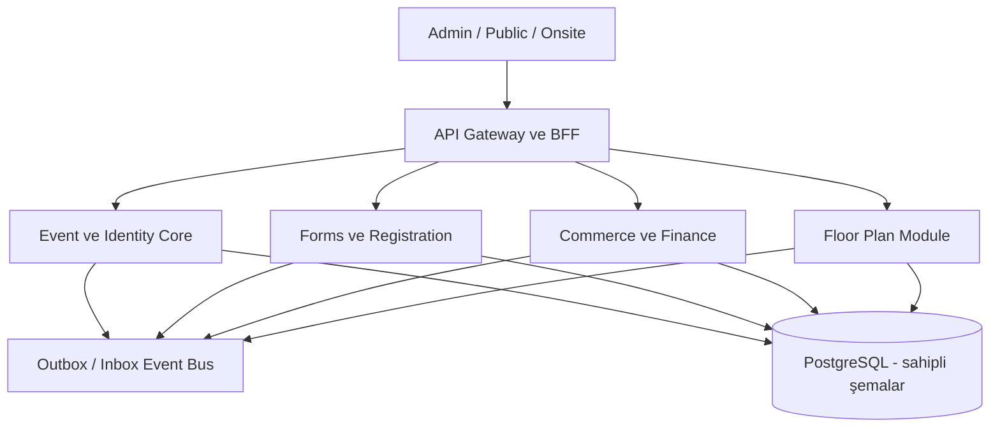

# MavenForms → Maven Event Platform Ana Planı

**Rapor tarihi:** 17 Eylül 2026  
**İncelenen ana kaynak:** `mavenform-main-son.zip`  
**Amaç:** MavenForms'u kayıt/form ürünü sınırından çıkarıp Maven Event Platform'un güvenli çekirdeğine dönüştürmek; Event Floor Plan Studio ile ortak kavram, veritabanı sahipliği ve API/event sözleşmesi kurmak; manuel finans süreçlerinden canlı ödeme ve e-belgeye, en son da Multi-Tenant yapıya ilerlemek.

## Mimari biçim

İlk hedef **modüler monolit + PostgreSQL + ayrı worker süreçleri**dir. Bu, küçük ekipte deploy ve transaction maliyetini düşük tutarken modül sınırlarını korur. Her modül tekil çalışabilmek için kendi API'sini, migration sahipliğini, inbox/outbox'ını ve read projection'ını taşır.

## Bounded context ve tablo sahipliği

| Modül | Sahip olduğu kavramlar | Başka modüllere sunduğu sözleşme |
|---|---|---|
| Identity/Organization | User, Organization, Membership, Role | actor/org context, permission check |
| Event Core | Event, Occurrence, Venue reference, Person, Party | event/person canonical IDs |
| Forms | FormDefinition, FormVersion, Field, Theme | published form snapshot |
| Registration | Registration, RegistrationAnswer, Group | registration lifecycle events |
| Commerce | CatalogItem, Price, Order, OrderItem | balance and fulfillment intent |
| Payments | Payment, Attempt, ManualEvidence, Allocation, Refund | verified financial movement |
| Invoicing | Invoice, Line, Relation, Document, Delivery | legal/document lifecycle |
| Floor Plan | Venue, Hall, Plan, Geometry, Space/Seat inventory, Hold | inventory and assignment API |
| Onsite | Ticket, Credential, CheckInEvent, Device | entry/attendance events |
| Messaging | Template, Audience, Consent, Outbox, Delivery | provider-neutral communication |
| Content | Session, Track, Speaker, Abstract, Review | agenda and program APIs |

## Ortak veritabanı kuralı

Tek PostgreSQL cluster kullanılabilir; ancak “ortak DB” herkesin her tabloya yazması değildir.

- Her tablo için tek owner modül vardır.
- Uygulama kodu başka modülün tablosuna write yapmaz.
- Cross-module okuma API/read model üzerinden yapılır.
- Aynı transaction gereken ilk sürüm akışları modüler monolitte application service ile yürütülür.
- Bağımsız deploy gerektiğinde event/outbox sözleşmesi korunur ve yerel projection kullanılır.
- Finans tabloları append ağırlıklı ve auditli olur; hard delete yapılmaz.
- PostgreSQL geçişi tamamlanmadan canlı finans açılmaz.

## API yaklaşımı

- Versioned REST command/query yüzeyi: `/api/v1/...`.
- Her mutation `Idempotency-Key`, actor, organization ve correlation id taşır.
- Kaynak sürümü için `ETag/If-Match` veya explicit version kullanılır.
- Webhook'lar signature, timestamp tolerance, inbox uniqueness ve retrieve ile doğrulanır.
- Integration event envelope: `eventId`, `eventType`, `schemaVersion`, `occurredAt`, `organizationId`, `aggregateType`, `aggregateId`, `correlationId`, `causationId`, payload.
- PII event payloadına gelişigüzel kopyalanmaz; gerekli projection ayrı amaç ve saklama süresiyle tutulur.

## Tek şirket modu ve Multi-Tenant ayrımı

Faz 1-8'de tek bir iç organization provision edilir; kullanıcı tenant seçmez, platform aboneliği ve custom domain yoktur. Yine de yeni tablolarda organization scope bulunur ve repository filtreleri zorunludur. Bu, SaaS özelliği değildir; güvenli veri şeklidir. Multi-Tenant son fazda provisioning, izolasyon kanıtı, RLS, tenant billing, BYO provider, support access ve domain routing açılır.
