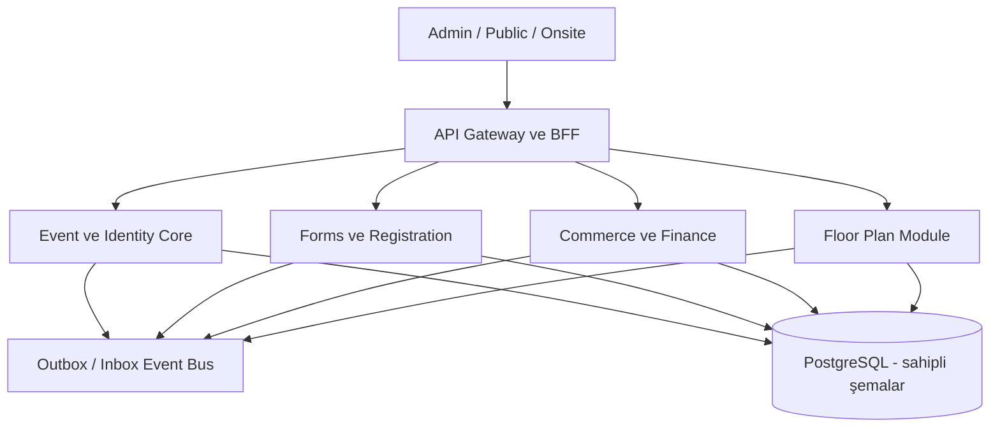

# MavenForms → Maven Event Platform Ana Planı

**Rapor tarihi:** 17 Eylül 2026  
**İncelenen ana kaynak:** `mavenform-main-son.zip`  
**Amaç:** MavenForms'u kayıt/form ürünü sınırından çıkarıp Maven Event Platform'un güvenli çekirdeğine dönüştürmek; Event Floor Plan Studio ile ortak kavram, veritabanı sahipliği ve API/event sözleşmesi kurmak; manuel finans süreçlerinden canlı ödeme ve e-belgeye, en son da Multi-Tenant yapıya ilerlemek.

## Teslimatın ana kararı

MavenForms **doğrudan bugünkü haliyle etkinlik platformu çekirdeği değildir**, fakat doğru bir yeniden sınırlandırmayla çekirdek için en güçlü başlangıç kod tabanıdır. Form yayınlama/snapshot, başvuru, RBAC, denetim kaydı, ödeme sağlayıcı sözleşmeleri, webhook/retrieve, özel belge güvenliği, transactional outbox, fatura belge akışı ve badge üretimi yeniden kullanılabilir. Eksik olan ana katman; `Event`, `Person`, `Registration`, `Order`, kalıcı manuel ödeme defteri ve muhasebe belgesi yaşam döngüsüdür.

Bu paket kaynak kodu değiştirmez. Kod envanterini, sorun kaydını, hedef veri modelini, entegrasyon sözleşmelerini, finans akışlarını, yönetim ekranlarını ve uygulanabilir faz planını teslim eder.

## Okuma sırası

1. `01_YONETICI_OZETI.md`
2. `03_GUNCEL_REPO_DENETIMI.md`
3. `04_MAVENFORMS_KAPSAM_UYUMU.md`
4. `05_HEDEF_MIMARI.md`
5. `06_KANONIK_VERI_MODELI.md`
6. `07_MANUEL_ODEME.md` ve `08_FATURA_EBELGE.md`
7. `09_FLOOR_EDITOR_ENTEGRASYONU.md`
8. `11_YOL_HARITASI.md`
9. `12_GELISTIRME_KONTROL_SISTEMI.md`

## Kanıt sınıfları

| Etiket | Anlamı |
|---|---|
| Kod kanıtı | ZIP içindeki şema, rota, test veya belge doğrudan incelendi. |
| Yerel doğrulama | Bağımlılık istemeyen seçili test komutu çalıştırıldı. |
| Sektör kanıtı | Resmî ürün, standart veya kamu kaynağına dayanır. |
| Öneri | Maven Event Platform için tasarım kararıdır; mevcut özellik iddiası değildir. |
| Canlı kanıt gerekli | Sağlayıcı hesabı, staging, mali müşavir/hukuk veya gerçek saha doğrulaması olmadan tamamlanmış sayılmaz. |

## Kaynak bütünlüğü

ZIP SHA-256: `9943a87ee88e0d55cd4dff1c936c5411c22194024a6e58ca8bb1ce60e19a1232`. Arşiv yorumunda `b314e07ca746d1cabfafc32da2d7c26ef3eda34f` değeri bulunur; `.git` verisi olmadığı için bu değer doğrulanmış commit iddiası olarak kullanılmamıştır.

---

# MavenForms → Maven Event Platform Ana Planı

**Rapor tarihi:** 17 Eylül 2026  
**İncelenen ana kaynak:** `mavenform-main-son.zip`  
**Amaç:** MavenForms'u kayıt/form ürünü sınırından çıkarıp Maven Event Platform'un güvenli çekirdeğine dönüştürmek; Event Floor Plan Studio ile ortak kavram, veritabanı sahipliği ve API/event sözleşmesi kurmak; manuel finans süreçlerinden canlı ödeme ve e-belgeye, en son da Multi-Tenant yapıya ilerlemek.

## Sonuç

MavenForms, Maven Event Platform'un **uygulama temeli ve operasyon çekirdeği** olabilir. `Form` nesnesi platformun merkezine konmamalıdır. Merkez; etkinlik, kişi, kayıt, sipariş ve finans zinciri olmalıdır. Form bu zincirde veri toplama aracıdır. Bu ayrım yapılmadan Floor Editor, biletleme, program, sponsor, konaklama ve mobil deneyim gibi modüller yine birbirinden kopar.

## Bugün ne kadarını karşılıyor?

| Alan | Durum | Karar |
|---|---|---|
| Form oluşturma, yayın snapshot'ı ve başvuru | Güçlü ve yeniden kullanılabilir | Registration intake motoru olur. |
| Kimlik, rol, audit | Kısmen güçlü | Tek şirket pilotunda korunur; oturum ve workspace seçimi sertleştirilir. |
| Ödeme altyapısı | Yerel sözleşme seviyesi güçlü, production kanıtı yok | `Order/Payment/Allocation` modeline taşınır. |
| Manuel ödeme | Yetersiz | Başvurudaki durum alanı yerine kalıcı finans hareketi gerekir. |
| Fatura belge güvenliği | Güçlü temel | Fatura tekil `PaymentOrder` eki olmaktan çıkarılır. |
| Paraşüt | Adapter ve sözleşme hazırlığı var | Canlı hesap/staging kanıtından önce açılmaz. |
| Badge | Üretim/export güvenliği güçlü | Ticket ve check-in modeli eklenmeden onsite modülü sayılmaz. |
| E-posta/outbox | Güçlü temel | Form bağımlılığı kaldırılıp genel domain outbox'a genişletilir. |
| Event/venue/session/speaker | Yok | Çekirdek yeniden kurulumunun parçasıdır. |
| Floor plan ve oturma | Ayrı projede kısmi | Platform çekirdeğine API/event ile bağlanır. |
| Multi-Tenant ürün | Erken sözleşmeler var, release yok | Son ürün kapısıdır. Veri izolasyonu kontrolleri baştan korunur. |

## Beş zorunlu mimari karar

1. **MavenForms kod tabanı evrimleştirilir; form şeması evrensel domain yapılmaz.**
2. **İlk sürüm tek şirket içindir.** Mevcut `Workspace`, sabit iç organizasyon adaptörü olarak kullanılabilir. Yeni kayıtlar yine `organizationId/workspaceId` taşır; bu gelecekte büyük veri göçünü önler.
3. **PostgreSQL ve modüler monolit ilk hedeftir.** Modüller aynı cluster'da ayrı şema/table ownership ile çalışır; başka modülün tablosuna doğrudan yazmaz.
4. **Finans zinciri:** `Order → Payment → PaymentAllocation → Invoice/Document → Delivery`. Manuel ve sağlayıcı ödemeleri aynı defterde farklı kaynak türleridir.
5. **Multi-Tenant son kapıdır.** Provisioning, tenant self-service, custom domain, tenant billing, tenant-a özgü provider hesabı ve RLS release'i ancak iç pilot, canlı ödeme, fatura gönderimi ve Floor Editor entegrasyonu kanıtlandıktan sonra açılır.

## İlk 90 günlük hedef

İlk 90 günde amaç genel Event Management ürününü bitirmek değildir. Çalışan ve ölçülebilir iç akış şu olmalıdır:

`Etkinlik oluştur → kayıt formu bağla → kişi/kayıt üret → sipariş çıkar → havale/nakit/çek/PO ödemesini kanıtıyla kaydet → kısmi/tam ödeme ve kalan bakiye hesapla → manuel fatura talebi ve belge kontrolü → badge üret → Floor Editor'da katılımcıyı/alanı eşleştir → audit ve raporla.`

Bu akış tamamlanmadan sanal POS, otomatik e-fatura veya Multi-Tenant açılması ürün borcunu büyütür.

---

# MavenForms → Maven Event Platform Ana Planı

**Rapor tarihi:** 17 Eylül 2026  
**İncelenen ana kaynak:** `mavenform-main-son.zip`  
**Amaç:** MavenForms'u kayıt/form ürünü sınırından çıkarıp Maven Event Platform'un güvenli çekirdeğine dönüştürmek; Event Floor Plan Studio ile ortak kavram, veritabanı sahipliği ve API/event sözleşmesi kurmak; manuel finans süreçlerinden canlı ödeme ve e-belgeye, en son da Multi-Tenant yapıya ilerlemek.

## Sektörde ortak ürün omurgası

Cvent, EventsAir, Swoogo, Swapcard ve Eventleaf'in resmî ürün yüzeyleri birlikte okunduğunda kapsam beş yaşam döngüsünde toplanır:

| Yaşam döngüsü | Sektör modülleri |
|---|---|
| Planlama | Etkinlik portföyü, bütçe, görev, venue/hall, tedarikçi, floor plan, envanter |
| Satış ve kayıt | Event site, kayıt, bilet/fiyat, promosyon, grup kaydı, waitlist, ödeme, fatura |
| İçerik | Program, session/track, speaker, abstract/CFP, hakemlik, doküman/proceedings |
| Saha | Check-in, badge, koltuk/masa/stant, erişim kontrolü, session attendance, kiosk/offline |
| Etkileşim ve gelir | Mobil uygulama, bildirim, networking, matchmaking, sponsor/exhibitor, lead retrieval, survey, analytics/CRM |

EventsAir; kayıt, bütçe, lojistik, speaker, abstract, sponsor/exhibitor, konaklama, check-in/badge, networking, analytics ve ödeme işlemesini aynı ürün ailesinde listeler. Swoogo; kayıt, event hub, lojistik, mobil uygulama, session/speaker, REST API, webhook ve çok sayıda ödeme gateway'ini birlikte sunar. Swapcard'ın odağı sponsor/exhibitor çalışma alanı, lead capture, networking ve ROI'dir. Bu dağılım, “Event Management”ın yalnız form+bilet olmadığını gösterir.

## Sektör doğruları ve platforma etkisi

1. **Başvuru, kişi ve kayıt farklıdır.** Bir kişi birden çok etkinliğe kayıt olabilir; aynı etkinlikte kayıt revize olabilir; bir grup siparişi birden çok katılımcı yaratabilir.
2. **Sipariş ödeme ile aynı şey değildir.** Sipariş borcu; ödeme tahsilatı; allocation ise ödemenin hangi borçlara dağıldığıdır. Cvent'in offline ödeme akışı ödeme detayını girip gerekirse dağıtmayı ayrı adımlar olarak ele alır.
3. **Offline ödeme bir istisna alanı değil, finans hareketidir.** Cvent çek, satın alma emri ve offline payment seçeneklerini; offline ödeme kaydı ve toplu importu; partial payment'ı ayrı yetenekler olarak sunar. Manuel kayıt mutabakat, düzeltme ve audit gerektirir.
4. **Fatura ile ödeme bağı gevşektir.** Fatura ödeme öncesi düzenlenebilir, kısmi tahsil edilebilir, iptal/itiraz/iade/credit note ilişkileri taşıyabilir. Tek PaymentOrder'a tek Invoice kısıtı gerçek yaşam döngüsünü karşılamaz.
5. **Badge check-in değildir.** Badge bir çıktı/tanıtıcıdır; check-in ise zaman, kapı, cihaz, operatör, event/session ve tekrar politikasına sahip attendance hareketidir.
6. **Floor plan satışla eşzamanlı envanter yönetir.** Seats.io örneğinde hold token, booking ve release farklı işlemlerdir. Erken release double-booking riski taşır. Maven'da `AVAILABLE/HELD/RESERVED/BOOKED/BLOCKED` ve süreli hold gerekir.
7. **API ve webhook ürün özelliğidir.** Swoogo 140+ REST endpoint ile event, registrant, session, speaker ve sponsor yönetimini; webhook ile kayıt ve check-in değişikliklerini entegrasyon yüzeyi sayar.
8. **Dağıtık akış en az bir kez teslim varsayar.** Webhook tekrar gelebilir ve sırası garanti edilmeyebilir. İdempotency, inbox/outbox, retrieve/reconciliation ve durum geçiş kontrolü zorunludur.
9. **Kart verisi platforma girmemelidir.** Hosted/redirect ödeme sayfası kapsamı azaltır; PCI SSC yine e-ticaret sayfasının script saldırılarına karşı korunmasını ister.
10. **Kişisel veri amacı event bağlamında tutulmalıdır.** Kayıt, badge, networking, pazarlama ve sponsor lead paylaşımı aynı amaç değildir; aydınlatma/tercih/saklama politikası ayrı tutulur.

## Rakiplerden alınacak ürün dersi

| Ürün | Güçlü sinyal | Maven kararı |
|---|---|---|
| Cvent | Registration + offline/partial payment + diagramming entegrasyonu | Sipariş/ödeme/floor envanteri aynı event kimliğine bağlanmalı. |
| EventsAir | Planlama, içerik, lojistik, konaklama, onsite tek ekosistem | Ana platform modül kataloğu geniş tutulmalı, teslim sırası dar tutulmalı. |
| Swoogo | Özelleştirilebilir kayıt + açık API/webhook + çok gateway | MavenForms form motoru korunur; public API ürünün erken parçası olur. |
| Swapcard | Exhibitor center, lead capture, networking ve ROI | Sponsor/exhibitor ayrı bounded context olmalı. |
| Eventleaf | Badge/check-in, booth sale, abstract, engagement | Badge mevcut gücünün yanına attendance ve booth inventory eklenmeli. |
| Seats.io | Hold/book/release ve orderId | Floor Editor bağlantısı süreli rezervasyon ve idempotent booking kullanmalı. |

Kaynakların tam listesi `15_KAYNAKLAR_VE_SINIRLAR.md` içindedir.

---

# MavenForms → Maven Event Platform Ana Planı

**Rapor tarihi:** 17 Eylül 2026  
**İncelenen ana kaynak:** `mavenform-main-son.zip`  
**Amaç:** MavenForms'u kayıt/form ürünü sınırından çıkarıp Maven Event Platform'un güvenli çekirdeğine dönüştürmek; Event Floor Plan Studio ile ortak kavram, veritabanı sahipliği ve API/event sözleşmesi kurmak; manuel finans süreçlerinden canlı ödeme ve e-belgeye, en son da Multi-Tenant yapıya ilerlemek.

## Teknik envanter

Güncel ZIP'te 49 Prisma modeli, 70 API route handler, 389 TypeScript/TSX dosyası ve 456 adet `.mjs` test dosyası vardır. Test adlarında ödeme 75, fatura 77, badge 46, e-posta 36, Paraşüt 25 ve form UX 55 kez kapsanır; kategoriler çakışabilir. Kod tabanı küçük bir demo değildir.

## Korunacak güçlü parçalar

- Yayınlanmış form snapshot'ı ve public allowlist yaklaşımı.
- Workspace kapsamlı RBAC ve audit log temeli.
- PaymentOrder, PaymentAttempt, webhook inbox, retrieve/reconciliation ve idempotency sözleşmeleri.
- InvoiceRecipientSnapshot, line snapshot, belge quarantine/scan/decision ve delivery intent yaklaşımı.
- Transactional outbox, retry/lease/dead-letter düşüncesi.
- Dosya MIME/size/hash/archive bomb ve private visibility kontrolleri.
- Badge template, render, QR, PDF/ZIP, artifact ve READY-only dağıtım zinciri.
- Paraşüt bağlantı/sağlık/contact/product/invoice adapter hazırlıkları.

## Kritik sorunlar

| No | Seviye | Kod kanıtı | Etki | Gerekli değişiklik |
|---:|---|---|---|---|
| 1 | Kritik | `Submission.paymentStatus` yalnız string | Manuel tahsilat tutar, yöntem, tarih, referans, kanıt ve onay taşımaz. | Immutable PaymentEntry/Payment ledger. |
| 2 | Kritik | Manuel durum evaluator'ı `unpaid/paid/review/refunded`; API `pending/authorized/paid/failed/refunded/partially_refunded` | İki farklı ödeme dili vardır. | Tek kanonik ödeme durumu ve kaynak türü. |
| 3 | Kritik | Invoice candidate çoğunlukla `PaymentOrder.status=succeeded` ister | Manuel ödenmiş kayıt doğal biçimde fatura akışına giremez. | Order balance ve allocation tabanlı adaylık. |
| 4 | Yüksek | `InvoiceRecord.paymentOrderId @unique` | Avans, çoklu ödeme, iade faturası/credit note, replacement zinciri zorlaşır. | Invoice bağımsız aggregate + relation chain. |
| 5 | Yüksek | Form odaklı `PaymentOrder.formId` zorunlu | Sponsorluk, stand, konaklama, grup siparişi gibi form dışı kalemler finansı kullanamaz. | Order ve OrderItem ilk sınıf model. |
| 6 | Kritik | Event/Person/Registration/Ticket yok | Platform domain'i kurulmamış. | Canonical event core. |
| 7 | Yüksek | `OutboxEvent` form ve submission zorunlu | Floor plan, order, invoice, attendance event'leri genel outbox'ı kullanamaz. | Generic IntegrationOutbox. |
| 8 | Yüksek | Public submission idempotency `publicToken` global; payload hash yok | Aynı anahtar farklı form/payload ile sessiz duplicate olabilir. | Scope + request hash + stored response. |
| 9 | Yüksek | Response limit transaction öncesi `submissionCount` ile kontrol | Eşzamanlı istek kapasiteyi aşabilir. | DB transaction/lock veya inventory counter. |
| 10 | Yüksek | SQLite pilot tabanı | Finans eşzamanlılığı, worker ve gelecek RLS için zayıf hedef. | PostgreSQL migration rehearsal. |
| 11 | Yüksek | 30 günlük raw DB session token | Token sızıntısı ve iptal kontrolü riski. | Hashli session, kısa access, refresh rotation, explicit workspace. |
| 12 | Yüksek | İlk aktif workspace sessiz seçilir | Birden çok üyelikte yanlış bağlam riski. | Workspace/org claim ve kullanıcı seçimi. |
| 13 | Yüksek | `scripts/context-check.mjs`, bulunmayan `scripts/local-ready.mjs` ister | Resmî geliştirme kapısı güncel ZIP'te çalışmıyor; çok sayıda packet de aynı dosyaya bağlı. | Önce paket bütünlüğünü düzelt. |
| 14 | Orta | Package'da birleştirilmiş `test` scripti yok | 456 testin standart CI yürütümü belirsiz. | Tek kanonik runner ve CI matrisi. |
| 15 | Orta | STATUS `R10-V4-26-44 PASS` ve `R10-V4-44 WIP` der | Release gerçeği çelişkili. | Tek makine-okunur evidence registry. |
| 16 | Yüksek | Badge var, attendance/check-in domain'i yok | Badge scan adı dosya AV taramasıyla karışabilir; saha giriş kaydı yok. | CheckInEvent ve AccessPolicy. |
| 17 | Yüksek | Workspace tenant özellikleri erken büyümüş | Tek şirket çekirdeği bitmeden SaaS karmaşıklığı yaratıyor. | SaaS provisioning/release'i dondur, izolasyonu koru. |

## Yerel doğrulama sonucu

Seçili bağımsız testlerden `badge-contract`, `manual-payment-status`, `payment-state` ve `invoice-state` geçti. `invoice-manual-chain` doğrudan Node çalıştırmasında `@/lib` alias çözülmediği için çalışmadı; bu sonuç iş kuralı hatası kanıtı değildir, standart test harness eksikliğinin kanıtıdır. `context:check`, ZIP'te `scripts/local-ready.mjs` bulunmadığı için BLOCKED oldu. `node_modules` yoktu; build/lint/typecheck ve canlı servis çalıştırması yapılmadı.

## Release gerçeği

Repo'nun kendi `STATUS.md` dosyası üretimi `NO-GO/BLOCKED` olarak tanımlar. Canlı provider, AV/quarantine, sender domain, staging, backup/restore ve hukuk/muhasebe kanıtları olmadan “hazır” iddiası kurulamaz. Bu rapor da aynı ayrımı korur: sözleşme testi başarısı, gerçek tahsilat veya yasal e-belge gönderimi değildir.

---

# MavenForms → Maven Event Platform Ana Planı

**Rapor tarihi:** 17 Eylül 2026  
**İncelenen ana kaynak:** `mavenform-main-son.zip`  
**Amaç:** MavenForms'u kayıt/form ürünü sınırından çıkarıp Maven Event Platform'un güvenli çekirdeğine dönüştürmek; Event Floor Plan Studio ile ortak kavram, veritabanı sahipliği ve API/event sözleşmesi kurmak; manuel finans süreçlerinden canlı ödeme ve e-belgeye, en son da Multi-Tenant yapıya ilerlemek.

## Ölçüm yöntemi

Her ihtiyaç dört seviyeden biriyle değerlendirilmiştir: **Yeniden kullan**, **Dönüştür**, **Yeni geliştir**, **Canlı kanıt bekliyor**. Bu bir pazarlama yüzdesi değil, iş paketleme karar aracıdır.

| Event Platform ihtiyacı | Mevcut karşılık | Seviye | Hedef |
|---|---|---|---|
| Organizasyon, kullanıcı, rol | Workspace/Member/RBAC | Dönüştür | Tek şirket modu; final fazda tenant provisioning. |
| Event katalog/occurrence | Yok | Yeni geliştir | Event, occurrence, timezone, status, owner. |
| Venue/hall/floor plan | Ayrı EFPS | Dönüştür | EFPS sahibi; core Event ID kullanır. |
| Kişi/kurum/contact | Submission values, EFPS Company/Attendee | Yeni geliştir | Canonical Person/OrganizationParty. |
| Form/builder | Güçlü | Yeniden kullan | FormDefinition + EventFormBinding. |
| Registration | Submission kısmi | Dönüştür | Registration aggregate, history, approval, group. |
| Ticket/entitlement | Yok | Yeni geliştir | TicketType, Entitlement, Ticket. |
| Pricing/promo/tax | Form pricing JSON kısmi | Dönüştür | PriceList, PriceRule, Discount, TaxSnapshot. |
| Order/order item | PaymentOrder ödeme odaklı | Yeni geliştir | Order, OrderItem, balance. |
| Manuel ödeme | Scalar status | Yeni geliştir | PaymentEntry + evidence + approval + allocation. |
| Online ödeme | Stripe/iyzico hazırlığı | Dönüştür + canlı kanıt | Hosted checkout, webhook, retrieve, refund. |
| Fatura kontrol | Güçlü belge akışı, dar ilişki | Dönüştür | Invoice aggregate, document chain, delivery. |
| e-Fatura/e-Arşiv | Paraşüt hazırlığı | Canlı kanıt bekliyor | Provider adapter, inbox, PDF/XML, legal reconciliation. |
| Badge | Güçlü üretim zinciri | Yeniden kullan | Ticket/participant snapshot'tan üret. |
| Check-in/attendance | Yok | Yeni geliştir | Event/session/door movement, offline sync. |
| Program/session/speaker | Yok | Yeni geliştir | Content module. |
| Abstract/review | Formla başlanabilir | Yeni geliştir | Submission/review/scheduling bounded context. |
| Sponsor/exhibitor/lead | EFPS Company kısmi | Yeni geliştir | Contract/package/booth/lead consent. |
| Communication | Email/outbox güçlü | Dönüştür | Event audience, consent, template, channel. |
| Survey/poll | Form motoru kullanılabilir | Dönüştür | Event/session survey binding + analytics. |
| Analytics/export | Form raporu kısmi | Dönüştür | Event metrics/read models; financial reconciliation. |
| CRM/integration API | Webhook türü kısmi | Dönüştür | Versioned API, inbox/outbox, external ID map. |
| Accommodation/travel | Yok | Yeni geliştir | İhtiyaç doğrulanırsa ayrı modül. |
| Mobile attendee app | Yok | Yeni geliştir | Sonraki ürün dalgası. |
| Multi-Tenant SaaS | Erken modeller/gates | Final faz | Tenant lifecycle, billing, custom domain, RLS. |

## MavenForms'un çekirdekte karşılayabileceği kesin kapsam

Doğru refactor sonrasında MavenForms şu çekirdekleri doğrudan taşıyabilir: kimlik ve yetki, form şeması ve yayınlama, kayıt intake, sipariş/ödeme/fatura workflow'ları, güvenli dosya, bildirim/outbox, badge üretimi, audit ve entegrasyon adaptörleri. Program, abstract, sponsor/exhibitor, floor plan, onsite attendance ve mobil deneyim ayrı modüllerdir; MavenForms bunların kimlik/olay/finans servislerini sağlar.

## Çekirdek olamayacağı durum

Eğer `Submission` kişi, kayıt, sipariş, bilet ve fatura yerine kullanılmaya devam ederse MavenForms yalnız bir form uygulaması olarak kalır. Dönüşümün başarı ölçütü yeni ekran sayısı değil, bu kavramların bağımsız kimlik ve yaşam döngüsüne sahip olmasıdır.

---

# MavenForms → Maven Event Platform Ana Planı

**Rapor tarihi:** 17 Eylül 2026  
**İncelenen ana kaynak:** `mavenform-main-son.zip`  
**Amaç:** MavenForms'u kayıt/form ürünü sınırından çıkarıp Maven Event Platform'un güvenli çekirdeğine dönüştürmek; Event Floor Plan Studio ile ortak kavram, veritabanı sahipliği ve API/event sözleşmesi kurmak; manuel finans süreçlerinden canlı ödeme ve e-belgeye, en son da Multi-Tenant yapıya ilerlemek.

## Mimari biçim

İlk hedef **modüler monolit + PostgreSQL + ayrı worker süreçleri**dir. Bu, küçük ekipte deploy ve transaction maliyetini düşük tutarken modül sınırlarını korur. Her modül tekil çalışabilmek için kendi API'sini, migration sahipliğini, inbox/outbox'ını ve read projection'ını taşır.

## Bounded context ve tablo sahipliği

| Modül | Sahip olduğu kavramlar | Başka modüllere sunduğu sözleşme |
|---|---|---|
| Identity/Organization | User, Organization, Membership, Role | actor/org context, permission check |
| Event Core | Event, Occurrence, Venue reference, Person, Party | event/person canonical IDs |
| Forms | FormDefinition, FormVersion, Field, Theme | published form snapshot |
| Registration | Registration, RegistrationAnswer, Group | registration lifecycle events |
| Commerce | CatalogItem, Price, Order, OrderItem | balance and fulfillment intent |
| Payments | Payment, Attempt, ManualEvidence, Allocation, Refund | verified financial movement |
| Invoicing | Invoice, Line, Relation, Document, Delivery | legal/document lifecycle |
| Floor Plan | Venue, Hall, Plan, Geometry, Space/Seat inventory, Hold | inventory and assignment API |
| Onsite | Ticket, Credential, CheckInEvent, Device | entry/attendance events |
| Messaging | Template, Audience, Consent, Outbox, Delivery | provider-neutral communication |
| Content | Session, Track, Speaker, Abstract, Review | agenda and program APIs |

## Ortak veritabanı kuralı

Tek PostgreSQL cluster kullanılabilir; ancak “ortak DB” herkesin her tabloya yazması değildir.

- Her tablo için tek owner modül vardır.
- Uygulama kodu başka modülün tablosuna write yapmaz.
- Cross-module okuma API/read model üzerinden yapılır.
- Aynı transaction gereken ilk sürüm akışları modüler monolitte application service ile yürütülür.
- Bağımsız deploy gerektiğinde event/outbox sözleşmesi korunur ve yerel projection kullanılır.
- Finans tabloları append ağırlıklı ve auditli olur; hard delete yapılmaz.
- PostgreSQL geçişi tamamlanmadan canlı finans açılmaz.

## API yaklaşımı

- Versioned REST command/query yüzeyi: `/api/v1/...`.
- Her mutation `Idempotency-Key`, actor, organization ve correlation id taşır.
- Kaynak sürümü için `ETag/If-Match` veya explicit version kullanılır.
- Webhook'lar signature, timestamp tolerance, inbox uniqueness ve retrieve ile doğrulanır.
- Integration event envelope: `eventId`, `eventType`, `schemaVersion`, `occurredAt`, `organizationId`, `aggregateType`, `aggregateId`, `correlationId`, `causationId`, payload.
- PII event payloadına gelişigüzel kopyalanmaz; gerekli projection ayrı amaç ve saklama süresiyle tutulur.

## Tek şirket modu ve Multi-Tenant ayrımı

Faz 1-8'de tek bir iç organization provision edilir; kullanıcı tenant seçmez, platform aboneliği ve custom domain yoktur. Yine de yeni tablolarda organization scope bulunur ve repository filtreleri zorunludur. Bu, SaaS özelliği değildir; güvenli veri şeklidir. Multi-Tenant son fazda provisioning, izolasyon kanıtı, RLS, tenant billing, BYO provider, support access ve domain routing açılır.

---

# MavenForms → Maven Event Platform Ana Planı

**Rapor tarihi:** 17 Eylül 2026  
**İncelenen ana kaynak:** `mavenform-main-son.zip`  
**Amaç:** MavenForms'u kayıt/form ürünü sınırından çıkarıp Maven Event Platform'un güvenli çekirdeğine dönüştürmek; Event Floor Plan Studio ile ortak kavram, veritabanı sahipliği ve API/event sözleşmesi kurmak; manuel finans süreçlerinden canlı ödeme ve e-belgeye, en son da Multi-Tenant yapıya ilerlemek.

## Çekirdek model

| Entity | Sorumluluk | Ana ilişki |
|---|---|---|
| Organization | Veri ve politika kapsamı | Users, Events, provider connections |
| Event | Ürün/operasyon üst kimliği | Occurrences, forms, price lists, plans |
| EventOccurrence | Tarih, saat, timezone, venue/hall | sessions, inventory, check-in |
| Person | Tek gerçek kişi kaydı | registrations, contacts, credentials |
| Registration | Kişinin event'e katılım başvurusu | form snapshot, answers, status history |
| TicketType | Satılabilir/atanabilir katılım hakkı tipi | price, capacity, entitlements |
| Ticket | Verilmiş katılım hakkı | registration/order item/check-in |
| Order | Alacak/borç ve müşteri bağlamı | items, payments, invoices |
| OrderItem | Fiyat/tax/discount snapshot | ticket, booth, sponsorship, service |
| Payment | Manuel veya provider tahsilat/çıkış hareketi | attempts, evidence, refunds |
| PaymentAllocation | Ödemenin sipariş/faturaya dağılımı | amount and reversal chain |
| Invoice | Mali belge iş akışı | lines, relations, documents, delivery |
| InvoiceRelation | İptal/iade/credit/debit/replacement bağı | source and target invoice |
| InventoryItem | Seat, booth, table, capacity bucket | hold/reservation/booking |
| InventoryHold | Süreli ve tokenlı ayırma | order/session |
| Credential | QR/badge kimliği | ticket/person/event |
| CheckInEvent | Giriş/çıkış/attendance hareketi | credential, gate, device, occurrence |

## Mevcut modelden hedefe geçiş

| Mevcut | Hedef | Göç kararı |
|---|---|---|
| Workspace | Organization | İlk aşamada 1:1 map; ID korunabilir. |
| Form | FormDefinition | EventFormBinding ile event/purpose eklenir. |
| Submission | Submission + Registration | Ham cevap korunur; başarılı dönüşüm registration üretir. |
| Submission.paymentStatus | Kaldırılacak projection | Payment/Allocation bakiyesinden hesaplanır. |
| PaymentOrder | Order + PaymentAttempt | Eski kayıtlar migration source olarak tutulur. |
| InvoiceRecord | Invoice | PaymentOrder unique bağı çözülür. |
| InvoiceLineSnapshot | InvoiceLine | Snapshot yaklaşımı korunur. |
| InvoiceDocument/Decision/Delivery | Aynı bounded context | Büyük ölçüde yeniden kullanılır. |
| OutboxEvent | IntegrationOutbox + MessageDelivery | Form/submission zorunluluğu kaldırılır. |
| EFPS Event | Core Event reference | EFPS'de authoritative kopya kaldırılır veya read projection olur. |
| EFPS Attendee | Participant projection | `registrationId/personId/ticketId` referansı; sınırlı display snapshot. |

## Durum makineleri

**Registration:** `draft → submitted → pending_review → confirmed | rejected | waitlisted → cancelled`. Finans durumu registration statüsüne gömülmez.

**Order:** `draft → open → partially_paid → paid → fulfilled`; ayrıca `cancelled`, `refunding`, `refunded`. Bakiye hesaplanmış projection'dır.

**Payment:** `recorded/pending → under_review → confirmed → allocated`; hata/düzeltme için `rejected`, `reversed`, `partially_refunded`, `refunded`, `disputed`. Manuel ödeme provider authorization durumlarını taklit etmez.

**Invoice:** `requested → data_review → approved_for_issue → issued → delivered`; ayrıca `rejected`, `delivery_failed`, `cancel_requested`, `cancelled`, `credited`, `replaced`. “PDF yüklendi” ile “yasal belge düzenlendi” aynı durum değildir.

**Inventory:** `available → held → reserved/booked`; `blocked` ve `released`. Hold TTL dolunca otomatik release; paid order sonrası idempotent booking.

## Finansal invariantlar

- Para birimi tutarları minor unit ve ISO currency ile tutulur.
- Order total; item snapshots toplamıdır, sonradan fiyat kataloğundan tekrar hesaplanmaz.
- Allocation toplamı payment net tutarını aşamaz.
- Confirmed/reversed hareketler güncellenmez; düzeltme karşı hareketle yapılır.
- Refund, özgün payment/transaction ve order item bağı taşır.
- Invoice ve payment mutabakatı ayrı projection'dır; biri diğerinin varlığını otomatik kanıtlamaz.
- Tüm mutation'larda organization scope ve optimistic concurrency vardır.

---

# MavenForms → Maven Event Platform Ana Planı

**Rapor tarihi:** 17 Eylül 2026  
**İncelenen ana kaynak:** `mavenform-main-son.zip`  
**Amaç:** MavenForms'u kayıt/form ürünü sınırından çıkarıp Maven Event Platform'un güvenli çekirdeğine dönüştürmek; Event Floor Plan Studio ile ortak kavram, veritabanı sahipliği ve API/event sözleşmesi kurmak; manuel finans süreçlerinden canlı ödeme ve e-belgeye, en son da Multi-Tenant yapıya ilerlemek.

## Neden ilk ürün fazı olmalı?

Şirket içi pilotta banka havalesi/EFT, nakit, çek, satın alma emri, proforma sonrası ödeme veya harici POS gibi yöntemler gerçek hayatın parçasıdır. Cvent'in offline payment yaklaşımı ödeme türü, tutar ve dağıtımı ayrı yönetir; Paraşüt'te de tahsilat ve kısmi tahsilat kavramları vardır. Mevcut MavenForms yalnız “paid” işareti tutabildiği için mutabakat yapamaz.

## Manuel Payment kaydı

Zorunlu alanlar: organization, payer/customer, currency, amount, method, value date, recorded date, reference, source, status, recorder, approver, evidence hash ve idempotency key. Bank transfer için banka/işlem referansı; çek için numara/vade; nakit için kasa/receipt; PO için sipariş belgesi ve beklenen ödeme tarihi eklenir. Hassas banka verileri gereksiz kopyalanmaz.

## Akış

1. Finans kullanıcısı açık siparişi seçer.
2. Ödeme yöntemi, tutar, tarih ve referans girer; belge yükler.
3. Sistem aynı referans+tutar+tarih kombinasyonunda olası duplicate uyarısı verir.
4. `recorded` hareket, yetki matrisine göre ikinci onay ister.
5. Onaylayan kişi kaydı `confirmed` yapar; aynı kullanıcı yüksek tutarlı kaydı hem oluşturup hem onaylayamaz.
6. PaymentAllocation ile tutar bir veya daha çok order'a dağıtılır.
7. Order balance transaction içinde güncellenir; partial/paid projection üretilir.
8. Yanlış kayıt editlenmez; reversal ve yeni doğru payment oluşturulur.

## Kabul senaryoları

- Tam havale tek order'a ayrılır ve order `paid` olur.
- Kısmi havale order'ı `partially_paid` yapar; kalan bakiye görünür.
- Tek ödeme bir grup siparişinin birden çok item/registration'ına dağıtılır.
- Aynı banka referansı tekrar girilirse duplicate/review akışına düşer.
- Fazla ödeme `unallocatedAmount` olarak kalır; otomatik gelir yazılmaz.
- Farklı currency allocation reddedilir veya onaylı FX snapshot ister.
- Reversal, bakiyeyi geri açar ve audit zincirini korur.
- Refund, özgün payment'a bağlı yeni hareket olarak kaydedilir.
- Belgesiz ödeme, belirlenen eşik üstünde onaylanamaz.
- Export toplamı ledger toplamıyla aynı çıkar.

## Admin ekranları

`Finans > Açık Bakiyeler`, `Ödeme Kaydet`, `İnceleme Kuyruğu`, `Dağıtılmamış Ödemeler`, `Mutabakat`, `İade/Düzeltme`, `Kanıt Belgeleri` ve `Audit` ekranları gerekir. Dashboard yalnız “paid” sayısı değil; tahsil edilen, açık, kısmi, incelemede, iade ve dağıtılmamış tutarları para birimine göre gösterir.

## Faz kapısı

İç pilotta hiçbir canlı provider gerekmez. Ancak dört göz onayı, duplicate kontrolü, reversal, allocation, export/reconciliation ve backup/restore kanıtı olmadan manuel finans fazı tamamlanmış sayılmaz.

---

# MavenForms → Maven Event Platform Ana Planı

**Rapor tarihi:** 17 Eylül 2026  
**İncelenen ana kaynak:** `mavenform-main-son.zip`  
**Amaç:** MavenForms'u kayıt/form ürünü sınırından çıkarıp Maven Event Platform'un güvenli çekirdeğine dönüştürmek; Event Floor Plan Studio ile ortak kavram, veritabanı sahipliği ve API/event sözleşmesi kurmak; manuel finans süreçlerinden canlı ödeme ve e-belgeye, en son da Multi-Tenant yapıya ilerlemek.

## Manuel fatura kontrolü — ilk sürüm

İlk sürüm e-belge üretmez. Platform fatura talebini ve kontrol zincirini yönetir; muhasebe dış sistemde belgeyi düzenler, PDF/XML veya referansı Maven'a yükler, ikinci kullanıcı eşleşmeyi onaylar ve gönderimi kontrollü yapar.

### Ayrılması gereken kavramlar

| Kavram | Anlam |
|---|---|
| InvoiceRequest | Kullanıcının/operasyonun belge talebi ve alıcı verisi |
| Invoice | Mali belgenin kanonik kaydı, numarası, UUID'si, tipi ve tutarı |
| InvoiceDocument | PDF/XML/UBL gibi özel dosya; hash, scan ve visibility taşır |
| InvoiceRelation | İptal, iade, credit/debit note veya replacement ilişkisi |
| InvoiceDelivery | Kime, hangi kanaldan, hangi belge sürümü gönderildiği |
| AccountingSync | Paraşüt/GİB durum eşleme ve provider kanıtı |

### Manuel akış

1. Paid veya onaylı post-pay order için fatura talebi açılır.
2. Alıcı tipi, unvan, vergi/TCKN alanları, adres, e-posta ve satır snapshot'ları server tarafında doğrulanır.
3. Muhasebe kuyruğu belge türünü ve vergi kararını kontrol eder.
4. Harici muhasebe sisteminde düzenlenen belge yüklenir; MIME/hash/AV/quarantine uygulanır.
5. Sistem tutar, currency, order ve alıcı eşleşmesi önerir; kullanıcı açıkça onaylar.
6. Belge `ready` olur; gönderim intent'i ayrı oluşturulur.
7. Teslimat sonucu provider evidence ile güncellenir; başarısızlık fatura durumunu geriye yazmaz.

## GİB/e-belge gerçeği

GİB'in resmî iptal/itiraz portalı fatura numarası ve tutar bilgisiyle imzalı talep ister. Bu bile belge yaşam döngüsünün `issued` sonrasında bitmediğini gösterir. İptal/itiraz süreleri, e-Fatura/e-Arşiv senaryoları, KDV/tevkifat/istisna ve belge tipi kararları kodlanmadan önce mali müşavir ve güncel resmî kılavuzla doğrulanmalıdır. Rapor, vergi hukuku kararı vermez; sistemin bu kararları snapshot ve audit ile taşımasını ister.

## Otomasyon fazları

| Alt faz | Kapsam | Go kapısı |
|---|---|---|
| F3A | Manuel request, alıcı/satır kontrolü, belge upload | İç muhasebe UAT |
| F3B | Güvenli belge gönderimi ve delivery evidence | Domain/sender doğrulaması |
| F7A | Paraşüt OAuth/connection health ve read-only lookup | Sandbox/staging kanıtı |
| F7B | Contact/product eşleme ve explicit approval | Muhasebe örnek seti |
| F7C | Sales invoice create + job polling + provider IDs | Canlı olmayan gerçek hesap kanıtı |
| F7D | e-Fatura/e-Arşiv formalization, PDF/XML inbox | Mali müşavir kabulü |
| F7E | İptal/iade/credit note reconciliation | Uçtan uca ledger mutabakatı |

## Mevcut koda özel değişiklikler

- `InvoiceRecord.paymentOrderId @unique` kaldırılmalı; invoice order/customer'a bağlanmalı.
- Invoice-payment ilişkisi gerektiğinde junction/allocation tablosu olmalı.
- `InvoiceRelation` eklenmeli.
- Document/Decision/Delivery modelleri korunmalı; organization ve immutable version bağı güçlendirilmeli.
- Invoice candidate, yalnız succeeded provider payment değil, order policy ve confirmed allocations üzerinden üretilmeli.
- Refund/chargeback sonrası otomatik belge iptali yapılmamalı; accounting review task açılmalı.

---

# MavenForms → Maven Event Platform Ana Planı

**Rapor tarihi:** 17 Eylül 2026  
**İncelenen ana kaynak:** `mavenform-main-son.zip`  
**Amaç:** MavenForms'u kayıt/form ürünü sınırından çıkarıp Maven Event Platform'un güvenli çekirdeğine dönüştürmek; Event Floor Plan Studio ile ortak kavram, veritabanı sahipliği ve API/event sözleşmesi kurmak; manuel finans süreçlerinden canlı ödeme ve e-belgeye, en son da Multi-Tenant yapıya ilerlemek.

## Mevcut çakışma

Event Floor Plan Studio bugün kendi `Organization`, `User`, `Event`, `Company`, `Attendee`, `Venue`, `Hall`, `EventPlan`, `Stand`, seating hierarchy ve subscription modellerine sahiptir. Bu yapı bağımsız demo için anlaşılırdır; platform birleşiminde Event ve Attendee için ikinci gerçek kaynağa dönüşür.

## Hedef sahiplik

| Kavram | Otorite |
|---|---|
| Organization/User/Role | Maven Platform Core |
| Event/Occurrence/Person/Registration/Ticket | Maven Platform Core |
| Company master | Core Party/CRM; Floor modülü sınırlı projection |
| Venue/Hall | Floor modülü yönetebilir; Core event reference yayınlar |
| EventPlan/PlanVersion/Canvas/Geometry | Floor Editor |
| Stand/Seat/Table/Section inventory | Floor Editor |
| Order/Payment/Invoice | Commerce/Finance core |
| Assignment/booking kararı | Core order + Floor inventory sözleşmesi |
| Badge/credential/check-in | Onsite module; core participant ID |

## Entegrasyon API'si

| İşlem | Sözleşme |
|---|---|
| Plan bağlama | `POST /v1/events/{eventId}/floor-plan-bindings` |
| Yayınlı planı oku | `GET /v1/floor-plans/{planId}/published` |
| Uygun envanter | `GET /v1/events/{eventId}/inventory?type=seat|booth` |
| Süreli hold | `POST /v1/inventory-holds` + idempotency + TTL |
| Hold uzatma/expire | Açık policy; sınırlı retry |
| Booking doğrula | `POST /v1/inventory-bookings` orderId + holdToken |
| Release | `POST /v1/inventory-releases`; permission ve reason zorunlu |
| Katılımcı atama | `PUT /v1/seats/{seatId}/assignment` ticketId/version |
| Booth atama | `PUT /v1/spaces/{spaceId}/assignment` orderItemId/companyId |

## Domain event'leri

`EventCreated`, `EventUpdated`, `RegistrationConfirmed`, `TicketIssued`, `OrderPaid`, `FloorPlanPublished`, `InventoryHeld`, `HoldExpired`, `InventoryBooked`, `InventoryReleased`, `SeatAssigned`, `BoothAssigned`, `AssignmentRevoked`.

Floor Editor bu event'lerden local projection tutabilir; kişi e-posta/telefonunu kopyalamak yerine `personId`, `registrationId`, `ticketId` ve gerektiğinde isim/badge label snapshot'ı taşır.

## Satış ve envanter akışı

1. Kullanıcı koltuk/stand seçer; Floor module süreli hold üretir.
2. Commerce order ve item yaratır; hold token order'a bağlanır.
3. Manuel veya online payment confirmed olur.
4. Commerce `OrderPaid` yayınlar; orchestration idempotent booking çağırır.
5. Booking başarısızsa order otomatik “tamamlandı” sayılmaz; operasyon task ve refund/reassignment politikası çalışır.
6. İptalde finans ve inventory ayrı compensating actions kullanır.

Seats.io'nun resmî modeli hold token ile seçimi korur; booking held seat'i token sahibiyle doğrular; erken release'in double booking doğurabileceğini açıkça belirtir. Maven entegrasyonu aynı concurrency disiplinini taşımalıdır.

## EFPS göç adımları

1. EFPS `Event` ve `Attendee` tabloları için source-of-truth dondurulur.
2. Core ID mapping tablosu oluşturulur: `sourceSystem/sourceType/sourceId → coreType/coreId`.
3. Event kayıtları core'a aktarılır; çakışma raporu üretilir.
4. Attendee kayıtları person+registration'a dedup kurallarıyla taşınır; otomatik merge yapılmaz.
5. EFPS tabloları read projection'a çevrilir veya `coreEventId/coreParticipantId` taşır.
6. Yeni write yalnız core API üzerinden yapılır.
7. Plan/geometry verisi EFPS'de kalır; canvas JSON core DB'ye kopyalanmaz.

## Tekil çalışabilme

Floor Editor standalone modda local demo identity ve stub event catalog kullanabilir. Entegre modda core OIDC/session ve API kullanır. İki mod aynı build-time interface'i uygular; üretimde demo adapter'ı kapalıdır.

---

# MavenForms → Maven Event Platform Ana Planı

**Rapor tarihi:** 17 Eylül 2026  
**İncelenen ana kaynak:** `mavenform-main-son.zip`  
**Amaç:** MavenForms'u kayıt/form ürünü sınırından çıkarıp Maven Event Platform'un güvenli çekirdeğine dönüştürmek; Event Floor Plan Studio ile ortak kavram, veritabanı sahipliği ve API/event sözleşmesi kurmak; manuel finans süreçlerinden canlı ödeme ve e-belgeye, en son da Multi-Tenant yapıya ilerlemek.

## Admin bilgi mimarisi

| Ana alan | Alt ekranlar |
|---|---|
| Etkinlikler | Genel bilgi, tarihler, ekip, venue/hall, modül durumu |
| Kayıt | Formlar, kayıtlar, onay/waitlist, grup kayıtları, duplicate kişiler |
| Ürün ve fiyat | Ticket, paket, stand/sponsor, fiyat, indirim, vergi snapshot |
| Siparişler | Order, item, müşteri, bakiye, cancellation |
| Finans | Açık bakiye, manuel ödeme, allocation, mutabakat, refund |
| Faturalar | Talep, veri kontrolü, belge, gönderim, iptal/iade inceleme |
| Floor plan | Plan, yayın, inventory, holds, assignments |
| Onsite | Badge, credential, check-in, cihaz, offline sync |
| Program | Session, track, room, speaker, abstract |
| İletişim | Template, audience, consent, queue, delivery |
| Raporlar | Kayıt funnel, gelir, tahsilat, attendance, sponsor ROI |
| Ayarlar | Kullanıcı/rol, entegrasyon, güvenlik, audit, saklama |

## Rol matrisi

| Rol | Ana yetki |
|---|---|
| Platform Admin | Teknik operasyon; finans içeriğini varsayılan olarak görmez. |
| Event Owner | Event yapılandırması ve ekip atama. |
| Registration Manager | Form, kayıt, onay ve katılımcı işlemleri. |
| Finance Recorder | Manuel ödeme kaydı ve belge yükleme. |
| Finance Approver | Ödeme/fatura onayı ve reversal. |
| Floor Planner | Plan/geometry/inventory; finans erişimi yok. |
| Onsite Operator | Check-in ve badge; sınırlı PII. |
| Analyst | Maskeli read-only rapor. |
| Support | Süreli, ticket'lı, read-only break-glass. Multi-Tenant fazında. |

## Operasyonel gerçeklik ekranları

Her async iş için `queued/processing/retry/dead` görünümü, correlation id, son hata, sonraki deneme ve güvenli replay butonu bulunmalıdır. Dashboard “gönderildi” ile “provider kabul etti/delivered” ayrımını; “ödeme callback geldi” ile “retrieve ile doğrulandı” ayrımını göstermelidir.

## Hata çözme runbook'ları

- Banka referansı duplicate.
- Payment confirmed, booking failed.
- Booking succeeded, ödeme sonradan disputed.
- Fatura belgesi order ile tutarsız.
- E-posta teslim edilemedi/suppressed.
- Floor plan yeni sürümde assigned seat silindi.
- Offline check-in cihazı conflict üretti.
- Provider webhook kayıp; retrieve/reconciliation gerekli.

---

# MavenForms → Maven Event Platform Ana Planı

**Rapor tarihi:** 17 Eylül 2026  
**İncelenen ana kaynak:** `mavenform-main-son.zip`  
**Amaç:** MavenForms'u kayıt/form ürünü sınırından çıkarıp Maven Event Platform'un güvenli çekirdeğine dönüştürmek; Event Floor Plan Studio ile ortak kavram, veritabanı sahipliği ve API/event sözleşmesi kurmak; manuel finans süreçlerinden canlı ödeme ve e-belgeye, en son da Multi-Tenant yapıya ilerlemek.

## Faz planı

Süreler küçük bir ürün ekibine göre tahmindir; takvim taahhüdü değildir. Bir fazın çıkış kanıtı yoksa sonraki fazın production özelliği açılmaz.

| Faz | Yaklaşık süre | Teslim | Çıkış kapısı |
|---|---:|---|---|
| F0 — Gerçeklik ve paket bütünlüğü | 1-2 hf | Kanonik status, çalışan test runner, local-ready, CI, karar kayıtları | Context check + seçili gate'ler temiz |
| F1 — Tek şirket Event Core | 4-6 hf | Organization, Event, Occurrence, Person, Registration, FormBinding, Postgres | Kayıt formundan canonical registration oluşur |
| F2 — Sipariş ve manuel ödeme | 3-5 hf | Catalog/Price/Order/Item, Payment ledger, allocation, evidence, approval | Tam/kısmi/overpayment/reversal mutabakatı |
| F3 — Manuel fatura kontrolü | 3-5 hf | InvoiceRequest, Invoice, relation, document decision, controlled delivery | Muhasebe UAT ve export reconciliation |
| F4 — İç şirket pilotu ve onsite | 2-4 hf | Ticket, credential, badge binding, check-in temel akışı | Gerçek iç etkinlik dry-run, backup/restore |
| F5 — Floor Editor entegrasyonu | 4-6 hf | Event/participant ID birleşimi, plan binding, hold/book/release, assignment | Concurrency ve double-booking testleri |
| F6 — Canlı ödeme dalgası | 5-8 hf | Önce hosted iyzico; webhook/retrieve/refund; sonra banka sanal POS adapter'ı | Gerçek merchant staging/canary ve mutabakat |
| F7 — Otomatik fatura/e-belge | 5-8 hf | Paraşüt contact/product/invoice/job/PDF/XML/delivery; iptal/iade review | Mali müşavir + provider UAT + replay testleri |
| F8 — Event modülleri | Modül başına 3-12 hf | Program/speaker, abstract, sponsor/exhibitor, survey, analytics vb. | Her modül bağımsız capability gate |
| F9 — Multi-Tenant son kapı | 8-14 hf | Provisioning, RLS, tenant domain, BYO provider, tenant billing, support | Cross-tenant negatif test, restore, DPA/ops |

## F0 mikro teslimleri

- Eksik `scripts/local-ready.mjs` kararını çöz: geri getir veya packet'lerden kontrollü kaldır.
- `npm/bun test` için tek runner ve test sınıfları: unit, contract, DB integration, e2e, external evidence.
- `STATUS.md` çelişkisini makine-okunur release registry ile bitir.
- Current DB backup ve migration rehearsal kopyası oluştur.
- “live”, “ready”, “delivered”, “paid”, “issued” kelimeleri için kanıt sözlüğü yayınla.

## F1-F3 veri göç sırası

1. PostgreSQL hedef şema ve shadow migration.
2. Workspace→Organization map.
3. Event/Person/Registration tabloları; mevcut submission'lar değişmeden kalır.
4. EventFormBinding ile yeni kayıtlar dual-write değil transaction içi orchestration ile registration üretir.
5. Order/Payment/Allocation eklenir; eski PaymentOrder read adapter ile görüntülenir.
6. Invoice migration; eski unique bağlantı çözülür.
7. Eski scalar payment status yalnız read projection olur; write kapatılır.

## F6 ödeme sırası

1. Hosted/redirect iyzico ile kart verisini platform dışında tut.
2. Create intent idempotency ve server-calculated amount.
3. Signed webhook inbox; hızlı 2xx; async processing.
4. Retrieve ile basket/conversation/amount/currency eşleştir.
5. Full/partial refund ve transaction-level mapping.
6. Settlement/payout dosyası veya provider report ile günlük reconciliation.
7. Canary event ve tutar limitleri.
8. Banka sanal POS ancak aynı provider contract'ı karşılayan ayrı adapter olarak eklenir; provider özel durumlar core'a sızmaz.

## F8 modül önceliği

İç müşteri talebine göre seçilir. Varsayılan sıra: Program/Speaker → Abstract/Review → Sponsor/Exhibitor/Booth → Surveys/Certificates → Networking/Lead Retrieval → Accommodation/Travel → Attendee Mobile. Her modül önce event core, permission, API, event ve analytics sözleşmesini tanımlar.

## Multi-Tenant son kapı

Multi-Tenant geliştirmesi F9'a kadar product backlog'ta dondurulur. F9 öncesi yapılacak tek hazırlık organization scope, unique key'lerde organization, repository filtreleri ve tenant leakage testleridir. Bunlar güvenlik borcunu önler; SaaS UI/provisioning değildir.

---

# MavenForms → Maven Event Platform Ana Planı

**Rapor tarihi:** 17 Eylül 2026  
**İncelenen ana kaynak:** `mavenform-main-son.zip`  
**Amaç:** MavenForms'u kayıt/form ürünü sınırından çıkarıp Maven Event Platform'un güvenli çekirdeğine dönüştürmek; Event Floor Plan Studio ile ortak kavram, veritabanı sahipliği ve API/event sözleşmesi kurmak; manuel finans süreçlerinden canlı ödeme ve e-belgeye, en son da Multi-Tenant yapıya ilerlemek.

## Vibe coding ve halüsinasyon kontrolü

Yeni özellik istemi doğrudan koda dönüşmemelidir. Her iş aşağıdaki küçük kanıt paketinden geçer:

1. **Problem ve kullanıcı:** Kim, hangi event akışında, hangi kararı veriyor?
2. **Domain sahibi:** Kavram hangi modüle ait? Aynı kavram başka tabloda var mı?
3. **Invariant:** Hangi durum asla oluşmamalı?
4. **Sözleşme:** API request/response, event schema, idempotency ve permission.
5. **Veri etkisi:** Migration, backfill, rollback, retention ve PII.
6. **Kabul örnekleri:** En az bir success, duplicate/retry, unauthorized ve failure/recovery.
7. **Kanıt türü:** Local test mi, staging mi, canlı provider mı, muhasebe/hukuk onayı mı?

## Çalışma birimi

Mevcut repo'nun 15 dakikalık READY packet yaklaşımı korunabilir; fakat packet ürün fazı değildir. Her packet tek invariant veya tek sözleşme değiştirir. `allowedFiles`, `reads`, bağımlılık, migration etkisi, test komutu ve beklenen kanıt içerir. Yapay zekâ yalnız READY packet üzerinde çalışır; yeni ihtiyaç görürse kod yerine issue/ADR açar.

## Definition of Done

- Domain terimi sözlükte tek anlam taşır.
- Server validation ve authorization vardır.
- Organization scope negatifi test edilmiştir.
- Idempotency duplicate ve payload conflict'i ayırır.
- Mutation + outbox aynı transaction'dadır.
- Migration forward ve rollback/restore provası vardır.
- UI gerçek provider durumunu taklit eden optimistic “başarılı” metin yazmaz.
- Audit hassas veriyi/log secret'ı sızdırmaz.
- Runbook ve ölçüm/alert tanımlıdır.
- Production iddiası yalnız ilgili evidence registry kaydıyla yapılır.

## Yasaklı kısayollar

- `Submission`a yeni bir string alan ekleyip ayrı domain'i taklit etmek.
- UI butonu ekleyip provider/mutation yokken tamamlandı saymak.
- Başka modül tablosuna route içinden doğrudan write yapmak.
- Payment/fatura kaydını edit ederek geçmişi silmek.
- Webhook'u tek gerçek kaynak kabul etmek.
- Test fixture sonucunu canlı provider kanıtı olarak sunmak.
- Multi-Tenant UI açıp izolasyon ve restore kanıtını sonraya bırakmak.

## Karar yönetimi

Her büyük karar ADR alır: canonical IDs, PostgreSQL, form-registration sınırı, order/payment model, invoice lifecycle, Floor ownership, payment provider contract ve Multi-Tenant gate. ADR değişebilir; değişiklik nedeni ve migration etkisi kaybolmaz.

---

# MavenForms → Maven Event Platform Ana Planı

**Rapor tarihi:** 17 Eylül 2026  
**İncelenen ana kaynak:** `mavenform-main-son.zip`  
**Amaç:** MavenForms'u kayıt/form ürünü sınırından çıkarıp Maven Event Platform'un güvenli çekirdeğine dönüştürmek; Event Floor Plan Studio ile ortak kavram, veritabanı sahipliği ve API/event sözleşmesi kurmak; manuel finans süreçlerinden canlı ödeme ve e-belgeye, en son da Multi-Tenant yapıya ilerlemek.

## En önemli riskler

| Risk | Olasılık/Etki | Erken sinyal | Karşılık |
|---|---|---|---|
| Form-centric model geri gelir | Yüksek/Yüksek | Yeni özellikler Submission alanı olur | Domain review gate |
| Finans toplamı tutmaz | Orta/Kritik | UI ve export farklı bakiye | Immutable ledger + allocation invariant |
| Double booking | Orta/Kritik | Aynı seat/stand iki order'da | TTL hold, version, DB uniqueness, idempotency |
| Provider callback yanlış success üretir | Orta/Kritik | Callback sonrası amount mismatch | Signed inbox + retrieve |
| E-belge yanlış kişi/tutara gider | Orta/Kritik | Otomatik fuzzy match | Explicit approval, hash, two-person review |
| Workspace/tenant veri sızıntısı | Orta/Kritik | ID ile başka kaynağa erişim | Scope repository + BOLA tests; final RLS |
| Test sayısı kalite yanılsaması yaratır | Yüksek/Yüksek | Runner/CI çalışmıyor | Kanonik test harness + evidence classes |
| Repo belgeleri gerçeklikle ayrışır | Yüksek/Orta | PASS ve WIP aynı anda | Machine-readable registry |
| SQLite→Postgres göçü gecikir | Orta/Yüksek | Finans pilotu SQLite'da büyür | F1'de shadow migration |
| Modüller bağımsız çalışamaz | Orta/Yüksek | Cross-table import/write | Owned schema + contract tests |
| Multi-Tenant erken açılır | Orta/Yüksek | Tenant UI/backlog öne gelir | F9 gate ve feature freeze |
| KVKK amaçları karışır | Orta/Yüksek | Kayıt e-postası marketing'e dönüşür | Consent purpose ve retention matrix |

## Kanonik kararlar

| ID | Karar |
|---|---|
| D-01 | MavenForms kod tabanı çekirdek temelidir; Form platform root aggregate değildir. |
| D-02 | Tek şirket iç pilot önce gelir. |
| D-03 | PostgreSQL + modüler monolit ilk deployment'tır. |
| D-04 | Event/Person/Registration core otoritesidir. |
| D-05 | Floor Editor geometry/inventory otoritesidir. |
| D-06 | Order, Payment, Allocation ve Invoice ayrıdır. |
| D-07 | Manuel ödeme ve manuel fatura kontrolü canlı ödemeden önce gelir. |
| D-08 | Hosted iyzico ilk kart ödeme yoludur; banka vPOS adapter olarak sonra gelir. |
| D-09 | Paraşüt otomasyonu manuel fallback'i kaldırmaz. |
| D-10 | Multi-Tenant ürün fazı en sondur; isolation hygiene baştan sürer. |

---

# MavenForms → Maven Event Platform Ana Planı

**Rapor tarihi:** 17 Eylül 2026  
**İncelenen ana kaynak:** `mavenform-main-son.zip`  
**Amaç:** MavenForms'u kayıt/form ürünü sınırından çıkarıp Maven Event Platform'un güvenli çekirdeğine dönüştürmek; Event Floor Plan Studio ile ortak kavram, veritabanı sahipliği ve API/event sözleşmesi kurmak; manuel finans süreçlerinden canlı ödeme ve e-belgeye, en son da Multi-Tenant yapıya ilerlemek.

## Faz kabul matrisi

| Faz | Zorunlu kabul kanıtları |
|---|---|
| F0 | Context/bootstrap çalışır; tek runner; CI; status çelişkisi yok; secret scan. |
| F1 | Event→form binding; duplicate person review; registration history; Postgres restore. |
| F2 | Full/partial/overpayment; split allocation; duplicate reference; reversal; audit; export equality. |
| F3 | Recipient/line validation; document quarantine; mismatch rejection; resend idempotency; invoice relation. |
| F4 | Ticket/badge mapping; duplicate scan policy; offline check-in conflict; device/operator audit. |
| F5 | Hold expiry; concurrent hold; idempotent book; early release protection; paid-booking failure recovery. |
| F6 | Provider signature; delayed/out-of-order/duplicate webhook; retrieve mismatch; partial refund; settlement reconciliation. |
| F7 | Contact/product ambiguity; provider retry; invoice job polling; PDF/XML hash; cancel/credit review. |
| F8 | Her modül için permissions, API, event, migration, analytics ve independent-run contract. |
| F9 | Cross-tenant BOLA, RLS default deny, owner bypass test, custom domain routing, tenant restore/delete/export. |

## Finans test veri seti

En az şu senaryolar fixture değil DB integration seviyesinde çalışır: TRY tam ödeme; TRY iki kısmi ödeme; tek ödeme iki order'a allocation; overpayment; duplicate reference; yanlış currency; onaysız yüksek tutar; reversed payment; partial refund; full refund; chargeback; payment sonrası fatura; ödeme öncesi fatura; credit note; belge mismatch; resend; provider timeout; event replay.

## Floor/onsite concurrency

- Aynı seat'e eşzamanlı iki hold: tek kazanan.
- Süresi dolmuş token ile booking: reddedilir.
- Aynı orderId ile retry: aynı sonuç.
- Paid order booking conflict: manual recovery task ve alarm.
- Plan version değişirken assignment: version conflict.
- Offline cihaz aynı credential'ı iki kez okur: policy'ye göre duplicate/exit/re-entry.

## Güvenlik

OWASP API Security 2023'e göre object-level, property-level ve function-level authorization her ID kullanan fonksiyonda değerlendirilir. Public formlar rate/resource limit, anti-automation ve idempotency conflict testlerine; internal worker'lar authentication, replay ve least privilege testlerine girer.

---

# MavenForms → Maven Event Platform Ana Planı

**Rapor tarihi:** 17 Eylül 2026  
**İncelenen ana kaynak:** `mavenform-main-son.zip`  
**Amaç:** MavenForms'u kayıt/form ürünü sınırından çıkarıp Maven Event Platform'un güvenli çekirdeğine dönüştürmek; Event Floor Plan Studio ile ortak kavram, veritabanı sahipliği ve API/event sözleşmesi kurmak; manuel finans süreçlerinden canlı ödeme ve e-belgeye, en son da Multi-Tenant yapıya ilerlemek.

## Sektör ve standart kaynakları

- [Cvent — Online Event Registration Software](https://www.cvent.com/)
- [Cvent — Managing Payment Methods](https://support.cvent.com/s/communityarticle/Managing-Your-Payment-Methods)
- [Cvent — Recording Offline Payments](https://support.cvent.com/s/communityarticle/Processing-Offline-Payments)
- [Cvent — Importing Offline Payments](https://support.cvent.com/s/communityarticle/Importing-Offline-Payments)
- [Cvent — Applying Partial Payments](https://support.cvent.com/s/communityarticle/Applying-Partial-Payments)
- [Cvent — Online and Offline Orders](https://support.cvent.com/s/communityarticle/What-is-the-difference-between-online-and-offline-orders)
- [Cvent — Registration and Event Diagramming integration](https://release.cvent.com/)
- [EventsAir — Platform Overview](https://www.eventsair.com/)
- [Swoogo — Platform Overview](https://swoogo.events/platform/)
- [Swoogo — Integrations](https://swoogo.events/integrations/)
- [Swoogo Developer Documentation](https://developer.swoogo.com/)
- [Swapcard — Event Platform](https://www.swapcard.com/)
- [Swapcard — Exhibitor Center](https://www.swapcard.com/features/exhibitor-center)
- [Eventleaf — Event Management](https://www.eventleaf.com/)
- [Seats.io — Hold Token](https://docs.seats.io/docs/renderer/config-holdtoken/)
- [Seats.io — Book Objects](https://docs.seats.io/docs/api/book-objects/)
- [Seats.io — Release Objects](https://docs.seats.io/docs/api/release-objects/)
- [iyzico — Refund & Cancel](https://docs.iyzico.com/)
- [PCI SSC — SAQ A e-commerce eligibility clarification](https://blog.pcisecuritystandards.org/faq-clarifies-new-saq-a-eligibility-criteria-for-e-commerce-merchants)
- [Stripe — Idempotent Requests](https://docs.stripe.com/api/idempotent_requests)
- [Stripe — Webhooks](https://docs.stripe.com/webhooks)
- [Microsoft — Transactional Outbox Pattern](https://learn.microsoft.com/en-us/azure/architecture/databases/guide/transactional-out-box-cosmos)
- [OWASP — API Security Top 10 2023](https://api-security.owasp.org/editions/2023/en/0x11-t10/)
- [PostgreSQL — Row Security Policies](https://www.postgresql.org/docs/current/ddl-rowsecurity.html)
- [GİB — e-Fatura İptal/İtiraz Portalı](https://ebelgebasvuru.gib.gov.tr/)
- [Paraşüt — Tahsilat Makbuzu](https://www.parasut.com/)
- [Kişisel Verileri Koruma Kurumu](https://www.kvkk.gov.tr/)

## İncelenen repo kanıtları

Ana dosyalar: `prisma/schema.prisma`, `src/lib/auth.ts`, `src/lib/policy.ts`, `src/lib/manual-payment-status.ts`, public submission route, payment state/webhook/retrieve kodu, invoice candidate/snapshot/document/delivery kodu, badge sözleşmeleri, `AGENTS.md`, `STATUS.md`, `PROJECT_CONTEXT.md`, workflow packet'leri ve script'ler.

Floor Editor tarafında `prisma/schema.prisma`, `PROJECT_CONTEXT.md`, API route envanteri, Event/Venue/Hall/EventPlan/Company/Attendee/Seating modelleri incelendi.

## Sınırlar

- Kaynak ZIP'te bağımlılıklar yoktu; tam build/lint/typecheck yapılmadı.
- Canlı Stripe/iyzico/Paraşüt, SMTP, AV, object storage veya GİB çağrısı yapılmadı.
- Vergi, e-belge ve KVKK kararları hukuk/mali müşavir onayı gerektirir.
- Event Floor Plan Studio incelemesi çalışma alanındaki public repo kopyasına dayanır; yeni MavenForms ZIP'i yalnız MavenForms için güncel kaynak kabul edilmiştir.
- Süre tahminleri ekip büyüklüğü, mevcut test borcu ve provider erişimine göre değişir.
