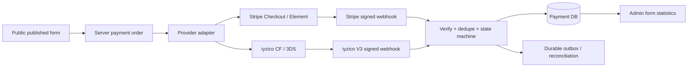

# MavenForms Ödeme Güvenliği, Sağlayıcı Entegrasyonu ve Release Yol Haritası

**Belge türü:** Araştırma, tehdit modeli, mimari karar ve mikro-faz uygulama planı  
**Tarih:** 2026-09-02  
**Kapsam:** Stripe, Google Pay ve Türkiye ödeme sağlayıcıları (öncelikli aday iyzico), public form, embed/WordPress, tenant izolasyonu, ödeme güvenliği ve üretim release kapıları  
**Durum:** Uygulama planı; henüz ödeme entegrasyonunun tamamlandığını göstermez

> Bu belge hukuki, vergi veya PCI-QSA danışmanlığının yerine geçmez. 6493, KVKK, tüketici/e-ticaret, vergi ve sağlayıcı sözleşmesi kapsamı; şirketin kuruluş ülkesi, iş modeli, merchant of record kararı, para akışı ve veri akışına göre bir hukuk/uyum uzmanı ve ilgili ödeme sağlayıcısı tarafından yazılı olarak doğrulanmalıdır.

## 1. Yürütücü karar

MavenForms için iki farklı ödeme modeli vardır. Bunları aynı özellik gibi uygulamak hatalı olur.

| Model | Para akışı | İlk sürüm kararı | Neden |
|---|---|---|---|
| **A — Sağlayıcı hesabı form sahibine ait** | Form sahibi kendi Stripe/iyzico merchant hesabına ödeme alır; MavenForms yalnızca entegrasyon ve form yüzeyini sağlar | **Önerilen ilk ödeme MVP’si** | MavenForms’ın müşteri parasını tutma/dağıtma, satıcı payout’u ve marketplace riskini azaltır |
| **B — MavenForms platform/marketplace** | Müşteri MavenForms veya platform hesabına öder; para form sahibine bölünür veya payout edilir | **Hukuk + sağlayıcı onayı olmadan başlatılamaz** | Connect/Marketplace, KYC/KYB, merchant of record, komisyon, iade, chargeback, payout ve olası düzenleyici kapsam gerekir |

### 1.1 Tavsiye edilen ürün sırası

1. **Ödeme UI prototipini gerçeğe çevir:** “Bağlı” yalnızca gerçek server-side doğrulama ile gösterilsin; desteklenmeyen sağlayıcılar “Yakında” veya gizli olsun.
2. **Model A ile Stripe/sağlayıcı-direct akışını kur:** Hosted Checkout veya sağlayıcının PCI kapsamını düşük tutan ödeme yüzeyi; MavenForms hiçbir zaman PAN/CVV görmesin.
3. **Sunucu doğrulamalı ödeme çekirdeğini kur:** Tutar, para birimi, form sürümü, order/payment attempt, webhook ve idempotency tek bir domain akışında olsun.
4. **Google Pay’i ayrı gateway olarak yazma:** Stripe Checkout/Payment Element/Express Checkout üzerinden, sağlayıcının desteklediği ülkelerde ve HTTPS altında etkinleştir.
5. **iyzico’yu provider adapter olarak ekle:** Checkout Form + 3DS + Retrieve + imzalı webhook; önce direct merchant modelinde.
6. **Model B’yi ayrı bir ürün kararı yap:** Stripe Connect veya iyzico Marketplace için yazılı ticari/uyum onayı, bağlı hesap onboarding’i ve payout operasyonu olmadan UI’a ekleme.

### 1.2 Kritik ülke bulgusu

Araştırma tarihinde Stripe’ın resmi küresel uygunluk sayfasındaki işletme ülkeleri listesinde Türkiye görünmüyor. Bu, Türkiye’de kurulu bir şirketin doğrudan Stripe hesabı açabileceğini varsaymamamız gerektiği anlamına gelir. Stripe’ın Connect belgelerinde Türkiye, bağlı hesap uygunluğu bağlamında geçebilir; bu durum Türkiye merkezli MavenForms platform hesabının otomatik olarak uygun olduğu anlamına gelmez. Stripe hesabının platform ülkesini, bağlı hesap ülkelerini, para birimini ve merchant of record modelini Stripe’tan yazılı olarak teyit etmeden “Stripe ilk sağlayıcı” kararı production planına kilitlenmemelidir. [Stripe küresel uygunluk](https://stripe.com/global), [Stripe Connect](https://docs.stripe.com/connect)

## 2. Mevcut repo kanıtı ve gerçek durum

Bu bölüm kaynak kodun 2026-09-02 tarihli yerel çalışma ağacındaki durumunu özetler. UI’da görünen her şeyin çalışan entegrasyon olduğunu varsaymıyoruz.

| Alan | Kanıt | Sonuç |
|---|---|---|
| Ödeme sağlayıcıları | `src/components/mavenforms/views/form-builder-view.tsx:1412-1437` içinde Stripe “connected”, PayPal/Authorize.net/Braintree/iyzico/manuel ödeme sabit kartlar olarak çiziliyor | Bu gerçek bağlantı kanıtı değil; yanlış başarı algısı oluşturuyor |
| Ödeme ayarları | Aynı dosyada `:1439-1470` arasında para birimi, vergi, test modu ve Apple Pay/Google Pay switch’leri var; değerleri server’a kaydeden ödeme endpoint’i yok | UI-only alan; release’te “çalışıyor” gösterilemez |
| Entegrasyon API’si | `src/app/api/integrations/route.ts:6-29` yalnızca authenticated GET yapıyor; credential redaction var ama create/update/connect/callback/webhook yok | Sağlayıcı bağlama akışı eksik |
| Integration modeli | `prisma/schema.prisma:358-369` yalnızca `configJson`, `provider`, `status` içeriyor | Secret referansı, environment, external account, validation, rotation ve capability modeli yok |
| Submission ödeme alanı | `prisma/schema.prisma:253-275` yalnızca `Submission.paymentStatus` tutuyor | Provider order/payment attempt/event/refund/dispute ayrımı yok |
| Public form | `src/app/api/public/forms/[slug]/submissions/route.ts:9-83` published snapshot, bounded payload, idempotency ve transaction/outbox temeline sahip | Ödeme eklenirken bu endpoint’e provider success güveni eklenmemeli; ödeme ayrı güvenli akış olmalı |
| Publish | `src/app/api/forms/[id]/publish/route.ts:29-82` immutable public snapshot üretip yayınlıyor | Ödeme yapılandırması da yayınlanan sürümün allowlist’li, sır içermeyen parçası olmalı |
| Environment | `src/lib/env.ts:1-18` yalnızca `DATABASE_URL` zorunlu; `STRIPE_SECRET` opsiyonel | Production ödeme için secret, webhook secret, encryption key ve provider mode kapıları henüz yok |
| Release kararı | `RELEASE-DECISION.md:3-15` public SaaS release’i `NO-GO`; gerçek entegrasyonlar ve operasyon kanıtı eksik | Ödeme entegrasyonu release kapılarından önce ayrıca kilitlenmeli |

### 2.2A PAY-06C uygulama kanıtı: iyzico provider status

İyzico webhook inbox’ı imzayı doğrulasa da önceki akışta yalnızca `iyziEventType` saklanıyor, `SUCCESS` veya `FAILURE` bilgisi kaybolduğu için worker iyzico olayını ödeme durumuna çeviremiyordu. Bu eksik `providerStatus` alanı ve additive migration ile giderildi.

- Direct/HPP webhook route’u `providerStatus` değerini güvenli biçimde inbox metadata’sına yazar.
- Worker yalnızca resmi webhook sözleşmesindeki `SUCCESS → succeeded` ve `FAILURE → failed` durumlarını işler.
- `INIT_THREEDS`, `CALLBACK_THREEDS` ve diğer ara durumlar otomatik olarak başarıya çevrilmez.
- Provider status ham payload olarak değil, sınırlı normalize metadata olarak tutulur; secret ve ham webhook body’si saklanmaz.
- Tutar/para birimi webhook’ta bulunmadığında event imzalı provider olayı ve provider payment ID eşleşmesiyle işlenir; reconciliation/retrieve fazı provider hesabındaki nihai tutar ve para birimi doğrulamasını ayrıca yapmalıdır.

Bu davranış iyzico’nun resmi webhook dokümanındaki direct/HPP status değerleri ve `X-IYZ-SIGNATURE-V3` sözleşmesiyle sınırlandırılmıştır: [iyzico resmi webhook dokümanı](https://docs.iyzico.com/en/advanced/webhook).

### 2.2B PAY-04C uygulama kanıtı: public provider config allowlist

Provider bağlantı route’u artık veritabanındaki `publicConfigJson` değerini doğrudan response’a taşımaz. Persist edilmiş veri geçmişte beklenmeyen alanlar içerse bile response projection yalnızca `publishableKey`, `merchantId` ve `accountId` alanlarını kabul eder; boş, satır sonu içeren, aşırı uzun veya string olmayan değerler elenir. `apiKey`, `secretKey`, `webhookSecret`, encrypted credential envelope, token ve tanınmayan alanlar response sınırını geçemez.

- Saf projection helper’ı `src/lib/payment-provider-public-config.ts` içinde tutulur.
- `tests/payment-provider-public-config.test.mjs` güvenli alanların korunmasını, credential/unknown alanların elenmesini ve header-injection/uzunluk kontrolünü kanıtlar.
- `tests/payment-provider-route-truth.test.mjs` route’un projection helper’ını kullandığını kanıtlar.
- Bu faz ödeme başlatma veya provider doğrulaması değildir; `PAY-00` dış karar kapısını, sandbox kanıtını ve canlı ödeme release kapısını açmaz.

### 2.2C PUBLIC-DEFENSE-01 uygulama kanıtı: yayın snapshot’ı read-boundary savunması

Public form GET route’u, yayın sırasında üretilen snapshot’ı anonim istemciye vermeden önce ortak `containsForbiddenKeys` taramasından geçirir. Böylece eski bir migration, manuel veri düzeltmesi veya gelecekteki serializer değişikliği snapshot’a `workspaceId`, `ownerId`, `secret`, `token`, `createdAt`, `id` gibi yasaklı bir anahtar taşısa bile public response fail-closed olur. Bu kontrol publish-time allowlist’in yerine geçmez; ikinci savunma katmanıdır ve public form özelliklerini değiştirmez.

- `tests/public-snapshot-defense.test.mjs` route’un ortak taramayı kullandığını ve yasaklı anahtar durumunda durduğunu kanıtlar.
- `tests/public-url.test.mjs` yayınlanmış sürüm ve public read-boundary savunmasının birlikte korunmasını doğrular.
- Bu faz ödeme/fatura/mail akışını başlatmaz; yalnızca direct link, iframe, inline ve WordPress’in ortak public snapshot güvenlik kapısını güçlendirir.

### 2.1 Bu turda doğrulanan mevcut kalite tabanı

- `node scripts/run-tests.mjs`: **49/49 test dosyası geçti**.
- `bunx tsc --noEmit`: **geçti**.
- `bun run lint`: **geçti**.
- `bun run build`: **geçti**; mevcut middleware-to-proxy deprecation uyarısı devam ediyor.
- `http://localhost:3000/api/health`: **200**.

Bu sonuçlar ödeme entegrasyonunun tamamlandığını kanıtlamaz; yalnızca mevcut repo tabanının ödeme geliştirmesine başlanabilecek durumda olduğunu gösterir.

## 3. Birincil kaynak araştırma sonuçları

### 3.1 Stripe ödeme yüzeyi

- Stripe, çoğu on-session ödeme için Checkout Sessions’ı; daha düşük seviyeli özel checkout state’i gerekiyorsa PaymentIntents’ı öneriyor. Yeni bir entegrasyonda Charges API kullanılmamalı. [Stripe Payments API hiyerarşisi](https://docs.stripe.com/payments/payment-methods/integration-options), [Checkout](https://docs.stripe.com/payments/checkout), [PaymentIntents yaşam döngüsü](https://docs.stripe.com/payments/paymentintents/lifecycle)
- Payment Element, kart bilgilerini Stripe’ın HTTPS iframe’ine gönderir; canlı kullanım için checkout sayfası HTTPS olmalıdır. İç içe iframe’lerde redirect gerektiren ödeme yöntemleri bozulabilir. [Stripe Payment Element](https://docs.stripe.com/payments/payment-element), [Accept a payment](https://docs.stripe.com/payments/accept-a-payment?payment-ui=elements)
- Dinamik ödeme yöntemleri, müşteri ülkesi, para birimi ve ödeme durumuna göre uygun yöntemleri sağlayıcı tarafında seçer. Uygulama kendi sabit ödeme yöntemi listesini yöneterek zamanla uyumsuzluk üretmemeli. [Dynamic payment methods](https://docs.stripe.com/payments/dynamic-payment-methods)
- Stripe API secret key yalnızca server’da secret vault veya güvenli environment ile tutulmalı; restricted key, IP kısıtlaması, düzenli rotation ve live/test ayrımı uygulanmalı. [Stripe API keys](https://docs.stripe.com/keys), [Secret key best practices](https://docs.stripe.com/keys-best-practices)
- Her create/update POST işlemi, ağ tekrarında duplicate ödeme oluşturmamak için benzersiz idempotency key ile yapılmalı. [Stripe idempotent requests](https://docs.stripe.com/api/idempotent_requests)
- Webhook raw body, `Stripe-Signature` ve endpoint secret ile doğrulanmalı; event timestamp replay saldırılarına karşı kontrol edilmeli; handler karmaşık iş bitmeden 2xx dönmeli; duplicate, gecikmiş ve sıra dışı event’ler desteklenmeli. [Stripe webhooks](https://docs.stripe.com/webhooks), [Webhook signature](https://docs.stripe.com/webhooks/signature), [Stripe go-live checklist](https://docs.stripe.com/get-started/checklist/go-live)

### 3.2 Google Pay

- Google Pay Web doğrudan “kart numarası alma” çözümü değildir; `PAYMENT_GATEWAY` tokenization ile desteklenen gateway’e ödeme token’ı üretir. Gateway adı ve merchant ID sağlayıcının verdiği değerlerle eşleşmelidir. [Google Pay request objects](https://developers.google.com/pay/api/web/reference/request-objects), [Google Pay tutorial](https://developers.google.com/pay/api/web/guides/tutorial)
- Google Pay token’ı imzalı/şifreli payment method token’dır. Direct decryption ve sertifika yönetimi gateway entegrasyonuna göre ayrı bir güvenlik alanıdır; ilk sürümde bunu kendimiz çözmek yerine Stripe/uyumlu sağlayıcı checkout yüzeyi seçilmelidir. [Google Pay payment-data cryptography](https://developers.google.com/pay/api/web/guides/use-api/payment-data-cryptography)
- Stripe üzerinde Google Pay ve Apple Pay için Payment Element/Express Checkout veya hosted Checkout kullanılabilir; yöntem müşterinin ülke, tarayıcı, cihaz, currency ve account eligibility koşullarına göre görünür. Iframe kullanılırsa Stripe’ın belirttiği `allow="payment *"` gereksinimi ayrıca doğrulanmalıdır. [Stripe Payment Element wallets](https://docs.stripe.com/payments/payment-element), [Stripe payment method support](https://docs.stripe.com/payments/payment-methods/payment-method-support)

**Karar:** UI’daki “Apple Pay / Google Pay” switch’i yalnızca provider capability endpoint’i gerçek destek döndürüyorsa etkinleşir. Bu switch, doğrudan Google Pay anahtarlarını veya card token’larını MavenForms’a alma anlamına gelmez.

### 3.3 iyzico

- iyzico API/Checkout Form akışında server-side initialize, redirect/responsive/iframe/pop-up, retrieve/officialize ve webhook adımları vardır. Checkout Form responsive, popup, iframe veya redirect sunabilir. [iyzico Checkout Form implementation](https://docs.iyzico.com/en/payment-methods/checkoutform/cf-implementation)
- 3DS akışında BIN check, init 3DS, bankaya yönlendirme, auth 3DS ve webhook adımları bulunur. Browser callback’i tek başına authoritative payment success kabul edilmemelidir. [iyzico 3DS implementation](https://docs.iyzico.com/en/payment-methods/api/3ds/3ds-implementation)
- iyzico webhook endpoint’i HTTPS olmalı; `X-IYZ-SIGNATURE-V3` imzası secret key ile HMAC-SHA256 doğrulanmalı. Eski signature sürümleri kullanılmamalı. Webhook tekrarları ve 2xx cevabı sağlayıcı dokümanındaki retry davranışına göre ele alınmalı. [iyzico Webhook](https://docs.iyzico.com/en/advanced/webhook), [iyzico response signature validation](https://docs.iyzico.com/en/advanced/response-signature-validation)
- iyzico Marketplace akışında submerchant onboarding, gerçek satıcı bilgileri, subMerchantKey, satıcı payı ve onay/settlement süreçleri gerekir. Bu, direct merchant credential bağlamından ayrı bir üründür. [iyzico Marketplace](https://docs.iyzico.com/en/products/marketplace), [iyzico submerchant](https://docs.iyzico.com/en/products/marketplace/marketplace-implementation/submerchant)

**Karar:** Türkiye için ilk aday iyzico ise önce direct merchant / Checkout Form akışı uygulanır. Marketplace ve payout, Model B fazına bırakılır.

### 3.4 Ödeme olayının fatura ve e-posta ile bağı

Ödeme planı, e-posta planından önce gelen çekirdek domain planıdır. E-posta sağlayıcısı ödeme sağlayıcısının yerine geçmez ve webhook request’i içinde doğrudan çağrılmaz.

```text
PaymentOrder created
  → provider checkout/API
  → verified provider event
  → PaymentOrder.succeeded
  → InvoiceRecord.paid_ready_for_invoicing
  → invoice issued + document_ready
  → optional receipt/invoice DeliveryIntent
  → email outbox/worker
```

- `PaymentOrder.succeeded` yalnızca imzası ve idempotency’si doğrulanmış provider olayı veya güvenilir reconciliation sonucu ile yazılır.
- Başarılı ödeme, fatura düzenlendiği anlamına gelmez; fatura kaydı ve belge hazır olmadan fatura e-postası kuyruğa alınamaz.
- Ödeme makbuzu gönderilecekse bu, fatura e-postasından ayrı bir transactional olay ve idempotency anahtarı kullanır.
- Webhook handler yalnızca inbox/domain event kaydını güvenle tamamlar; PDF üretimi, Paraşüt çağrısı, e-posta, export ve ağır analytics worker’a bırakılır.
- `DeliveryIntent` ödeme/fatura domain’lerinin kararını taşıyan sınırlı tüketici sözleşmesidir. E-posta worker tutar, vergi, kart veya provider secret hesaplamaz; yalnızca doğrulanmış intent’i teslim eder.
- Kart numarası, CVV, PAN, wallet token ve ödeme sağlayıcısı secret’ı hiçbir e-posta payload’ına, public response’a, log’a veya ek belgeye giremez.

E-posta teslimat altyapısının credential encryption, suppression, rate guard, domain health, accepted/delivered ayrımı, retry ve dead-letter kapıları ödeme/fatura akışının yerine geçmez; ilgili payment/invoice kabul kriterinin son teslimat adımı olarak çağrılır. Gerçek ödeme/fatura kanıtı yoksa yalnızca synthetic contract test çalıştırılır.

### 3.4 PCI DSS

- Kart alanlarını MavenForms’ın kendi HTML input’larıyla toplamak yerine tamamen hosted ödeme sayfası veya PCI-uyumlu provider iframe’i kullanmak PCI kapsamını azaltır; ancak “PCI gerekmiyor” sonucu otomatik çıkmaz.
- PCI SSC SAQ A uygunluğu için payment page’in bütün ilgili elemanlarının PCI DSS validated third-party provider’dan gelmesi gerekir. Merchant sitesine ait script/payment element page bütünlüğünü etkiliyorsa farklı SAQ kapsamı doğabilir. [PCI SSC SAQ A FAQ](https://www.pcisecuritystandards.org/faqs/1588/), [PCI iframe/page element FAQ](https://www.pcisecuritystandards.org/faqs/1438/), [PCI DSS standard](https://www.pcisecuritystandards.org/standards/pci-dss/)

**Kırmızı çizgi:** PAN, CVV, full expiry, raw Google Pay direct token veya provider secret; form submission, log, analytics, error message, database, export, webhook payload veya browser localStorage’a yazılmayacak.

### 3.5 Türkiye düzenleyici ve KVKK yüzeyi

- Türkiye’de ödeme hizmetleri ve elektronik para faaliyetleri 6493 ve ikincil düzenlemeler kapsamında TCMB tarafından düzenlenir; izinsiz ödeme hizmeti sunma varsayımıyla tasarım yapılamaz. Yetkili kuruluşlar ve faaliyet izinleri TCMB listelerinden kontrol edilmelidir. [TCMB Payment Services](https://www.tcmb.gov.tr/wps/wcm/connect/EN/TCMB+EN/Main+Menu/Core+Functions/Payment+Services/Payment+Services+Overview), [TCMB SSS](https://www.tcmb.gov.tr/wps/wcm/connect/TR/TCMB+TR/Main+Menu/Banka+Hakkinda/Sikca+Sorulan+Sorular/), [TCMB yetkili kuruluş listesi](https://www.tcmb.gov.tr/wps/wcm/connect/tr/tcmb+tr/main+menu/temel+faaliyetler/odeme+hizmetleri/elektronik+para+kuruluslari)
- MavenForms yalnızca veri işleyen veya SaaS altyapısı olabilir; form sahibi, MavenForms, provider ve varsa marketplace modeli için veri sorumlusu/veri işleyen rolleri sözleşme ve fiili amaçlara göre belirlenmelidir. KVKK, uygun teknik/idari tedbir, erişim kontrolü, saklama/imha ve ihlal bildirimi yükümlülüklerini vurgular. [KVKK veri güvenliği yükümlülükleri](https://www.kvkk.gov.tr/Icerik/2040/Veri-Guvenligine-Iliskin-Yukumlulukler), [KVKK teknik/idari tedbir rehberi](https://www.kvkk.gov.tr/Icerik/4198/Kisisel-Veri-Guvenligi-Rehberi-%28Teknik-ve-Idari-Tedbirler%29)
- Provider veya cloud kişisel veriyi yurt dışına aktarıyorsa KVKK yurt dışı aktarım mekanizması, uygun güvence, standart sözleşme ve aydınlatma/işleme envanteri ayrıca doğrulanmalıdır. [KVKK yurt dışına aktarım](https://www.kvkk.gov.tr/Icerik/2053/Yurtdisina-Aktarim)

Bu kaynaklar “MavenForms kesin olarak lisans almak zorundadır” sonucunu tek başına vermez. Sonuç; para kimin hesabına geçtiği, kimin merchant of record olduğu, payout/komisyon olup olmadığı, provider sözleşmesi ve Türkiye’deki fiili faaliyetle birlikte hukuk/uyum incelemesiyle verilir.

## 4. Tehdit modeli

### 4.1 Varlıklar

| Varlık | Gizlilik | Bütünlük | Kullanılabilirlik |
|---|---:|---:|---:|
| Provider secret/API key/webhook secret | Çok yüksek | Yüksek | Yüksek |
| Form sahibinin merchant account bağlantısı | Yüksek | Çok yüksek | Yüksek |
| Published form payment config | Orta | Çok yüksek | Yüksek |
| Payment order ve amount/currency | Yüksek | Çok yüksek | Çok yüksek |
| Provider event ID ve raw webhook metadata | Orta | Çok yüksek | Yüksek |
| Submission PII | Çok yüksek | Yüksek | Yüksek |
| Refund/dispute/payout kayıtları | Yüksek | Çok yüksek | Yüksek |
| Public checkout/session reference | Düşük-Orta | Yüksek | Yüksek |
| Audit/reconciliation kayıtları | Orta-Yüksek | Çok yüksek | Yüksek |

### 4.2 Aktörler ve saldırı yolları

| Aktör | Saldırı yolu | Korunacak invariant |
|---|---|---|
| Public ziyaretçi | Tutarı, currency’yi veya provider success’i client payload ile değiştirme | Para ve ürün/fiyat daima server-side published config/order’dan hesaplanır |
| Bot/fraudster | Public endpoint spam, card testing, duplicate checkout, replay webhook | Rate limit, CAPTCHA/risk provider, idempotency, signed webhook, amount limits |
| Kötü niyetli workspace user | Başka workspace’in integration/order/submission verisini görme | Her sorgu ve mutation `workspaceId + resourceId` ile yetkilendirilir |
| Ele geçirilmiş admin session | Provider bağlama, refund veya live mode değişimi | MFA/step-up, capability bazlı yetki, audit, re-auth ve live mode confirmation |
| Kötü niyetli embed host | Formdan app token/secret çıkarma, postMessage spoof | Public allowlist DTO, origin/source doğrulaması, secret-free script |
| Ele geçirilmiş provider secret | Unauthorized charge/refund, account takeover | Vault, restricted key, rotation, IP allowlist, secret reference, audit |
| Sahte provider webhook | Payment’ı paid yapma | Provider signature + raw body + event ID dedupe + server retrieve |
| Gerçek provider event replay | Aynı event’i tekrar işleme | Unique `(provider, account, eventId)` ve state transition guard |
| Sağlayıcı kesintisi | Başarılı ödemeyi pending bırakma veya veri kaybetme | Durable event inbox/outbox, retry, reconcile, operator queue |
| İçeriden veri sızıntısı | PAN/secret’ı log/export/analytics’e yazma | Field redaction, denylist testleri, no raw card data contract |

### 4.3 Stripe/iyzico ayrımı

Provider adapter ortak domain sözleşmesini uygulamalı; provider-specific verification ortaklaştırılmamalıdır.



## 5. Hedef mimari kararları

### 5.1 Ödeme formun içinde ama ödeme sağlayıcıda

MavenForms’ın kendi formu şu sırayı kullanır:

1. Public client published formu alır; yalnızca `payment.enabled`, public display labels, currency ve opaque order-init endpoint bilgisi görünür.
2. Public client submission değerlerini gönderir; payment amount client’tan alınmaz veya güvenilmez.
3. Server published version’ı, form payment policy’sini ve seçili price item’ı doğrular.
4. Server immutable `PaymentOrder` oluşturur; amount minor unit olarak hesaplanır.
5. Server provider adapter ile hosted Checkout Session veya iyzico Checkout Form initialize çağrısı yapar.
6. Client sağlayıcıya redirect/iframe/embedded component ile gider; kart verisi MavenForms endpoint’ine POST edilmez.
7. Return/callback yalnızca UX göstergesidir. `paid` durumu yalnızca doğrulanmış provider event veya server-side retrieve ile yazılır.
8. Webhook event inbox’a idempotent kaydedilir; state machine ve submission update transaction içinde yürür.
9. UI pending/paid/failed/refunded/disputed durumunu server’dan tekrar okur.

### 5.2 Secret ve credential kararı

`Integration.configJson` içine raw secret yazmak hedef mimari değildir.

- Uygulama veritabanında yalnızca `secretRef`, provider account ID, mode, masked last-four/metadata, capability ve doğrulama tarihi tutulur.
- Secret production’da KMS/secret manager; local’de `.env` yalnızca test secret ve `.gitignore` ile korunmuş olarak tutulur.
- Workspace admin, bağlantı için OAuth/hosted onboarding veya provider dashboard ile üretilen kısa ömürlü bağlantı kullanır.
- UI hiçbir zaman raw secret’ı tekrar göstermez; “yenile/değiştir” akışı secret’ı yeniden yazdırır.
- Test/live mode birbirinden ayrı bağlantı ve webhook secret kullanır.

### 5.3 Önerilen domain tabloları

Mevcut `Integration` tablosu geriye dönük uyumluluk için tutulabilir; ödeme için aşağıdaki ayrım eklenmelidir.

```text
PaymentProviderConnection
  id, workspaceId, provider, mode(test|live), externalAccountId
  secretRef, webhookSecretRef, status, capabilitiesJson
  lastValidatedAt, lastErrorCode, createdAt, updatedAt
  unique(workspaceId, provider, mode)

FormPaymentConfig
  id, formId, connectionId, enabled, currency
  amountMode(fixed|field|price_table), amountMinor
  priceDefinitionJson, taxPolicyJson, allowedMethodsJson
  returnPolicyJson, version, createdAt, updatedAt

PaymentOrder
  id, workspaceId, formId, submissionId?
  publicToken, providerConnectionId, providerOrderId
  currency, amountMinor, taxMinor, totalMinor
  status(created|requires_action|processing|succeeded|failed|canceled|refunded|partially_refunded|disputed)
  idempotencyKey, publishedVersionId, createdAt, updatedAt
  unique(providerConnectionId, providerOrderId)
  unique(workspaceId, idempotencyKey)

PaymentAttempt
  id, paymentOrderId, provider, providerPaymentId
  status, clientReference, nextActionJsonRedacted
  errorCode, errorCategory, createdAt, updatedAt

ProviderEvent
  id, workspaceId, provider, providerAccountId, eventId
  eventType, signatureVerified, payloadHash, receivedAt, processedAt
  processingStatus(received|processed|ignored|failed|dead)
  unique(provider, providerAccountId, eventId)

PaymentRefund
  id, paymentOrderId, providerRefundId, amountMinor
  reason, status, idempotencyKey, actorId, createdAt

PaymentDispute
  id, paymentOrderId, providerDisputeId, status, dueAt
  evidenceStatus, createdAt, updatedAt

ReconciliationRun
  id, workspaceId, provider, rangeStart, rangeEnd
  status, mismatchCount, reportRef, createdAt
```

Kart numarası, CVV, raw wallet token, secret key ve tam banka hesap bilgisini bu tablolara koymayız.

### 5.4 Para ve fiyat invariant’ları

- Tutar `float` değil integer minor unit veya para birimine uygun Decimal olarak saklanır.
- TRY, USD, EUR gibi currency exponent kuralları merkezi money utility ile uygulanır.
- `amountMinor > 0`, üst limit, precision, currency ve provider capability server’da doğrulanır.
- Vergi, indirim, ücret, komisyon ve toplam ayrı alanlarda hesaplanır; client’tan gelen toplam yalnızca görüntü bilgisi olabilir.
- Published formdaki price definition immutable sürümle PaymentOrder’a kopyalanır.
- Draft’ta fiyat değiştiğinde eski PaymentOrder değişmez; yeni order yeni published version ile oluşturulur.
- Form submission başarılı olup ödeme başarısız olabilir; `Submission.status` ile `PaymentOrder.status` birbirine eşitlenmez.

### 5.5 Ödeme durum makinesi

```text
created
  -> requires_action
  -> processing
  -> succeeded
  -> failed
  -> canceled

succeeded
  -> partially_refunded
  -> refunded
  -> disputed

processing -> succeeded | failed | canceled
requires_action -> processing | failed | canceled
```

Geçersiz geçişler server’da reddedilir. Browser return “success” parametresi state transition için yeterli değildir.

## 6. API sözleşmesi

### 6.1 Admin/provider bağlantısı

```text
GET    /api/v1/workspaces/:workspaceId/payment-connections
POST   /api/v1/workspaces/:workspaceId/payment-connections/:provider/connect
POST   /api/v1/payment-connections/:id/validate
POST   /api/v1/payment-connections/:id/rotate
DELETE /api/v1/payment-connections/:id
GET    /api/v1/payment-connections/:id/capabilities
```

Kurallar:

- Gerçek resource ID’si workspace scope ile birlikte sorgulanır.
- `manageIntegrations` capability’si zorunludur; live bağlama/refund için step-up gerekir.
- Secret response’da dönmez; status `configured`, `verified`, `degraded`, `disconnected`, `requires_action` gibi gerçek durumları ifade eder.
- `connected` yalnızca provider test çağrısı ve gerekli capability doğrulanınca kullanılır.
- Error response provider raw message, secret, request body veya stack trace içermez.

### 6.2 Public ödeme başlatma

```text
POST /api/v1/public/forms/:slug/payment-orders
Idempotency-Key: <client retry key>

Request:
{
  "submissionToken": "opaque-token",
  "priceSelection": "vip"
}

Response:
{
  "data": {
    "orderToken": "opaque-public-token",
    "status": "requires_action",
    "checkout": {
      "mode": "redirect",
      "url": "https://provider.example/opaque-session"
    },
    "display": { "currency": "TRY", "totalMinor": 150000 }
  }
}
```

Server, `priceSelection` değerini yayınlanmış allowlist’e göre eşler; `amount`, `currency`, `provider`, `destination`, `application_fee` veya `connectedAccountId` public client’tan kabul edilmez.

### 6.3 Webhook

```text
POST /api/webhooks/stripe/:connectionPublicId
POST /api/webhooks/iyzico/:connectionPublicId
```

- Endpoint yalnızca HTTPS production’da açılır.
- Raw request body bytes imza doğrulamasından önce korunur.
- Provider-specific signature verifier adapter içinde çalışır.
- Doğrulama başarısızsa 400/401; işleme hatasıysa retry stratejisine uygun 5xx; provider’ın tekrar göndermesi beklenir.
- Event ID unique insert ile dedupe edilir.
- `2xx` yalnızca event güvenli şekilde inbox’a yazıldıktan sonra döner; ağır email, export, analytics ve payout işi webhook request’inde yapılmaz.

### 6.4 Refund/dispute

```text
POST /api/v1/payment-orders/:id/refunds
POST /api/v1/payment-orders/:id/cancel
GET  /api/v1/payment-orders/:id
GET  /api/v1/forms/:id/payment-reconciliation
```

- Refund amount server’da mevcut refundable amount ile sınırlandırılır.
- Refund idempotency key ve unique provider refund ID zorunludur.
- Refund yetkisi `payments.refund`; admin confirmation ve audit zorunludur.
- Dispute webhook’u payment/submission durumunu yanlışlıkla “başarısız” yapmaz; ayrı dispute görünümü oluşturur.

## 7. Güvenlik kontrol listesi

### 7.1 Kimlik, yetki ve tenant

- [ ] Payment connection, form, order, attempt, refund ve event her mutation’da workspace scope ile yüklenir.
- [ ] Formun `connectionId` değeri aynı workspace’e ait olmayan bağlantıyı referanslayamaz.
- [ ] Bir kullanıcı yalnızca sahip olduğu veya role capability’si bulunan workspace’te ödeme ayarı değiştirebilir.
- [ ] Public endpoint yalnızca slug/publishedVersion/opaque order token görür.
- [ ] Public response `workspaceId`, `ownerId`, internal form ID, integration ID, secretRef, raw provider payload ve credential dönmez.
- [ ] Live mode enable, provider disconnect, refund ve payout ayarları step-up authentication/audit gerektirir.

### 7.2 Secret yönetimi

- [ ] `STRIPE_SECRET`, provider secret ve webhook signing secret source, client bundle, public env, DB plain JSON ve log’a girmez.
- [ ] Test/live secret ayrıdır.
- [ ] Restricted key veya minimum yetkili OAuth scope kullanılır.
- [ ] Secret rotation uygulanır ve eski secret için kontrollü overlap/revoke prosedürü vardır.
- [ ] Secret leak runbook’u: revoke, rotate, affected orders audit, provider support, incident record.
- [ ] `.env` ve backup dosyaları release artifact’ına dahil edilmez.

### 7.3 Payment integrity

- [ ] Amount/currency/tax/price selection server-side published snapshot’tan hesaplanır.
- [ ] Client success, redirect query, hidden input veya localStorage paid kararı vermez.
- [ ] Create session/payment/refund işlemlerinde internal ve provider idempotency key kullanılır.
- [ ] PaymentOrder oluşmadan provider charge başlatılmaz.
- [ ] Submission ve payment ayrı state machine olarak tutulur.
- [ ] Payment success webhook’u ilgili provider account, form, version ve order ile eşleşir.
- [ ] Provider event ID duplicate işlenmez.
- [ ] Webhook event sırası varsayılmaz; provider retrieve/reconciliation yapılır.

### 7.4 Public form, iframe ve WordPress

- [ ] Published public config’te yalnızca ödeme gösterim bilgisi vardır; secret veya private integration detail yoktur.
- [ ] Public payment endpoint rate limit, abuse detection, payload limit ve gerekirse CAPTCHA/risk kontrolü uygular.
- [ ] Embed parent origin exact allowlist ile doğrulanır; `postMessage` alıcı origin ve source doğrular.
- [ ] Payment iframe provider’dan gelir; MavenForms payment page içine keylogger/analytics script’i koymaz.
- [ ] Stripe Payment Element/Checkout iframe’inde provider’ın istediği `allow` attribute ve HTTPS doğrulanır.
- [ ] WordPress plugin yalnızca published form public endpoint’ini kullanır; admin secret’ı browser’a göndermez.
- [ ] WordPress shortcode/block output’u arbitrary HTML/JS injection’a izin vermez.

### 7.5 Privacy, retention ve log

- [ ] Kart verisi, CVV, raw token ve secret için denylist log/export testleri vardır.
- [ ] PII minimizasyonu: payment provider customer ID veya last4 yalnızca iş gerektiriyorsa tutulur.
- [ ] Provider DPA, KVKK veri işleme rolleri, yurt dışı aktarım ve saklama süresi dokümante edilir.
- [ ] Payment event audit log’da actor, workspace, order, action, provider event ID ve redacted result tutulur.
- [ ] Retention süresi dolan PII ve payment metadata için silme/anonymization job’u vardır; finansal zorunluluk varsa istisna açıkça belgelenir.
- [ ] Backup’lar şifreli, erişim kontrollü ve restore testinden geçmiştir.

## 8. En küçük güvenli mikro-fazlar

Genel faz kuralı: Her faz önce mevcut test ve önceki faz smoke suite’ini çalıştırır, sonra hedef testte fail üretir, en küçük değişikliği yapar, tekrar test/lint/typecheck/build çalıştırır ve ayrı verifier kanıtı alır. Bir fazın UI kartı bulunması geçiş kanıtı değildir.

### PAY-00 — Araştırma ve iş modeli kilidi

**Bağımlılık:** M00.1–M00.6 mevcut baseline  
**Amaç:** Model A mı B mi, merchant of record kim, hedef işletme ülkesi nedir, provider ile para akışı nasıl olacak sorularını yazılı karara bağlamak.

**Revize edilmiş iki aşamalı karar:**

- **Evre 1:** MavenForms kendi formlarının merchant'ıdır. İlk release kendi Stripe/iyzico bağlantısıyla yurtiçi ve yurtdışı ödeme alır; Paraşüt API v4 ve API'siz manuel muhasebe/fatura akışlarının ikisi de kullanılabilir.
- **Evre 2:** Ürün doğrulandıktan sonra SaaS tenant şirketler kendi Stripe/iyzico ve muhasebe/Paraşüt bağlantılarını workspace bazında tanımlar. MavenForms abonelik tahsilatı ayrı bir first-party PaymentOrder akışıdır; tenant müşteri ödemeleriyle birleştirilmez.
- **Evre 2 bağlantı modeli:** Tenant şirket provider ve muhasebe bilgilerini kendisi tanımlar; ödeme doğrudan tenant’ın merchant hesabına gider. MavenForms tenant adına ödeme almaz, para tutmaz, payout yapmaz veya tenant müşteri ödemesini kendi abonelik tahsilatıyla birleştirmez.
- **Marketplace/Connect:** Bu BYO provider modelinin parçası değildir. MavenForms’ın ileride tenant adına para toplayıp dağıtması gerekirse `PAY-16` ayrı ticari/uyum kararı olarak açılır; mevcut SaaS release’inin ön koşulu değildir.

Her evre için merchant of record, provider hesabı, ülke/para birimi, vergi/fatura sorumlusu, refund, chargeback ve payout sahibi ayrı yazılır. Aynı provider hesabı tenantlar arasında paylaşılmış gibi varsayım yapılamaz.

**İş:**

- Stripe account/platform ülke uygunluğunu Stripe’tan teyit et.
- iyzico direct mi Marketplace mi olacağını sağlayıcıdan teyit et.
- Şirket, form sahibi, provider ve müşteri arasındaki sözleşme/rol haritasını çıkar.
- Currency, tax, invoice, refund, cancellation, chargeback ve payout sorumlularını belirle.

**Fail-first test:** `tests/payment-business-model.test.mjs` belirsiz merchant-of-record veya boş provider eligibility ile fail olur.

**Kapı:** Evre 1 yazılı kararı olmadan gerçek ödeme fazları `BLOCKED`; Evre 2 ise Evre 1 operasyon kanıtı, tenant isolation, provider connection ve SaaS abonelik ayrımı olmadan `DEFERRED` kalır. Yalnızca credential'sız contract testleri ve güvenli domain hazırlığı ilerleyebilir.

**Evre 2 gizlilik kapısı:** Tenant’ın provider/muhasebe credential’ı yalnızca encrypted server-side secret reference ile saklanır. Public form, embed, WordPress, başka tenant, genel export, log ve audit kaydı secret veya gereksiz müşteri verisi göremez. Tenant bağlantısı revoke/rotate edilebilir; provider webhook’u yalnızca kendi `connectionId + workspaceId` kapsamındaki kaydı değiştirebilir.

**İlk SaaS pilotu abonelik kararı:** Tenant aboneliğinin otomatik online tahsilatı ilk pilot için ertelenebilir. Platform owner/operator paneli abonelik tarihini ve manuel onayını kaydeder; `due_soon`, `grace`, `suspended` ve `ended` durumları açık bir state machine ile yönetilir. Bu abonelik durumu tenant’ın kendi müşterilerinden aldığı ödemeleri veya tenant’ın Stripe/iyzico bağlantısını değiştirmez.

**Ana plan sırası değişmez:** SaaS abonelik kararı ana ödeme, fatura, entegrasyon ve gerekli teslimat fazlarının yerine geçmez ve onları yeniden sıralamaz. `BILL-00` yalnızca ilerideki SaaS tasarımının first-party/tenant scope ayrımını koruyan geleceğe dönük saf sözleşmedir; `BILL-01..BILL-06` mevcut ana fazların önüne alınamaz.

- `suspended/ended`: tüm tenant formları public publish yüzeyinde unavailable olur; mevcut snapshot ve veriler silinmez.
- Yeni form oluşturma, form silme, publish, provider/muhasebe bağlantısı değiştirme ve secret işlemleri kapanır.
- Yetkili kullanıcı mevcut yanıtları ve iş verilerini read-only görebilir; yalnızca izin verilen Excel export çalışır.
- Askıya alma sırasında yalnızca o anda yayınlanmış formların `formId + publishedVersionId + önceki durum` resume snapshot’ı alınır; taslak, yayınlanmamış ve arşivlenmiş formlar snapshot’a girmez.
- Reaktivasyon aynı subscription transition için idempotent transaction ile snapshot’taki yayınlanmış formları aynı `publishedVersionId` ile otomatik açar; form yeni yanıtları kaldığı yerden almaya devam eder.
- Reaktivasyon sırasında snapshot dışında kalan veya askıya alma öncesinde yayınlanmamış form otomatik açılmaz. Platform operator’ının askıya alma sırasında açıkça kalıcı olarak kapattığı bir form için `resumeExcluded` işareti uygulanır; otomatik restore bunu geçersiz kılamaz.
- Subscription state değişikliği platform operator’ı tarafından audit edilir; tenant workspace admin’i kendi aboneliğini yükseltemez veya tekrar aktif edemez.

### PAY-01 — UI doğruluk ve feature flag

**Bağımlılık:** PAY-00  
**Amaç:** Sahte “Stripe bağlı” algısını kaldırmak.

**İş:**

- Hardcoded provider kartlarını capability/catalog kaynağına bağla.
- “Bağlı”, “Doğrulanıyor”, “Bağlantı gerekli”, “Yakında”, “Devre dışı” durumlarını ayır.
- Ödeme ve Google Pay switch’lerini backend capability yoksa disabled/read-only yap.
- Her disabled durumuna gerçek neden ve sonraki işlem ekle.

**Kapı:** UI’daki her ödeme aksiyonu gerçek endpoint’e veya açıkça disabled açıklamasına sahip olmalı.

### PAY-02 — Domain sözleşmeleri ve veri modeli

**Bağımlılık:** PAY-01  
**Amaç:** `Submission.paymentStatus` alanını tam payment domain’in yerine kullanmamak.

**İş:**

- `PaymentProviderConnection`, `FormPaymentConfig`, `PaymentOrder`, `PaymentAttempt`, `ProviderEvent`, `PaymentRefund`, `PaymentDispute` ve reconciliation tiplerini ekle.
- Prisma migration yaz; `db:push --accept-data-loss` kullanma.
- Unique/index/foreign key ile workspace, provider account, event ID ve idempotency invariant’larını DB’ye taşı.
- Eski submission ödeme status’unu geriye dönük raporlama alanı olarak map et.

**Kapı:** Migration test database copy’sinde uygulanır; rollback/restore denemesi olmadan production’a geçilmez.

### PAY-03 — Money ve price policy çekirdeği

**Bağımlılık:** PAY-02  
**Amaç:** Client’ın amount/currency manipülasyonunu engellemek.

**İş:**

- minor unit money utility ve currency exponent tablosu ekle.
- fixed/field/price table kaynaklarını published schema ile validate et.
- tax/discount/fee/total hesaplarını server-side saf fonksiyonlarla yaz.
- negatif, zero, overflow, precision ve unsupported currency testlerini ekle.

**Kapı:** Aynı published form ve aynı seçim için farklı client payload’ları aynı server total’ı üretir; client amount değişikliği ödeme order’ını değiştiremez.

### PAY-04 — Secret reference ve provider connection storage

**Bağımlılık:** PAY-02  
**Amaç:** Credential’ı raw `configJson` olmaktan çıkarmak.

**İş:**

- Local/test için açıkça sınırlanmış env adapter; production için secret manager adapter sözleşmesi.
- DB’de yalnızca `secretRef` ve redacted metadata tut.
- Secret read/write işlemlerini `payments.manage_connections` capability’si ile koru.
- Rotation ve revoke runbook’u yaz.

**Kapı:** API response, snapshot, logs, exports ve client JS içinde secret pattern taraması zero olmalı.

### PAY-05 — Provider adapter contract

**Bağımlılık:** PAY-03, PAY-04  
**Amaç:** Stripe/iyzico özgü davranışı ortak domain’den ayırmak.

**Önerilen contract:**

```ts
interface PaymentProviderAdapter {
  validateConnection(input: ConnectionContext): Promise<ProviderCapabilities>
  createCheckout(input: CreateCheckoutInput): Promise<CheckoutResult>
  retrievePayment(input: RetrievePaymentInput): Promise<NormalizedPayment>
  verifyWebhook(input: RawWebhookInput): VerifiedProviderEvent
  refund(input: RefundInput): Promise<NormalizedRefund>
}
```

**Kurallar:**

- Adapter raw response’u admin/public boundary’den dışarı çıkarmaz.
- Provider failure’ları `declined`, `requires_action`, `configuration`, `rate_limited`, `unavailable`, `unknown` kategorilerine normalize edilir.
- Adapter unit testleri mock provider contract’ını; integration testleri sandbox gerçek çağrıyı kanıtlar.

### PAY-06 — Internal payment order lifecycle

**Bağımlılık:** PAY-03, PAY-05  
**Amaç:** Provider çağrısından önce internal order oluşturmak.

**İş:**

- Server payment order endpoint’i.
- publishedVersionId, amountMinor, currency, price selection, formId ve workspaceId snapshot’ı.
- Internal idempotency key unique constraint.
- Order creation ile submission link transaction’ı.
- Public response’ta yalnızca opaque order token ve provider action.

**Kapı:** Aynı Idempotency-Key ile 10 paralel istek en fazla bir provider create çağrısı üretir.

### PAY-06C — iyzico webhook status bridge

**Bağımlılık:** PAY-05, PAY-06 provider event inbox ve payment order eşleştirme temeli  
**Durum:** Uygulandı; mevcut payment temelinin tekrarını yapmaz.

**Amaç:** İmzalı iyzico direct/HPP webhook’unda bulunan provider status bilgisinin inbox’tan worker’a kaybolmadan taşınmasını sağlamak.

**Kabul kriterleri:**

- `providerStatus` yalnızca sınırlı provider metadata olarak saklanır; ham webhook body’si veya secret saklanmaz.
- Resmi event tipleri içinde `SUCCESS` `succeeded`, `FAILURE` `failed` olarak normalize edilir.
- `INIT_THREEDS`, `CALLBACK_THREEDS` ve benzeri ara durumlar ödeme başarısı olarak yazılmaz.
- Aynı provider event idempotent kalır; Stripe mapping’i değişmez.
- İyzico gerçek sandbox/retrieve, tutar/para birimi reconciliation ve live uygunluğu bu fazın tamamlanmış sayılması değildir; sonraki provider adapter kapılarıdır.

**Kanıt:** `PaymentWebhookEvent.providerStatus`, `20260903235500_add_payment_webhook_provider_status` migration’ı, `payment-webhook-processing.test.mjs` ve `payment-webhook-route-truth.test.mjs`.

### PAY-07 — Stripe direct merchant sandbox

**Bağımlılık:** PAY-06  
**Amaç:** İlk gerçek sağlayıcı akışını düşük riskli sandbox’ta çalıştırmak.

**İş:**

- Uygunluk kararı olumluysa Stripe Checkout Sessions ile one-time payment.
- Form sahibi merchant account modelinde connection/account mapping.
- Server-side session creation; client’a yalnızca Checkout URL veya Elements için gereken public/client secret.
- Dynamic payment methods; hardcoded card type listesi yok.
- API version ve SDK sürümü sabitlenir ve güncelleme runbook’u yazılır.

**Kapı:** Başarılı, declined, requires_action, duplicate, timeout, refresh ve browser kapanması testleri geçer.

### PAY-08 — Stripe webhook inbox ve state machine

**Bağımlılık:** PAY-07  
**Amaç:** Browser return yerine authoritative provider event ile ödeme yazmak.

**İş:**

- Raw body ile `Stripe-Signature` verification.
- Event timestamp/replay tolerance.
- Unique provider event dedupe.
- Inbox transaction → payment state machine → submission linkage.
- Hızlı 2xx + durable worker.

**Kapı:** Sahte signature reddedilir; aynı event iki kez gönderilince bir state transition olur; event sırası değişince sonuç tutarlı kalır.

### PAY-09 — Refund, cancel ve failure semantics

**Bağımlılık:** PAY-08  
**Amaç:** “Ödeme aldıktan sonra iş bitti” mantık hatasını kapatmak.

**İş:**

- Cancel yalnızca provider desteklediği aşamada.
- Partial/full refund server-side amount guard ile.
- Refund event ve dispute kaydı.
- Admin audit, confirmation ve permission.
- Kullanıcıya provider raw error yerine güvenli hata sınıfları.

**Kapı:** Refund retry duplicate refund üretmez; submission paid iken refund sonrası status ve rapor doğru görünür.

### PAY-10 — Reconciliation ve operasyon

**Bağımlılık:** PAY-08, PAY-09  
**Amaç:** Webhook kaybı veya provider kesintisinde para durumunu bulabilmek.

**İş:**

- Günlük/manuel date-range reconciliation.
- Internal order vs provider payment vs refund karşılaştırması.
- Mismatch queue ve operator action.
- Provider request ID, event ID, latency ve error metric’leri.
- Secret/PII içermeyen structured logs.

**Kapı:** Kontrollü webhook kaybı sonrası reconciliation mismatch’i bulur; yeniden işleme duplicate ödeme oluşturmaz.

### PAY-11 — Google Pay through provider

**Bağımlılık:** PAY-07, PAY-08  
**Amaç:** Google Pay’i doğrudan token decrypt etmeye çalışmadan güvenli sunmak.

**İş:**

- Önce Stripe Express Checkout/Payment Element veya hosted Checkout capability’si.
- HTTPS, domain/merchant configuration, iframe `allow` ve CSP testleri.
- Wallet görünürlüğünü provider/browser eligibility’ye bırak.
- Google Pay görünmüyorsa kullanıcıya yanlış “aktif” mesajı verme.

**Kapı:** Desteklenen cihaz/tarayıcıda wallet action oluşur; desteklenmeyen ortamda kart fallback’i çalışır; hiçbir wallet token MavenForms DB/log’unda kalmaz.

### PAY-12 — iyzico direct adapter ve 3DS

**Bağımlılık:** PAY-05, PAY-06, PAY-08 için provider-neutral inbox  
**Amaç:** Türkiye provider akışını eklemek.

**İş:**

- iyzico API authentication/signature adapter.
- Checkout Form initialize → redirect/iframe → retrieve.
- 3DS init/auth/callback.
- Callback’i UX olarak ele al; retrieve/webhook ile server doğrulaması yap.
- V3 response/webhook signature validation.
- Sandbox credential/mode ayrımı ve provider support contact bilgisi.

**Kapı:** SUCCESS, FAILURE, INIT_THREEDS, CALLBACK_THREEDS, timeout, duplicate webhook ve browser-return-without-webhook durumları geçer.

### PAY-13 — Public/embed payment hardening

**Bağımlılık:** PAY-08 ve ilgili provider sandbox akışı  
**Amaç:** Public formun app kritik bilgilerini sızdırmamasını ve embed’in güvenli kalmasını sağlamak.

**İş:**

- Published DTO payment allowlist.
- Exact parent origin/source validation.
- Public order token expiration, one-form/one-order binding ve rate limit.
- CSP script/frame/connect/img kaynaklarını provider’a göre daralt.
- WordPress shortcode/block’ta yalnızca public embed token/slug.

**Kapı:** Public form response, embed script, page source, network payload ve error body’de secret/internal identifier leak scan zero.

### PAY-14 — Form builder ödeme UX

**Bağımlılık:** PAY-03, PAY-06  
**Amaç:** UI’da görünen ödeme ayarlarını gerçek domain’e bağlamak.

**İş:**

- Sağlayıcı bağlantı durumu.
- Test/live badge ve live mode warning.
- Currency, pricing source, tax, allowed methods, success/failure behavior.
- Provider capability’ye göre Google Pay switch.
- Publish öncesi validation: provider connection verified, price valid, return URLs valid, legal texts present.
- Form preview’da ödeme adımı ve disabled/pending/paid durumları.

**Kapı:** Her ayar save/reload/publish/public render zincirinde aynı değeri gösterir; draft değişikliği eski published formu etkilemez.

### PAY-15 — Payment privacy, terms ve admin controls

**Bağımlılık:** PAY-09, PAY-10  
**Amaç:** Teknik akışın işletme ve kullanıcı yüzünü tamamlamak.

**İş:**

- Payment privacy notice, provider disclosure, refund/cancellation links ve consent kayıtlarının form snapshot’ı.
- Kullanıcıya sağlayıcı adı, merchant bilgisi ve ödeme makbuzu/receipt flow.
- Retention/anonymization policy.
- Refund/dispute support runbook.
- KVKK inventory/DPA/cross-border transfer assessment.

**Kapı:** Hukuk/uyum sorumlusu yazılı review vermeden live mode açılmaz.

### PAY-16 — Model B: Stripe Connect veya iyzico Marketplace kararı

**Bağımlılık:** PAY-00’dan ayrı ticari/uyum onayı; PAY-10 ödeme çekirdeği  
**Amaç:** MavenForms’ın platform olarak para toplaması veya bölmesi gerekiyorsa ayrı güvenli ürün yapmak.

**Mevcut SaaS kararı:** Bu faz tenant şirketlerin kendi provider hesabını bağladığı BYO provider modelini kapsamaz ve ilk SaaS release’inde uygulanmaz. Yalnızca MavenForms’ın tenant adına para toplaması, bölüştürmesi, payout yapması veya platform komisyonu kesmesi gündeme gelirse açılır.

**Stripe yolu:**

- Connect Accounts v2 ve provider’ın hosted/embedded onboarding’i.
- Connected account KYC/KYB requirements ve capability status takibi.
- Direct/destination/separate charge modelinden biri; aynı use case içinde rastgele karıştırma yok.
- Merchant of record, negative balance, refund/chargeback ve payout sorumluluğu.

**iyzico yolu:**

- Marketplace başvurusu/onayı.
- Submerchant tipleri, gerçek kimlik/şirket/IBAN bilgisi ve subMerchantKey.
- Seller share, commission, settlement, approval, refund ve payout reconciliation.

**Kapı:** Provider sözleşmesi, lisans/kapsam görüşü, KYC/KYB operasyonu, payout/chargeback owner ve test sertifikasyonu olmadan Model B production’a açılmaz.

### PAY-17 — PCI/KVKK/security verification

**Bağımlılık:** PAY-07–PAY-16  
**Amaç:** Release öncesi bağımsız doğrulama.

**İş:**

- PCI scope/QSA/SAQ kararı.
- OWASP ASVS 5.0 web security verification baseline. [OWASP ASVS](https://owasp.org/www-project-application-security-verification-standard/)
- SAST, dependency audit, secret scan, DAST, webhook signature negative tests.
- IDOR/cross-tenant/payment amount manipulation/replay/race tests.
- Browser 360/768/1280 public/embed/payment matrix.

**Kapı:** Her kritik bulgu owner, severity, fix/retest evidence olmadan release audit geçmez.

### PAY-18 — Sandbox-to-live canary

**Bağımlılık:** PAY-17 ve mevcut M00–M12 release kapıları  
**Amaç:** Gerçek ödeme açılışını kontrollü yapmak.

**İş:**

- Live key ve webhook secret son aşamada yüklenir.
- İlk workspace/form allowlist ile açılır.
- Düşük tutarlı gerçek işlem, refund ve receipt testi; kullanıcı onayı ve muhasebe kaydı.
- Monitoring, alert, rollback/disable switch.
- 24–72 saat gözlem ve reconciliation.

**Kapı:** Başarılı canary olmadan tüm workspace’lere live payment feature flag açılmaz.

## 9. Her faz için zorunlu AI çalışma protokolü

Başka bir ajan veya otomatik 15 dakikalık job bu protokole uymadan ödeme koduna dokunamaz.

### 9.1 Başlangıç kapısı

1. `D:\project\mavenform` içindeki `AGENTS.md`, mevcut master plan, `phase-manifest.v2.json`, önceki lock/evidence ve dirty worktree okunur.
2. `http://localhost:3000/api/health` kontrol edilir; server kapalıysa güvenli biçimde yeniden başlatılır ve açık bırakılır.
3. `git status --short`, package scripts, migration durumu ve `.env` isimleri okunur; secret değerleri asla yazdırılmaz.
4. `node scripts/run-tests.mjs`, `bunx tsc --noEmit`, `bun run lint` çalıştırılır; baseline fail ise yeni özellik yapılmaz.
5. Önceki fazların tüm smoke testleri tekrar çalıştırılır.

### 9.2 Uygulama kapısı

1. Yalnızca aktif fazın izin verdiği dosya sınırında değişiklik yap.
2. Önce fail-first test ekle veya mevcut failing test’i çalıştır.
3. Mock provider ile başarı üretmek “live provider doğrulaması” sayılmaz.
4. UI’da bir kontrol bağlandıysa gerçek API/state/error/loading/disabled davranışı olmalı; değilse kaldır veya “Yakında” göster.
5. Payment secret, PAN, CVV, raw wallet token, full PII test fixture’ına dahi yazılmamalı.
6. Provider event success’i browser callback’inden değil imzalı webhook veya server retrieve’den kabul et.

### 9.3 Sonuç kapısı

1. Test, typecheck, lint, build ve ilgili browser testlerini çalıştır.
2. Public DTO, logs, exports, embed source ve network payload redaction taraması yap.
3. Cross-tenant negative testleri ve duplicate/replay/race testlerini çalıştır.
4. Önceki fazların testlerini tekrar çalıştır.
5. Farklı bir verifier changed-file scope, evidence, security invariant ve UI davranışını kontrol eder.
6. `PASSED` lock’u executor kendisi elle yazmaz; controller kanıtı doğruladıktan sonra yazar.

## 10. Test matrisi

### 10.1 Fonksiyonel ödeme senaryoları

- [ ] Provider bağlantısı yokken form publish engellenir veya payment disabled açıkça gösterilir.
- [ ] Test mode başarı.
- [ ] Live mode yanlış secret ile başarısız bağlantı.
- [ ] Card declined.
- [ ] 3DS/SCA requires action ve dönüş.
- [ ] Browser kapanır, webhook sonradan gelir.
- [ ] Webhook önce, callback sonra.
- [ ] Callback önce, webhook sonra.
- [ ] Aynı webhook iki veya daha çok kez.
- [ ] Aynı Idempotency-Key ile paralel create.
- [ ] Aynı order için iki farklı Idempotency-Key.
- [ ] Provider timeout sonrası retry.
- [ ] Full refund.
- [ ] Partial refund.
- [ ] Duplicate refund retry.
- [ ] Dispute/chargeback.
- [ ] Provider unavailable ve reconciliation.
- [ ] Form pause/end date/payment limit.
- [ ] Form draft price değiştiğinde eski published order değişmez.

### 10.2 Güvenlik negatifleri

- [ ] Public client amount/currency/provider/connected account değiştirir.
- [ ] Workspace A session’ı Workspace B order/connection/refund ID’siyle istek atar.
- [ ] Public slug başka formun order token’ını kullanır.
- [ ] Invalid signature.
- [ ] Valid signature ile eski timestamp replay.
- [ ] Valid event ID tekrar gönderilir.
- [ ] Event payload’taki amount internal order’dan farklıdır.
- [ ] Provider account event’i başka connection’a gönderilir.
- [ ] Secret pattern client bundle/source map/log/export içinde aranır.
- [ ] HTML/JS injection payment return, custom CSS, WordPress shortcode ve metadata’ya gönderilir.
- [ ] Rate limit ve card-testing abuse testi.
- [ ] Error response raw provider response/secret içerir.

### 10.3 Browser ve responsive

- [ ] Public form 320/360/768/1280 CSS pixel.
- [ ] Payment redirect ve return 360/768/1280.
- [ ] Hosted iframe veya embedded component overflow/clip yapmaz.
- [ ] Google Pay görünmezken kart fallback görünür.
- [ ] Keyboard-only focus, error, loading ve disabled state.
- [ ] Slow network duplicate submit üretmez.
- [ ] WordPress inline ve iframe sandbox.
- [ ] Console’da unhandled rejection, hydration veya provider configuration error yok.

## 11. Release checklist: ödeme açma şartları

Aşağıdaki maddelerden biri eksikse release kararı `NO-GO` olur.

### İş ve uyum

- [ ] Merchant of record ve Model A/B yazılı olarak kararlaştırıldı.
- [ ] Hedef işletme ülkesi/provider availability doğrulandı.
- [ ] Provider merchant agreement ve gerekli onboarding tamamlandı.
- [ ] Türkiye’de 6493 kapsamı/temsil/marketplace değerlendirmesi yazılı review’dan geçti.
- [ ] KVKK veri rolleri, DPA, yurt dışı aktarım, retention ve breach runbook’u hazır.
- [ ] İade, iptal, dispute, makbuz/fatura ve müşteri destek owner’ı belirlendi.

### Teknik

- [ ] Hosted/embedded provider payment page; MavenForms raw card data almıyor.
- [ ] Provider secret vault/secret reference ve rotation.
- [ ] Test/live ayrı.
- [ ] Server-side amount/currency/pricing.
- [ ] PaymentOrder/Attempt/Event/Refund state model.
- [ ] Signed webhook + raw body + replay check + event dedupe.
- [ ] Idempotency ve race testleri.
- [ ] Reconciliation ve dead-letter/runbook.
- [ ] Public/embed/WordPress leak scan zero.
- [ ] Rate limit, abuse, logging redaction ve alerting.
- [ ] Backup/restore ve migration rehearsal.

### UI ve ürün doğruluğu

- [ ] “Bağlı” gerçek validation olmadan gösterilmiyor.
- [ ] “Apple Pay / Google Pay” destek yoksa aktif switch gibi görünmüyor.
- [ ] Form builder payment preview ile public published form aynı config’i gösteriyor.
- [ ] Pending/paid/failed/refunded/disputed ayrımı görünür.
- [ ] Her buton gerçek handler’a sahip; UI-only ödeme kartı yok.
- [ ] Responsive/responsive iframe ve WordPress akışları canlı tarandı.

## 12. Kalan bilinmeyenler ve bilinçli olarak ertelenenler

Bu sorular cevaplanmadan maliyet, süre, komisyon veya “Stripe kesin çalışır” sonucu üretilmemeli:

- MavenForms’ın tüzel kişiliği ve Stripe/iyzico merchant account ülkesi.
- Form sahipleri kendi merchant hesabını mı bağlayacak, yoksa MavenForms para mı toplayacak?
- Form sahipleri gerçek ticari satıcı mı, bireysel kullanıcı mı?
- Payout/commission/settlement gerekiyor mu?
- Sadece tek seferlik ödeme mi, abonelik veya taksit mi?
- TRY dışında hangi currency’ler ve hangi ülkelerde müşteriler hedefleniyor?
- İyzico için direct merchant mı, Marketplace başvurusu mu?
- Hangi cloud, secret manager, static egress IP ve data residency kullanılacak?
- PCI SAQ/QSA kapsamını kim onaylayacak?

Bu bilinmeyenler nedeniyle mevcut UI’daki PayPal, Authorize.net, Braintree ve manuel Check/Cash kartları gerçek ödeme roadmap’inin parçası değildir; her biri ayrı provider contract, compliance ve test seti olmadan görünür “Bağla” aksiyonu almamalıdır.

## 13. Sonuç ve önerilen hemen sonraki küçük iş

PAY-01 doğruluk kapısı mevcut regression testiyle tamamlanmış durumdadır: UI sahte “connected” göstermez, uygulanmayan provider aksiyonlarını açmaz ve kart verisinin tutulmadığını belirtir. Şu an en doğru sonraki adım **PAY-00**’dır: Model A/B, merchant-of-record ve ülke/provider uygunluğunu yazılı kilitlemek. Bu dış karar kanıtı gelmeden PAY-02..PAY-10’un canlı provider çağrıları, Google Pay switch’inin etkinleştirilmesi veya iyzico Marketplace kodu başlatılamaz; yalnızca credential’sız contract testleri ve güvenli domain hazırlığı ilerleyebilir.

Önerilen ilk production kapsamı:

```text
Model A direct merchant
  + Stripe Checkout Sessions (eligibility confirmed)
  + provider-signed webhook
  + server-side price/order/state
  + refund/reconciliation
  + Google Pay only through provider-supported checkout
  + Türkiye için ayrı iyzico Checkout Form + 3DS adapter
```

Önerilmeyen ilk kapsam:

```text
MavenForms’ın parayı kendi hesabında toplaması
+ connected account payout
+ custom KYC/KYB
+ direct Google Pay token decryption
+ raw card form
+ browser callback’i paid kabul etmek
```

Bu belge uygulanınca mevcut `RELEASE-DECISION.md` içindeki `NO-GO` kararı otomatik olarak `GO` yapılmaz; PAY-17 ve PAY-18 kanıtları ile mevcut M00–M12 bağımsız release kapıları birlikte geçmelidir.

## 13A. e-Belge ve faturalama bağımlılığı

Ödeme başarılı olması fatura düzenlendiği veya müşteriye teslim edildiği anlamına gelmez. Paraşüt API v4 otomasyonu, API’siz muhasebe Excel akışı, muhasebeden belge importu ve güvenli fatura e-postası ayrı bir yaşam döngüsü olarak uygulanmalıdır. Ayrıntılı model, güvenlik kuralları, Paraşüt endpoint akışı, Excel değişim sözleşmesi ve mikro-faz kapıları için [`2026-09-02-mavenforms-e-belge-parasut-v4-ve-api-siz-faturalama-yol-haritasi.md`](./2026-09-02-mavenforms-e-belge-parasut-v4-ve-api-siz-faturalama-yol-haritasi.md) belgesini kullan.

Faturalama için minimum bağımlılıklar:

- PAY-02/PAY-03: ödeme siparişi ve fiyat/para birimi snapshot’ı.
- PAY-08/PAY-10: doğrulanmış webhook ve reconciliation sonucu.
- PAY-09/PAY-15: iade/itiraz, gizlilik ve rol politikaları.
- EINV-00–EINV-17: fatura ve e-belge kapıları.

Faturalama tarafında `Submission.paymentStatus`, tarayıcı başarı sayfası veya UI’deki ödeme etiketi authoritative kaynak olarak kullanılamaz.

## 14. Kaynak özeti

1. [Stripe global availability](https://stripe.com/global)
2. [Stripe Checkout](https://docs.stripe.com/payments/checkout)
3. [Stripe Payment Element](https://docs.stripe.com/payments/payment-element)
4. [Stripe API keys and secret management](https://docs.stripe.com/keys)
5. [Stripe idempotency](https://docs.stripe.com/api/idempotent_requests)
6. [Stripe webhook security](https://docs.stripe.com/webhooks)
7. [Stripe go-live checklist](https://docs.stripe.com/get-started/checklist/go-live)
8. [Stripe Connect](https://docs.stripe.com/connect)
9. [Stripe hosted onboarding](https://docs.stripe.com/connect/hosted-onboarding)
10. [Google Pay Web request objects](https://developers.google.com/pay/api/web/reference/request-objects)
11. [Google Pay token cryptography](https://developers.google.com/pay/api/web/guides/use-api/payment-data-cryptography)
12. [iyzico Checkout Form](https://docs.iyzico.com/en/payment-methods/checkoutform/cf-implementation)
13. [iyzico 3DS](https://docs.iyzico.com/en/payment-methods/api/3ds/3ds-implementation)
14. [iyzico webhook V3](https://docs.iyzico.com/en/advanced/webhook)
15. [iyzico Marketplace/submerchant](https://docs.iyzico.com/en/products/marketplace/marketplace-implementation/submerchant)
16. [PCI SSC SAQ A guidance](https://www.pcisecuritystandards.org/faqs/1588/)
17. [PCI DSS](https://www.pcisecuritystandards.org/standards/pci-dss/)
18. [OWASP ASVS](https://owasp.org/www-project-application-security-verification-standard/)
19. [TCMB Payment Services](https://www.tcmb.gov.tr/wps/wcm/connect/EN/TCMB+EN/Main+Menu/Core+Functions/Payment+Services/Payment+Services+Overview)
20. [KVKK veri güvenliği yükümlülükleri](https://www.kvkk.gov.tr/Icerik/2040/Veri-Guvenligine-Iliskin-Yukumlulukler)
21. [KVKK yurt dışına veri aktarımı](https://www.kvkk.gov.tr/Icerik/2053/Yurtdisina-Aktarim)
